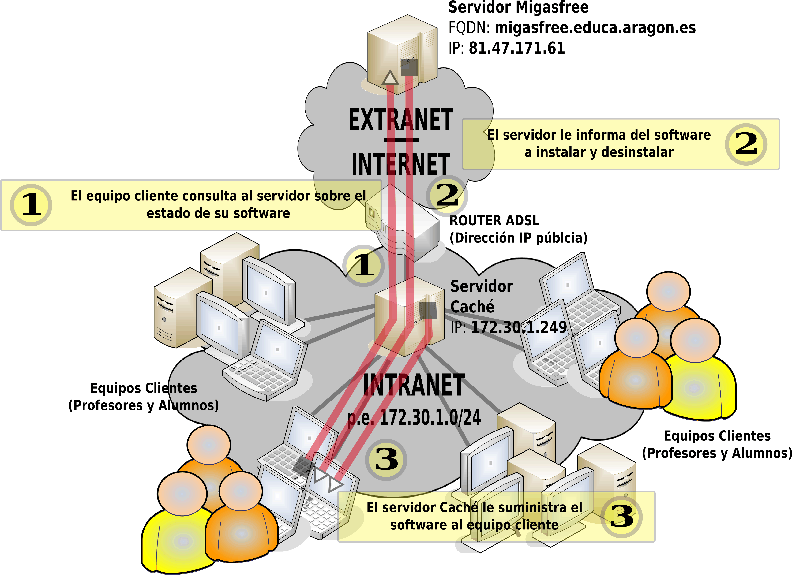

## ¿Cómo se sincroniza Vitalinux con Migasfree?

Tal como se ha tratado de explicar en el apartado anterior la comunicación y sincronización entre **Vitalinux** y **Migasfree** es fundamental para tener un sistema operativo totalmente actualizado y personalizado a nivel de centro educativo.  Por defecto, todos los días se podruce una sincronización en la cual el servidor Migasfree le indica a cada equipo Vitalinux cual debería ser su configuración y programas instalados, enviándole las ordenes oportunas.

En la figura anterior se muestran los pasos que se siguen para llevar a cabo la sincronización:

1. Tras iniciarse la sesión gráfica en Vitalinux, éste le informa a Migasfree de quién es mediante su **CID** (*Computer IDentificator*).  Este **CID** es un número que identifica a cada Vitalinux de forma unívoca.
2. Migasfree consulta que configuraciones y programas se han establecido para el equipo que tiene ese **CID**, y le envía las ordenes oportunas para se cumplan.
3. En el caso de que el equipo Vitalinux se encuentre dentro de un centro educativo que disponga de un servidor Caché este le entragará los programas que le ha indicado Migasfree que debe instalarse.  En caso de no existir este servidor Caché saldrá a Internet a buscarlos (*Migasfree y otros repositorios de software*) para descargarlos e instalarlos.