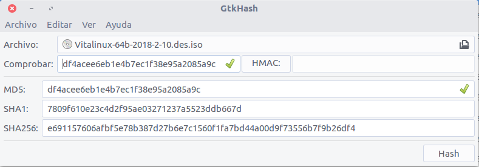

# ¿Donde Descargar Vitalinux?

A continuación veremos donde encontrar la versión más actualizada de <span style='color: darkblue; font-weight: 600'; font-size: 120%;><tt>Vitalinux</tt></span> lista para su descarga en <b>formato ISO</b>.


La extensión <b>*.iso</b> en un archivo nos advierte de que ese archivo es el resultado de comprimir y empaquetar un conjunto de archivos y directorios.  A modo de ejemplo existen muchos programas que nos permiten crear un archivo o imagen ISO a partir de un CD de música o DVD de vídeo, obteniendo como resultado un único archivo resultante <b>*.iso</b>, el cual contiene todos los archivos existentes en el CD o DVD, posibilitando posteriormente su copia o restauración.

En lo que a este curso respecta, en el ámbito de los sistemas operativos, una imagen ISO de un sistema operativo (<i>p.e. Vitalinux</i>) hace referencia a un único archivo que aglutina en su interior a todos los archivos necesarios, que volcados sobre un disco duro, o pendrive, o DVD, permiten a un equipo informático arrancar bajo ese sistema, interactuar y trabajar con él.



### Área de DESCARGA de ISOS e Imágenes {#areaDescargas}

El proyecto de Software Libre <span style='color: darkblue; font-weight: 600'; font-size: 120%;><tt>Vitalinux</tt></span> dispone de una <a href="http://wiki.vitalinux.educa.aragon.es">Wiki</a> de referencia en la cual se públican todos las novedades, noticias, avisos, contenidos (<i>cursos de formación</i>), FAQs, ... y demás aspectos que le conciernen.  En concreto, en esta <a href="http://wiki.vitalinux.educa.aragon.es">Wiki</a> podemos encontrar el <a href="http://wiki.vitalinux.educa.aragon.es/index.php/P%C3%A1gina_principal/Materiales_e_im%C3%A1genes">Área de Descargas</a> desde la cual obtener las imágenes ISOs para su posterior prueba e instalación.

Una vez hayamos descargado la imagen ISO de Vitalinux, antes de hacer uso de ella, es aconsejable [comprobar la integridad](#comprobarIntegrar) del archivo descargado, ya que al tratarse de archivo muy pesados (<i>tamaño > 2GB</i>) es posible que durante el proceso de descarga se haya producido algún error.


Desde él <a href="http://wiki.vitalinux.educa.aragon.es/index.php/P%C3%A1gina_principal/Materiales_e_im%C3%A1genes">Área de Descargas</a> podrás descargar el sistema Vitalinux EDU DGA en sus diferentes formatos, siendo estos:

<ol>
<li>
<b>Imágenes ISO de Vitalinux</b>.  Tras descargar estas imágenes ISOS podrás crear un <b>DVD o USB arrancable</b> que te permitirá probar Vitalinux en modo Live o directamente instalar el sistema en un equipo informático.
</li>
<li>
<b>Imágenes DRBL/Clonezilla en formato ZIP</b>.  Tras descargar y descomprimir el archivo ZIP correspondiente obtendrás una imagen Clonezilla que podrás utilizar para <b>restaurar el sistema Vitalinux EDU DGA en un equipo o en varios</b> mediante el uso de la herramienta de clonación en Red <b>DRBL Live</b> (<i>Clonezilla Server</i>)
</li>
<li> 
<b>Imágenes ISO de Clonezilla Live</b>.  Tras su descarga podrás crear un <b>DVD o USB arrancable</b> que te permitirá <b>restaurar la imagen de Clonezilla de Vitalinux</b> en un equipo informático.
</li>
</ol>

Es muy importante el recalcar que cualquiera de los archivos anteriores (<i>*.iso o *.zip</i>) son de <b>un gran tamaño</b> (<i>>2GB</i>) al aglutinar en un único archivo al sistema operativo <span style='color: darkblue; font-weight: 600'; font-size: 120%;><tt>Vitalinux</tt></span> con todas sus aplicaciones ya preinstaladas (<i>herramientas ofimáticas, programas multimedia, utilidades, etc.</i>).

Por ello, cuando nos descargamos un fichero de Internet, y en éste caso un fichero tan grande, es importante <b>verificar que el fichero se ha descargado correctamente</b> (<i>verificar su integridad</i>). Ocurre más a menudo de lo que nos gustaría, que la descarga no se realiza de forma correcta y luego perdemos mucho tiempo hasta que nos damos cuenta de que el error está en una descarga errónea o fallida.



## Comprobar la Integridad de un fichero descargado {#comprobarIntegrar}

Para verificar que la descarga de un fichero ha sido correcta existen las "*firmas*", "*resúmenes*" o "*ficheros hash*". Si observas, en el <a href="http://wiki.vitalinux.educa.aragon.es/index.php/P%C3%A1gina_principal/Materiales_e_im%C3%A1genes">Área de Descargas</a> al lado del fichero a descargar tienes otra descarga disponible: **MD5SSUM**. Prueba a bajar uno y abrirlo con el bloc de notas o cualquier editor de texto plano.

Observarás que es un fichero de texto que contiene simplemente una línea con el **resumen** del fichero y el nombre del fichero. El resumen de un archivo es una cadena de texto de tamaño fijo (<i>32 caracteres</i>) resultante de aplicar un algoritmo al fichero original, de forma que si el archivo original cambiara en lo más mínimo, el resultado de aplicar de nuevo el resumen sería completamente distinto.

Así pues, si aplico el algoritmo (<i>MD5 en éste caso</i>) al fichero **\*.iso** que me he descargado y resulta la misma cadena que contiene en su adjunto ***.iso.md5**, puedo asegurar que la descarga se realizó con éxito.

¿Y cómo hago ésto? Dependerá del Sistema Operativo que uses para descargar y comprobar los ficheros de descargas:

-  Si usamos una **distribución GNU/Linux**, puedes hacer la comprobación mediante el programa gráfico **gtkhash**, o directamente desde una terminal haciendo uso del ejecutable llamado **md5sum**.



<ol>
<li>Mediante <b>gtkhash</b>.  Instala y lanza <b>gtkhash</b>.  Una vez abierto el <b>gtkhash</b> selecciona el archivo (<i>p.e. *.iso</i>) del cual quieres comprobar su integridad y pincha en <b>calcular Hash</b>, habiendo pegado en el campo <b>comprobar</b> el código que debería obtenerse (<i>p.e. contenido del archivo *.iso.md5</i>).</li>

<li>Mediante el ejecutable <b>md5sum</b>.  Abre una terminal (CONTROL+ALT+T) y navega hasta el directorio donde se localiza el archivo (<i>p.e. *.iso</i>) del cual quieres comprobar su integridad, junto al fichero md5 (<i>p.e. *.iso.md5</i>) y ejecutas (*si se verifica el fichero saldrá un resultado de "**La suma coincide**"*):
</li>
</ol>

```
cd Descargas
md5sum -c fichero_md5_descargado.md5
```

-  Si usamos **Windows**, podemos descargarnos el programa [winmd5free](http://wiki.vitalinux.educa.aragon.es/isos/WinMD5.exe). Lo ejecutamos y seguiremos unos sencillos pasos:
    1.  Ejecuta el programa y busca el archivo del cual deseas comprobar su integridad (<i>p.e. *.iso</i>)
    1.  El programa comprobará el fichero y generará un **resumen** o **hash** resultante 
    1.  Abre con un <b>Bloc de Notas</b> el fichero con extensión MD5 que descargaste que contiene el **resumen MD5** del archivo original (<i>p.e. *.iso.md5</i>).<br>
    
    1.  Comprueba que el resumen generado por el programa a partir del archivo, y el resumen proporcionado por el archivo MD5 son iguales.  Si la firma coincide podemos concluir que está todo correcto, que el archivo descargado está integro.
    
