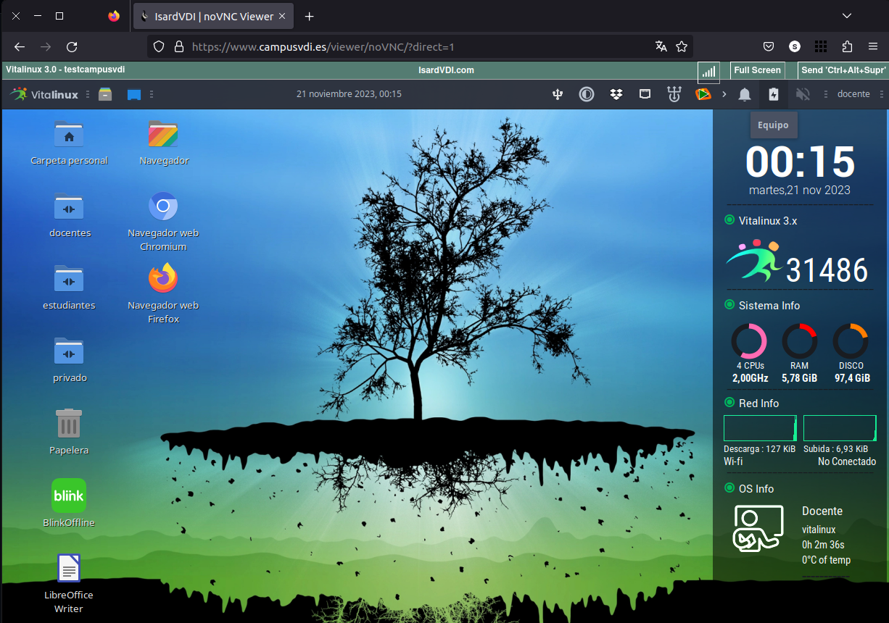


Para poder continuar deberás tener acceso a un Vitalinux. Ésta decisión es importante ya que <tt>Vitalinux</tt> no es una aplicación sin más que podamos instalar y desinstalar ... sino de un Sistema Operativo completo. En esta segunda parte del curso de introducción a <tt>Vitalinux</tt> se pretende, en caso de ser necesario, saber que hacer con la imagen ISO descargada anteriomente y empezar a <em>trastear</em> con él y ver cual es su aspecto. 
 
En cualquier caso, recuerda que solo será necesario que abordes <b>UNA</b> de las tres opciones, pero puedes hacer las cuatro si quieres...Para ello se aconseja seguir por orden de prioridad, una de las siguientes:
  
<ol>
<li>
Como la pretensión del curso <b>NO es enseñar a instalar</b> un sistema operativo en un equipo.  Por ello, la opción preferente es que si tienes la posibilidad de disponer de un equipo con <tt>Vitalinux</tt> ya instalado hagas uso de él:
</li>
<ul>
<li>Algún equipo portatil del centro (<em>para que puedas llevartelo a casa y seguir con el curso desde allí</em>) que tenga ya instalado <tt>Vitalinux</tt>.
</li>
<li>Si no dispones en tu centro de ningún equipo con <tt>Vitalinux</tt> ponte en contacto con el <b>Coordinador de Medios Informáticos</b> de tu centro y pídele el favor de si no le importaría preparte un equipo con dicho sistema operativo.  Es fácil que el sepa de la disponibilidad de los equipos que hay en el centro, y en caso de ser necesario, sepa instalarle un sistema operativo <tt>Vitalinux</tt>.
</li>
Si haces uso de esta posibilidad, no hace falta que sigas los contenidos del curso de esta segunda parte, puedes ir directamente a la tarea o entrega correspondiente de ésta Parte 2.
</ul>
 
<li>
En el caso que no dispongas de un equipo físico con <tt>Vitalinux</tt> ya instalado, y no quieras invertir tu tiempo en aprender a instalar <tt>Vitalinux</tt> o no tengas equipo informático donde hacerlo, te ofrecemos la opción de hacer el resto del curso a través de un equipo <tt>Vitalinux</tt> virtual en la nube al cual tendrás acceso a través de un navegador Web.  Para ello deberás indicárselo al tutor del curso a través de un mensaje y te indicará las instrucciones necesarias.
 

</li>
Si haces uso de esta posibilidad, no hace falta que sigas los contenidos del curso de esta segunda parte. Solo debes contactar con el tutor para que te facilite el acceso a una máquina en la nube y puedes ir directamente a la tarea o entrega correspondiente de ésta Parte 2.
 
<li>En el caso de que quieras probar tú a instalar Vitalinux, te recomendamos que hagas uso de una <b>Máquina Virtual mediante VirtualBox</b>.  A lo largo de la siguiente parte del curso se explicará como instalar el programa <b>VirtualBox</b> y como instalar sobre dicho programa <tt>Vitalinux</tt> para poder seguir con el curso.
 
Ésta tercera opción es recomendable si quieres tener un primer contacto con <tt>Vitalinux</tt>, no dispones de un equipo dedicado y no quieres depender de internet (la opción 2 requiere tener acceso a internet para interactuar con el vitalinux que se te ofrece).  Virtualbox permite crear dentro de nuestro equipo <b>Máquinas Virtuales</b> con sus respectivos <b>discos duros virtuales</b> que posteriormente podemos eliminar, al igual que eliminamos cualquier otro archivo de nuestro sistema, y sobre las cuales podemos instalar el sistema operativo que deseemos probar, en nuestro caso <tt>Vitalinux</tt>.   En concreto, haciendo uso de estas <b>máquinas virtuales</b> tendremos exactamente las mismas posibilidades que tendríamos con un equipo físico, y todo ello <b>sin tener que temer que le ocurra nada a nuestro equipo</b>.
</li>
 
<li>Como última posibilidad, y en caso de que quieras aprender a instalar un sistema operativo en un equipo real (<em>tal vez ya sepas hacerlo</em>), haz uso de un equipo que tengas disponible para ello e instala en él <tt>Vitalinux</tt>.  A lo largo de los contenidos de esta segunda parte del curso se explica como crear un USB o DVD bootable para poder posteriormente instalar <tt>Vitalinux</tt> en el equipo que tu hayas elegido.
 
Esta última opción es la más recomendable cuando tenemos claro que <tt>Vitalinux</tt> va a ser nuestro sistema operativo de trabajo de ahora en adelante.  Al instalar <tt>Vitalinux</tt> en el disco duro de tu equipo tendrás la opción de eliminar todo lo que allí exista y hacer una instalación limpia, o hacer una <b>instalación dual</b> para tener la opción de poder seguir trabajando tanto con el sistema operativo que ya tengas instalado (<em>p.e. Windows 11 o Windows 11</em>) y <tt>Vitalinux</tt>.  Si deseas hacer uso de esta opción y dudas si usar tu equipo personal, puedes usar <b>otro ordenador</b> diferente, puedes usar otro ordenador que tengas de pruebas, alguno del centro educativo en el que trabajas o un equipo antiguo que no sepas que uso darle. Los detalles del proceso de instalación se explican en el anexo de la Tarea 2.
</li>
</ol>


