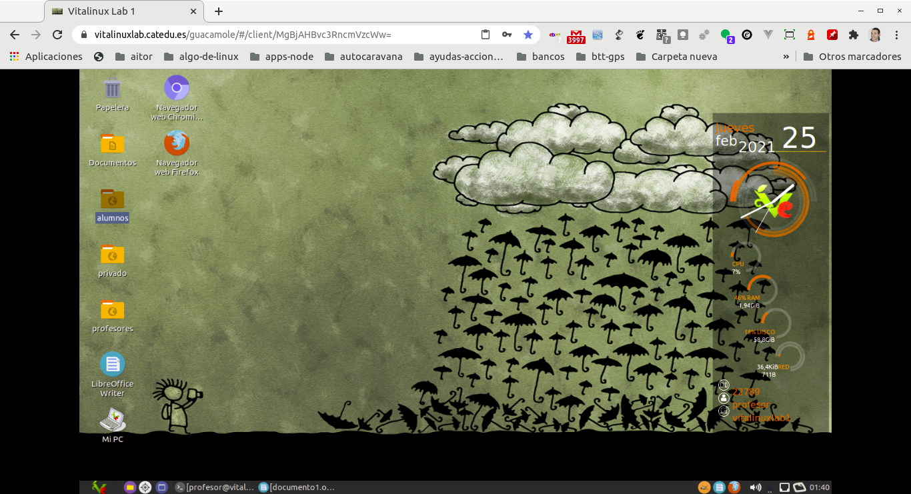

{% notificacion_task title='¿Cómo probar Vitalinux mediante Virtualbox o mediante un equipo físico?',
numexer='2.1',
req='Es necesario haber leido el apartado de <em>¿Cómo Probar Vitalinux</em> y haber descargado la imágen ISO de Vitalinux',
formatoentrega='En un documento ofimático escribe y pega las fotos o capturas de pantalla necesarias para dar respuesta a todo lo que se te pide a continuación. Si es posible expórtalo a <b>formato PDF</b> para garantizar su portabilidad, y adjúntalo como respuesta a la tarea solicitada. Por tanto, envía al tutor un único archivo <b>.pdf</b> que se nombrará siguiendo las siguientes pautas: <b>apellido1_apellido2_nombre_TareaX.pdf</b>.
 
Este curso tiene muchas entregas de ficheros de capturas de pantalla. Procura entregar las tareas <b>en formato PDF</b> y no en ficheros de imágen de capturas de pantalla.

<b>¿Por qué?</b> Porque con las entregas PDF EL TUTOR PUEDE HACER COMENTARIOS EN LA MISMA ENTREGA y ayudarte mejor en el caso de que haya problemas.

<b>¿Cómo se hace?</b> Muy fácil. Cuando tengas que adjuntar una captura:
1. Haces la captura de pantalla con la tecla <b>ImprPant</b> del teclado (más adelante daremos herramientas que permiten hacer captura de sólo una región) te saldrá un diálogo para que puedas elegir <b>Copiar en portapapeles</b>.
2. Abres el <b>LIBRE OFFICE WRITER</b> que tienes instalado en Vitalinux y pegas en el documento (<b>Edición - Pegar</b>)
3. En este documento tú puedes hacer comentarios y las capturas necesarias para justificar tu tarea.
4. En Archivo de Writer tienes la opción <b>Exportar a PDF</b>
5. También puedes usar otras estrategias si no te sientes cómodo con ésta de momento, como puede ser <b>hacer una foto</b> con el móvil y copiar la imagen en un documento ofimático que puedas exportar en pdf.

Es engorroso, lo sabemos, pero es la mejor manera de entregar la tarea de forma correcta y bien justificada.

Asegúrate que el nombre no contenga la letra ñ, tildes ni caracteres especiales extraños. Así por ejemplo la alumna <b>Begoña Sánchez Mañas</b>, debería nombrar esta tarea como: <b>sanchez_manas_begona_Tarea2.1.pdf</b>' %}
<b>Recuerda: La pretensión de este curso NO es aprender a saber instalar un sistema operativo</b>, pero disponer de un equipo con <tt>Vitalinux</tt> instalado es requisito indispensable para poder continuar con los contenidos del curso.  Esta tarea tan sólo pretende que el participante del curso justifique de alguna forma de que dispone de un equipo, físico o virtual, con <tt>Vitalinux</tt> instalado para poder continuar con el curso.  Por tanto, tal como ya se ha explicado en el apartado referente a <em>¿Cómo Probar Vitalinux?</em>, tenemos las siguientes opciones:

<ol>
<li>
Disponer de un equipo personal o del centro con <tt>Vitalinux</tt> ya instalado.  En éste caso, para la realización de la tarea <b>tan sólo será necesario hacer una foto al equipo</b> con el sistema opertivo iniciado...sencillo, no?
</li>
<li>
En el caso que no dispongas de un equipo físico con Vitalinux ya instalado, y no quieras invertir tu tiempo en aprender y probar a instalar Vitalinux (<i>siguientes opciones</i>), te ofrecemos la opción de hacer el resto del curso a través de un equipo Vitalinux virtual al cual tendrás acceso a través de un navegador Web.  Para ello unicamente deberás indicárselo a través de la presente tarea al tutor del curso para que éste te de la dirección Web y credenciales de acceso.
 

</li>
<li>
En defecto de lo anterior, instalar <tt>Vitalinux</tt> sobre una máquina virtual de Virtualbox.  Para la realización de la tarea <b>tan solo será necesario algunas capturas del proceso de instalación de Vitalinux...y sobre todo una en la que aparezca la máquina arrancada con <tt>Vitalinux</tt> funcionando</b>. Esta opción es idónea ya que:
</li>

<ul>
<li><b>No es necesario crear ningún DVD o USB bootables</b> a partir de la imagen ISO</li>
<li><b>No es necesario configurar la BIOS u opciones de arranque de la máquina</b> para que se inicie el proceso de instalación</li>
<li><b>No es necesario dedicar un equipo equipo físico</b> para estos menesteres</li>
<li>Nos va permitir trabajar con <tt>Vitalinux</tt> de forma idéntica a una instalación en equipo físico</li>
 
Para hacer uso de <b>Virtualbox</b> deberemos seguir los siguientes pasos:
<ol type="A">
<li> Acceder mediante nuestro navegador preferido a el <a href="https://www.virtualbox.org/wiki/Downloads">Área de Descargas de Virtualbox</a></li>
<li>Descargar el programa de instalación de <b>Virtualbox</b> para el sistema operativo que tengas.</li>
<li><b>Instalar Virtualbox</b> en tu máquina a través del instalador que te acabas de descargar</li>
<li>Una vez que ya tenemos instalado Virtualbox en nuestra máquina deberemos <b>descargar e instalar</b> el <b>Extension Pack</b> tal como se ha sugerido en la contenidos teóricos. Este paquete no es más que un conjunto de drivers y funcionalidades añadidas para Virtualbox (<i>soporte para dispositivos USB, carpetas compartidas, etc.</i>)</li>
<li><b>Crear una nueva máquina Virtual en Virtualbox indicando cual es el sistema operativo que se va a instalar</b> en ella.  Indicar en este punto que Vitalinux esta basado en la versión ligera de Ubuntu, por lo que deberemos indicar que vamos a instalar un <b>Ubuntu</b>, de <b>32 o 64 bits</b> dependiendo de la versión de Vitalinux que te hayas descargado</li>
<li><b>En la unidad de DVD de la máquina virtual cargar la imagen ISO de Vitalinux</b>.  De esta forma, lo primero que hará la maquina virtual al arrancar será comprobar que hay esa ISO y comenzará su instalación.</li>
<li><b>Arrancar la máquina virtual</b> pulsando en el botón de encendido.</li>
<li>Una vez la máquina virtual ya este iniciada sería conveniente instalar las <b>Guest Additions</b> tal como se ha sugerido en los contenidos teóricos, tal como se describe a continuación en un videotutorial.</li>
</ol>
</ul>

 

<li>
En defecto de las dos opciones anteriores, se sugiere <b>crear un DVD/USB Bootable</b> e instalar <tt>Vitalinux</tt> en un equipo físico. En éste caso, para la realización de la tarea al igual que para la opción 1, <b>tan sólo será necesario hacer una foto al equipo</b> con el sistema opertivo iniciado. Para ello deberemos seguir los contenidos teóricos de esta parte del curso.
</li>
<ul>
<li>
Graba la imagen <b>ISO de Vitalinux</b> en una <b>memoria USB</b> mediante algún software que te permita este proceso, como por ejemplo <b>UnetBootin</b>.
</li>
<li>
Posteriormente configura el <b>Boot Loader</b> de tu equipo para que en lugar de arrancar con el sistema que tienes instalado en el disco duro lo haga con el sistema disponible en el USB.  De esta forma se iniciará el proceso de instalación de <tt>Vitalinux</tt>.
</li>
<li>
Con la finalidad de que el sistema se cargue y responda rápido se recomienda hacer uso de una <b>memoria USB 3.0</b>.
</li>
</ul>
</ol>
 



### Algunas notas finales SOLO por si te decides a instalar la máquina en un equipo o como máquina virtual (opciones 3 y 4)

Si al final decidimos adentrarnos en un proceso de instalación (virtual o físico <i><b>y no queremos mantener el sistema antiguo...por ejemplo Windows</b></i>), **una vez se inicie el proceso de instalación aparecerá un menú de opciones de instalación** entre las cuales deberemos escoger la opción correspondiente a **una Instalación Desatendida**, la cual nos instalará <tt>Vitalinux</tt> sin ser necesario estar pendientes del proceso de instalación:


Si has elegido la opción de instalación <b>Desatendida</b>, debes advertir que el proceso de instalación <b>no es interactivo</b>, sino <b>desantendido</b>.  Es decir, no solicita ningún tipo de información al usuario, haciendo que la instalación de <tt>Vitalinux</tt> sea muy trivial, posibilitando que durante el tiempo que se produce la instalación podamos invertirlo en otros menesteres.


Si por el contrario, queremos que a la hora de instalar nos pregunte algnua detalle pero seguimos queriendo dejar solo instalado Vitalinux, podemos usar la opción interactiva.

Finalmente, si se trata de una instalación física (en Virtualbox ésto no tendría sentido) y queremos mantener el sistema operativo instalado actualmente (por ejemplo windows), deberemos seleccionar la opción dual. Ésta opción puede ser algo mas trabajosa en cuanto que hay que tomar algunas precauciones.

Es por ello que se ha realizado la siguiente **píldora formativa de instalación de un equipo en forma dual**:

https://youtu.be/qv3715HUsR0

