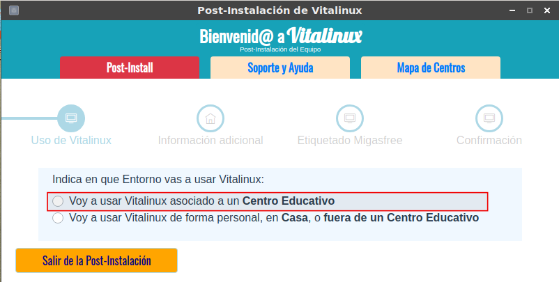
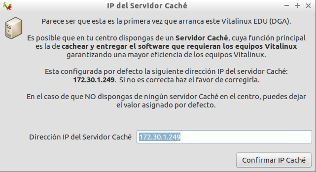
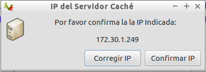
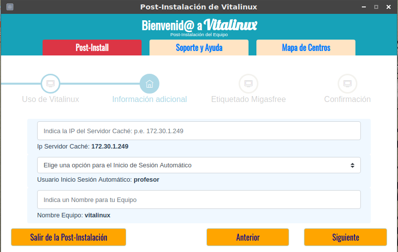
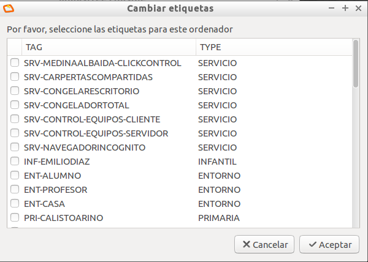
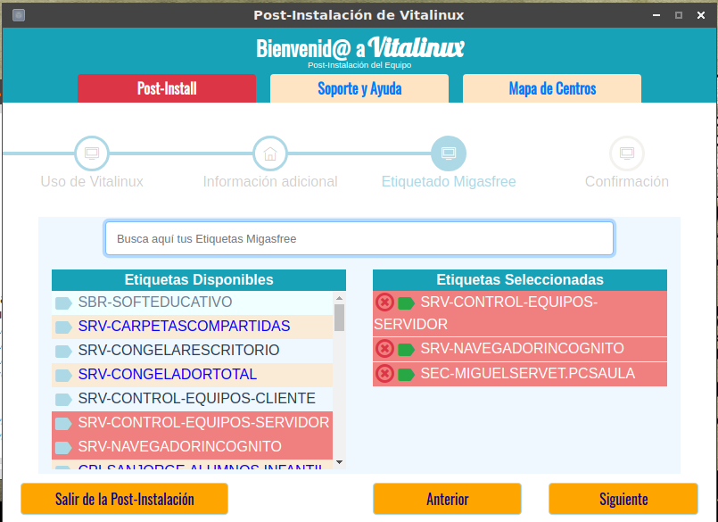

## Asistente de Post-Instalación en el caso de usar Vitalinux en un Centro Educativo {#AsistentedePost-InstalacionVitalinuxCentroEducativo}

<!--  -->

Tal como se puede apreciar a través de las siguientes capturas de pantalla, en el caso de que el uso que se le vaya a dar al sistema Vitalinux sea dentro de un **Centro Educativo** deberemos informar a Vitalinux de lo siguiente:

* **¿Dirección IP del servidor Caché?** Los centros que hacen uso de Vitalinux tienen la opción de implementar un pequeño servidor dentro del centro con la finalidad de aumentar la eficacia del conjunto de equipos Vitalinux.  En concreto cabría destacar que este servidor ofrece los siguientes servicios:
    * Servicio de carpetas compartidas para alumnos y profesores. De esta forma todos los usuarios de Vitalinux pueden almacenar de manera centralizada sus documentos haciendo que sean accesibles desde cualquier equipo del centro.  Además esto facilita la entrega de documentos entre profesores y alumnos.
    * Servicio de entrega de software.  Este servicio es fundamental, ya que cuando se requiere instalar un programa en todos o parte de los equipos Vitalinux del centro, en lugar de descargarse de Internet múltiples veces el mismo software, este se descarga una única vez en el servidor y posteriormente este se encarga de entregárselo a todos aquellos que lo requieran.  De esta forma reducimos el consumo de ancho de banda del centro y aceleramos el proceso de instalación de software en los equipos Vitalinux.

<!-- 
 -->

* **¿Usuario que inicia sesión de manera automática en Vitalinux?** Con la finalidad de evitar que el usuario tenga que introducir un **login** y una **password** para poder iniciar sesión gráfica cada vez que arranca un equipo, a través del asistente podremos indicar quien es el usuario que mayormente va a usar el equipo. En caso de desearse puede indicarse que el equipo no inicie sesión de manera automática, y que sea necesario autenticarse cada vez que se inicia.

<!--  -->

* **¿Qué etiquetas Migasfree queremos asignar al equipo?** La correcta asignación de **etiquetas Migasfree** al equipo es fundamental ya que en función de sus etiquetas Migasfree se decidirá que software tendrá ese equipo. Es decir, al menos todo equipo Vitalinux ubicado en un centro educativo debería tener una etiqueta Migasfree correspondiente al nombre de su centro, de tal forma que ese etiquetado le obligue al equipo a instalarse un determinado conjunto de aplicaciones que ha sido especificado por los responsables informáticos de ese centro. Más adelante veremos más en detalle la importancia de un correcto etiquetado y comprenderemos más en detalle las funciones del <b>Cliente de Migasfree</b>.

<!--  -->

