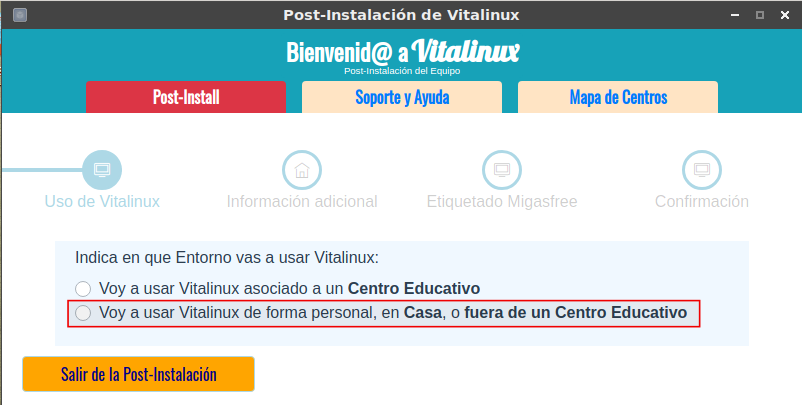
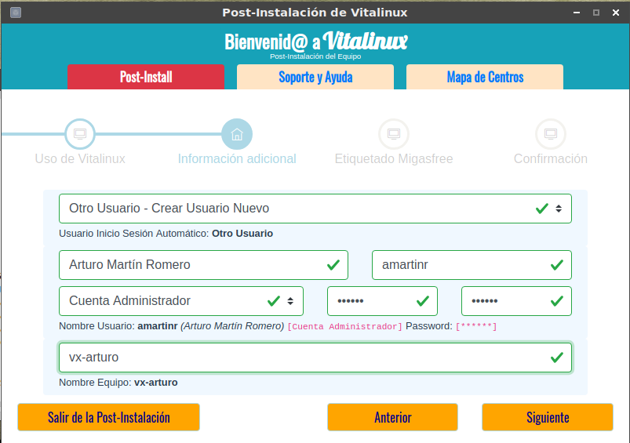
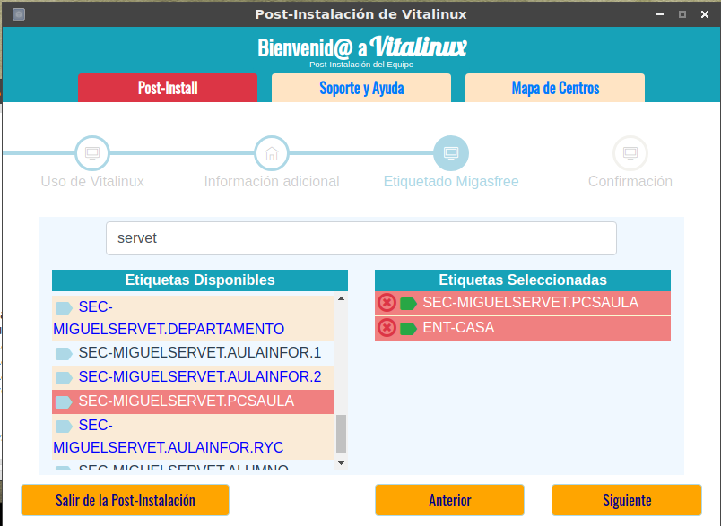

## Asistente de Post-Instalación en el caso de usar Vitalinux en Entorno Casa{#AsistentePost-InstalacionVitalinuxCasa}

En el caso de que Vitalinux vaya a ser usado de manera privada fuera de un centro educativo deberemos contestar al asistente de Post-Instalación lo siguiente:

- Indicaremos explicitamente que vamos a usar Vitalinux fuera de un centro educativo.  Esto, como veremos a continuación, nos preseleccionará la etiqueta Migasfree **ENT-CASA** garantizando de esta forma que los técnicos de Vitalinux no puedan acceder al equipo de manera remota (*en equipos de centro es necesario que los técnicos puedan acceder remotamente para solucinar problemas que puedan darse a posteriori*).

<!--  -->

- A continuación indicaremos la cuenta de usuario con la que deseamos que Vitalinux inicie sesión de manera automática, más el nombre que queremos asignar al equipo.

-  **¿Usuario con el que queremos que se inicie sesión de manera automática en Vitalinux?** Con la finalidad de evitar que el usuario tenga que introducir un **login** y una **password** para poder iniciar sesión gráfica cada vez que arranca Vitalinux, a través del asistente podremos indicar una cuenta de inicio de sesión automático.  Lógicamente también puede indicarse que no inicie sesión de manera automática y que sea necesario autenticarse con login/password cada vez que se inicia Vitalinux.

-  Vitalinux trae preconfiguradas varias cuentas de usuario con privilegios diferentes: **alumno, profesor y control**, pero podemos seleccionar **Otro Usuario - Crear Usuario Nuevo**, lo que nos permitirá crear una nueva cuenta de usuario personalizada para el equipo con la que iniciar sesión de manera automática.

<!-- 

 -->

<!-- -  **¿Aceptas el uso de formatos restrictivos no libres necesarios en la reproducción de archivos MP3, DVDs, Windows Media, etc?** Por cuestiones de legalidad es necesario aceptar explícitamente el uso de estos formatos en el caso de querer trabajar con ellos. -->
<!--  -->

-  En el siguiente paso, al llegar al etiquetado, verás que por defecto aparecerá seleccionada la etiqueta **ENT-CASA**, indicativa de que el equipo va a ser usado en un entorno privado fuera del entorno educativo, pudiendo al mismo tiempo seleccionar las **etiquetas** de un centro educativo para que el entorno de Escritorio y programas de ese centro educativo se repliquen en el equipo.  Es decir, podríamos tener la misma *personalización* en un equipo privado que el de un centro educativo cualesquiera (por ejemplo, esto permite que un alumno pueda tener en el ordenador de casa el mismo software que el que tiene instalado el equipo con el que trabaja en el cole). La funcionalidad de las etiquetas la veremos algo mas adelante: [Parte 4](parte_4_gestion_del_software_en_vitalinux.md).

