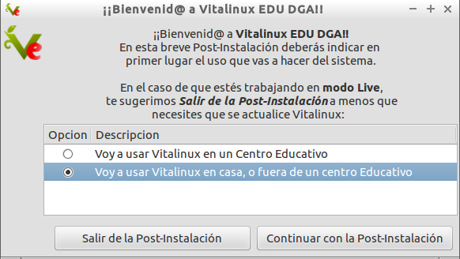
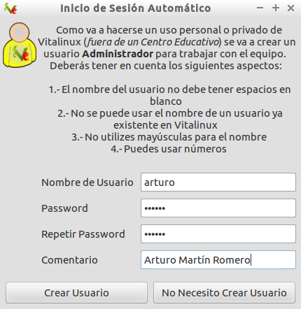
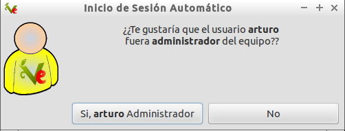
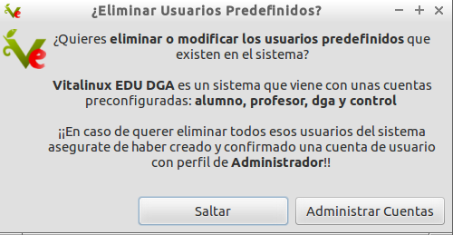
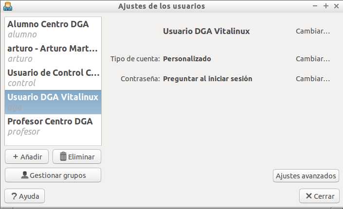
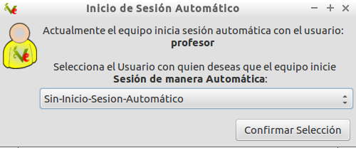

## Asistente de Post-Instalación en el caso de usar Vitalinux en Entorno Casa{#AsistentePost-InstalacionVitalinuxCasa}

En el caso de que Vitalinux vaya a ser usado de manera privada fuera de un centro educativo deberemos contestar al asistente de Post-Instalación en lo siguiente:

-  Vitalinux trae preconfiguradas varias cuentas de usuario con privilegios diferentes: **alumno, profesor y control**.  Por ello al indicar que vamos a  hacer un uso personal de Vitalinux fuera de un centro educativo, el asistente nos sugiere crear un nueva cuenta de administrador y modificar o eliminar las cuentas ya existentes.
-  **¿Usuario con el que queremos que se inicie sesión de manera automática en Vitalinux?** Con la finalidad de evitar que el usuario tenga que introducir un **login** y una **password** para poder iniciar sesión gráfica cada vez que arranca un equipo, a través del asistente podremos indicar quien es el usuario que mayormente va a usar el equipo.  En caso de desearse puede indicarse que el equipo no inicie sesión de manera automática, y que sea necesario autenticarse cada vez que se inicia.

-  **¿Aceptas el uso de formatos restrictivos no libres necesarios en la reproducción de archivos MP3, DVDs, Windows Media, etc?** Por cuestiones de legalidad es necesario aceptar explícitamente el uso de estos formatos en el caso de querer trabajar con ellos.
-  Y podría tener las **etiquetas** como en mi centro, de forma que tuviera la misma *personalización*? (por ejemplo, que un alumno pueda tener en el ordenador de casa el mismo software que en el cole). Pues si...pero la funcionalidad de las etiquetas la veremos algo mas adelante: [Parte 4](parte_4_gestion_del_software_en_vitalinux.md).

