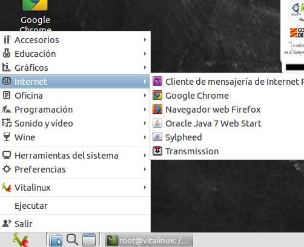
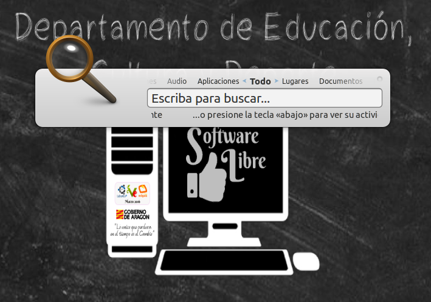
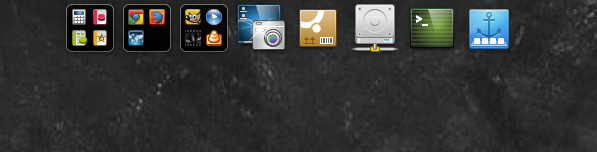
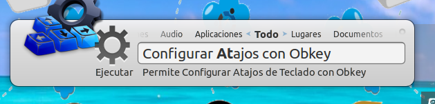
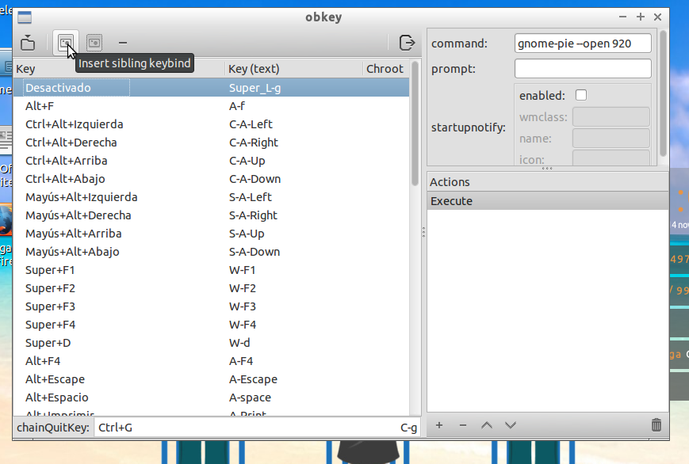
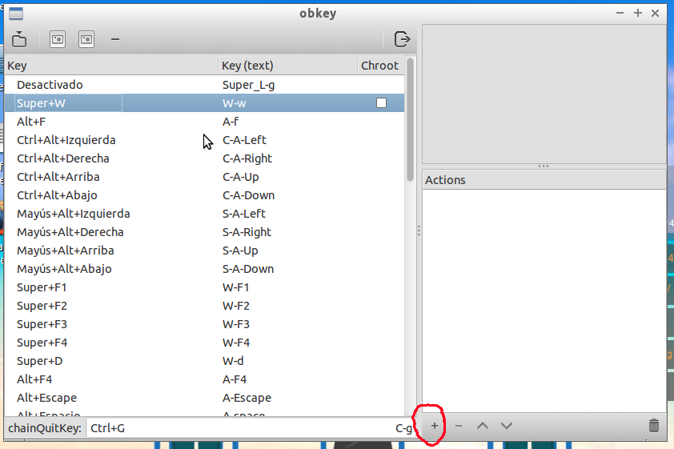
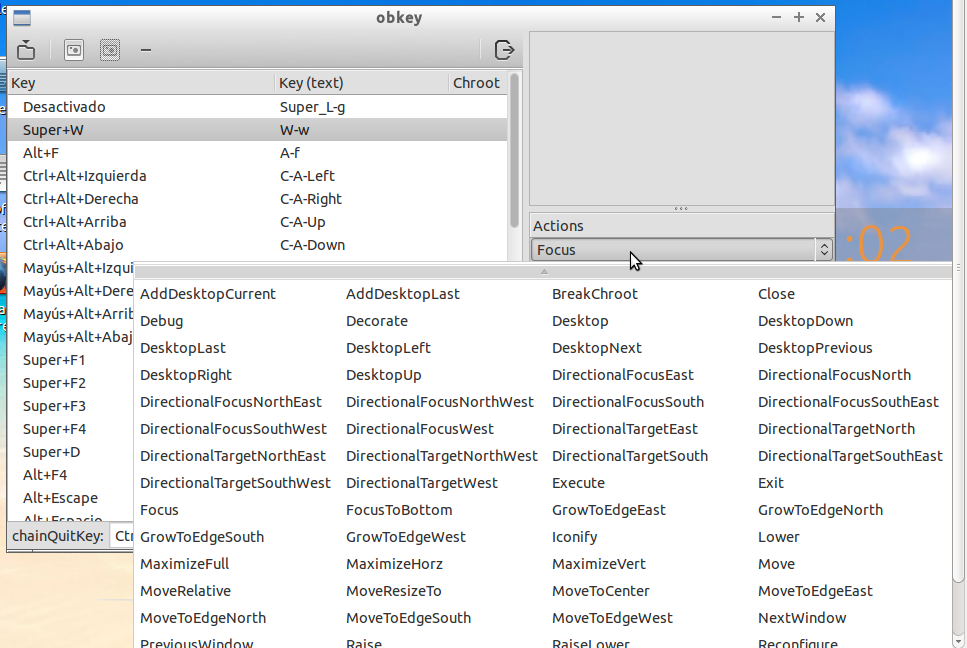
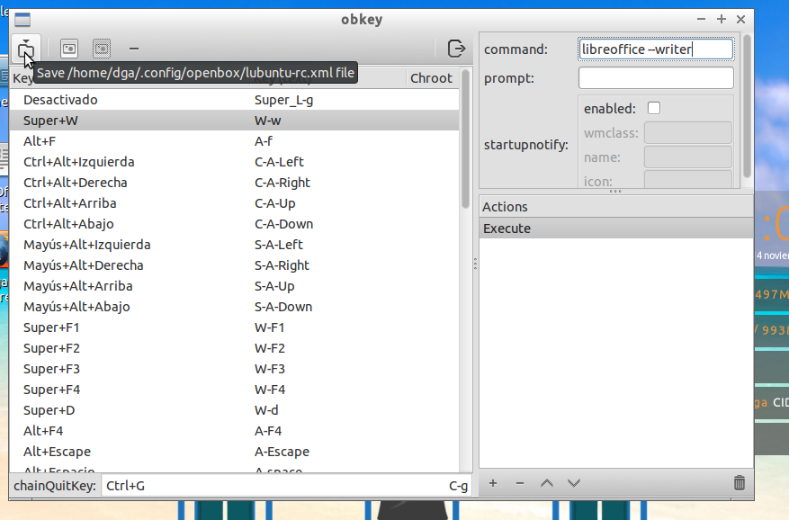

# ¿Cómo lanzar Aplicaciones?


En <tt>Vitalinux</tt> existen diferentes formas de abrir o lanzar aplicaciones.  Podrían destacarse las siguientes: desde el <b>Menú Clásico de Inicio</b>, mediante el <b>Lanzador de Aplicaciones Synapse</b>, haciendo uso de los <b>Dock Plank o Gnome Pie</b> o mediante el uso de <b>Atajos de Teclado</b>.  ¡¡Todas ellas se describen a continuación!!


## Contenido

- [1 Desde el clásico **Menú de Inicio**](#DesdeMenuInicio)
- [2 Mediante el **lanzador de Aplicaciones Synapse**](#DesdeLanzadorAplicacionesSynapse)
- [3 Lanzar Aplicaciones desde el **Dock de Aplicaciones Plank**](#DesdeDockAplicacionesPlank)
- [4 Lanzar Aplicaciones desde el **Dock Circular de Aplicaciones Gnome Pie**](#DesdeDockCircularAplicacionesGnomePie)
- [5 Mediante la configuración de **Atajos de teclado**](#MedianteAtajosDeTeclado)
    - [5.1 Atajos de Teclado predefinidos en Vitalinux (*Lubuntu*)](#AtajosTecladoPredefinidosVitalinux)
    - [5.2 Definir nuevos Atajos de Teclado](#DefinirAtajosTeclado)
- [6 Tarea 2.3: Repaso de estrategias para Lanzar y Matar Aplicaciones en Vitalinux](#LanzarMatarAplicaciones)

## Desde el clásico **Menú de Inicio** {#DesdeMenuInicio}

El **Menú de Inicio Clásico**  es el típico menú desplegable de Windows que puede desplegarse y acceder a sus aplicaciones pinchando con el botón izquierdo del ratón sobre el icono de **Vitalinux** que hay en la parte izquierda del panel inferior del Escritorio.  También puede desplegarse mediante el **Atajo de teclado** ***CONTROL+ESC***.

Una vez desplegado podrás comprobar que todos los lanzadores están clasificados por temática: **Internet, Oficina, Gráficos, Sonido y Video, etc.**

## Mediante el **lanzador de Aplicaciones Synapse/Albert** {#DesdeLanzadorAplicacionesSynapse}

Sin lugar a dudas, el uso del **Lanzador de Aplicaciones Synapse (en VX 1.0) o Albert (en VX2.0)** es **la forma más aconsejable, rápida y eficiente** de lanzar aplicaciones. Para lanzar cualquier aplicación del sistema tan sólo tendrás que pulsar la combinación de teclas **CONTROL+ESPACIO** y a continuación escribir un texto relacionado con la aplicación que deseas lanzar: por ejemplo, **firefox, chrome, matar proceso, etc...**.  Además si tecleamos una **palabra clave** que esta en varias aplicaciones, pulsando la **flecha que apunta hacia abajo** se desplegarán todas las aplicaciones o documentos que la contengan.  Por ejemplo, si escribimos **Libreoffice** y pulsamos la **flecha hacia abajo** veremos todas las aplicaciones de la suite ofimática Libreoffice, alternativa a las Microsoft Office. Puedes probar si lo deseas a lanzar alguna aplicación para comprobar su eficiencia.

Albert además nos permite más funcionalidades:

* Buscar en nombres de archivos y directorios
* Buscar en diferentes navegadores
* Se pueden realizar operaciones como si fuera una calculadora
* Lanzar comandos como si estuviéramos en una terminal, escribiendo antes el símbolo >

## Lanzar Aplicaciones desde el **Dock de Aplicaciones Plank** (solo para VX 1.0) {#DesdeDockAplicacionesPlank}

En Vitalinux 1.0 (para 2.0 no está disponible ya) se puede habilitar un **Dock** o **barra de aplicaciones más comunes** a través de la cual se pueden lanzar aplicaciones preconfiguradas o añadir nuevas.  Para usarlo será necesario habilitar el **Dock** de la siguiente forma: teclear **CONTROL+ESPACIO** y teclear **habilitar o deshabilitar dock plank**, a continuación te pedirá la contraseña de administración (**careidga** es la password *por defecto, para los usuarios dga y profesor*), y desde allí ya podrás habilitarlo.

Si quieres probar su funcionamiento habilita el Dock Plank, cierra sesión (_**CONTROL+ESPACIO** y teclear **cerrar sesión**_), e inicia sesión de nuevo y comprobarás que éste, una vez habilitado, se despliega de manera automática al acercar el ratón en la parte superior central del **Escritorio**.  Comprueba su correcto funcionamiento pinchando sobre alguno de sus lanzadores de aplicaciones.  El aspecto y comportamiento de este **Dock** puede personalizarse pinchando con el botón derecho del ratón sobre el **icono ancla** que hay en este **Dock**.  Además puedes añadir o anclar aplicaciones nuevas arrastrándolas desde el menú de inicio al **Dock**, o una vez estas estén abiertas.

## Lanzar Aplicaciones desde el **Dock Circular de Aplicaciones Gnome Pie** (solo para VX 1.0){#DesdeDockCircularAplicacionesGnomePie}

En Vitalinux 1.0 (para 2.0 no está disponible ya), y al igual que el **Dock Plank** anterior, para trabajar con él es necesario habilitarlo: teclear **CONTROL+ESPACIO** y teclear **habilitar o deshabilitar gnome pie**, a continuación te pedirá la contraseña de administración (**careidga** es la password *por defecto, para los usuarios dga y profesor*), y desde allí ya podrás habilitarlo.

Para hacer uso de él es necesario teclear la combinación de teclas **Tecla Windows + G**.  Si lo deseas puedes comprobar su funcionamiento.

## Mediante la configuración de **Atajos de teclado** {#MedianteAtajosDeTeclado}

Sin lugar a dudas, el uso de combinación de teclas para el acceso a recursos y aplicaciones es la forma más rápida y eficiente de interactuar con un sistema operativo.  En **Vitalinux** es posible modificar los atajos existentes e introducir nuevos.

Podemos repasar algunos de los **Atajos** que ya están predefinidos e incluso probar a definir alguno:

### Atajos de Teclado predefinidos en Vitalinux (*Lubuntu*) {#AtajosTecladoPredefinidosVitalinux}
1.  Tecla **IMPRIMIR PANTALLA**: Lanza un programa que nos permitirá capturar la pantalla completa, una ventana activa, o una parte de la pantalla.  Además nos permitirá elegir un nombre para la captura y su ubicación (*por defecto la dejará en la carpeta del HOME del usuario **Imágenes***)
1.  Tecla **F11**: Pone en pantalla completa la ventana que tengamos abierta
1.  Combinación **Tecla de Windows + E**: Abre el explorador de archivos de Vitalinux
1.  Combinación **Tecla de Windows + D**: Minimiza todas las ventanas y nos muestra únicamente el Escritorio limpio.  Para regresar a la situación en la que estabamos, podemos volver a pulsar dicha combinación.
1.  Combinación **CONTROL + ESC**: Despliega el menú de Inicio clásico de aplicaciones
1.  Combinación **CONTROL + ALT + T**: Abre una terminal de comandos
1.  Combinación **ALT + F4**: Cierra la ventana que este en ese momento activa
1.  Combinación **ALT + TABULADOR**: Permite navegar entre las distintas ventanas que tenemos abiertas.  Para probarlo, podemos abrir varias aplicaciones y comprobar su efecto.
1.  Combinación **ALT + SHIFT + TABULADOR**: Permite navegar entre las distintas ventanas que tenemos abiertas en sentido inverso al anterior.  Para probarlo, podemos abrir varias aplicaciones y comprobar su efecto.
1.  Combinación **Tecla Función + f7** y **Función + f8**: Subir/Bajarla intensidad de la luz del ordenador
1.  Combinación **Tecla Función + f11** y **Función + f12**: Subir/Bajar el volumen
1.  Combinación **CONTROL + ALT + SUPRIMIR**: Cierra la sesión del usuario

### Definir nuevos Atajos de Teclado {#DefinirAtajosTeclado}

A modo de ejemplo, a continuación se va a definir un nuevo atajo, de forma que cuando se pulsen la tecla Windows y la letra w (<i>sin soltar la tecla windows</i>) se inicie el Libreoffice Writer. Para definir éste nuevo atajo de teclado, tenemos en Vitalinux una aplicación instalada llamada <b>Obkey</b>. 

<ol>
<li> Para lanzar la aplicación, nada más facil que teclear <b>CONTROL+ESPACIO</b> y escribir <b>atajos</b> y cuando veamos la aplicación <b>Configurar atajos con Obkey</b> pulsar Intro</li>

<li> Ahora podemos ver los atajos que hay definidos o crear uno nuevo. Para añadir uno, simplemente deberemos pulsar el botón <b>Insert sibling keybing</b> (<i>el segundo empezando por la izda</i>).</li>

<li> Cuando lo creemos se añadirá una nueva fila en la tabla inferior, para que podamos definir nuestro atajo con el valor de Key A y el Key(text) A. Si clickamos sobre la A de la columna Key podemos hacer la combinación que deseemos (<i>por ejemplo, la tecla Windows y la W</i>).</li>

<li> Ahora, deberemos asociar una acción a dicha combinación. Seleccionada la combinación que he realizado, vamos a la caja de Actions de la derecha y clickamos en el botón de + para definir una nueva acción. Por defecto sale Focus, y lo cambiaremos a Execute.</li>

<li>En la caja de texto que aparece arriba al lado de <b>command</b>, indicamos el comando que queremos asociar al atajo. En mi caso: `libreoffice --writer`. (Podemos escribir solo libreoffice si queremos que se lanze toda la suite) y guardar dicho atajo para el futuro.</li>

</ol>

Con la finalidad de aclarar visualmente la forma de crear un **atajo de teclado** en Vitalinux se sugiere ver el [siguiente videotutorial](https://youtu.be/bdBM6U0seUE):

https://youtu.be/bdBM6U0seUE
