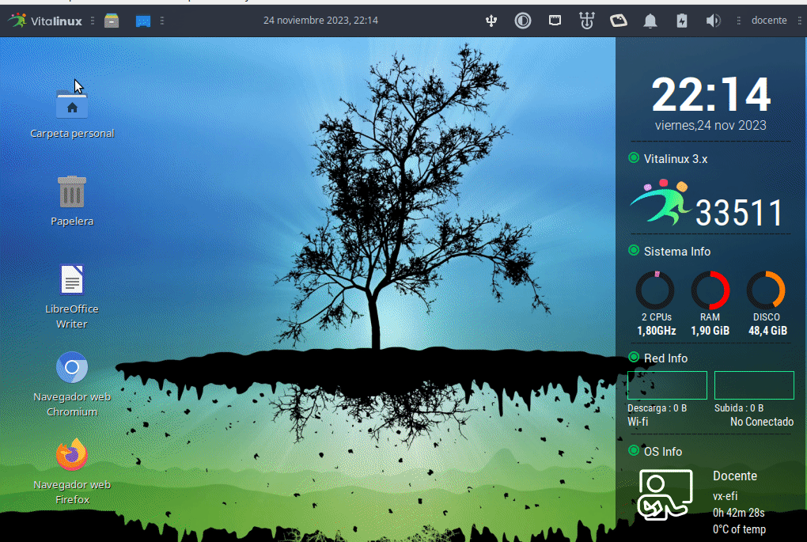
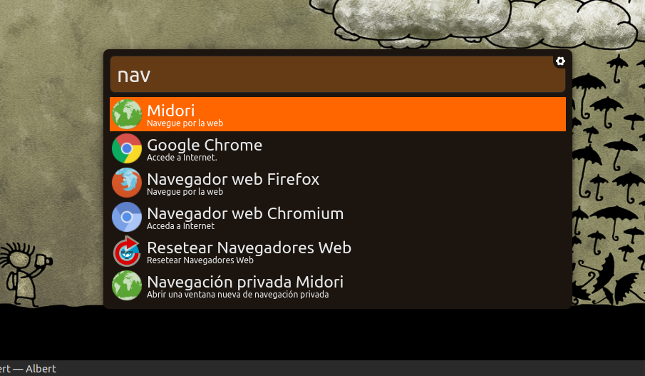

# ¿Cómo lanzar Aplicaciones?


En <tt>Vitalinux</tt> existen diferentes formas de abrir o lanzar aplicaciones.  Podrían destacarse las siguientes: desde el <b>Menú Clásico de Inicio</b>, mediante el <b>Lanzador de Aplicaciones Synapse</b>, haciendo uso de los <b>Dock Plank o Gnome Pie</b> o mediante el uso de <b>Atajos de Teclado</b>.  ¡Todas ellas se describen a continuación!


## Contenido

- [1 Desde el clásico **Menú de Inicio**](#DesdeMenuInicio)
- [2 Mediante el **lanzador de Aplicaciones Synapse**](#DesdeLanzadorAplicacionesSynapse)
- [3 Mediante la configuración de **Atajos de teclado**](#MedianteAtajosDeTeclado)
    - [3.1 Atajos de Teclado predefinidos en Vitalinux (*Lubuntu*)](#AtajosTecladoPredefinidosVitalinux)
    - [3.2 Definir nuevos Atajos de Teclado en Vitalinux 3](#DefinirAtajosTeclado3)
    - [3.2 Definir nuevos Atajos de Teclado en Vitalinux 2](#DefinirAtajosTeclado2)

## Desde el clásico **Menú de Inicio** {#DesdeMenuInicio}

El **Menú de Inicio Clásico**  es el típico menú desplegable de Windows que puede desplegarse y acceder a sus aplicaciones pinchando con el botón izquierdo del ratón sobre el icono de **Vitalinux** que hay en la parte izquierda del panel inferior del Escritorio.  También puede desplegarse mediante el **Atajo de teclado** ***CONTROL+ESC***.

Una vez desplegado podrás comprobar que todos los lanzadores están clasificados por temática: **Internet, Oficina, Gráficos, Sonido y Video, etc.**

## Mediante el **lanzador de Aplicaciones Synapse/Albert** {#DesdeLanzadorAplicacionesSynapse}

Sin lugar a dudas, el uso del **Lanzador de Aplicaciones Albert** es **la forma más aconsejable, rápida y eficiente** de lanzar aplicaciones. Para lanzar cualquier aplicación del sistema tan sólo tendrás que pulsar la combinación de teclas **CONTROL+ESPACIO** y a continuación escribir un texto relacionado con la aplicación que deseas lanzar: por ejemplo, **firefox, chrome, matar proceso, etc...**.  Además si tecleamos una **palabra clave** que esta en varias aplicaciones, pulsando la **flecha que apunta hacia abajo** se desplegarán todas las aplicaciones o documentos que la contengan.  Por ejemplo, si escribimos **Libreoffice** y pulsamos la **flecha hacia abajo** veremos todas las aplicaciones de la suite ofimática Libreoffice, alternativa a las Microsoft Office. Puedes probar si lo deseas a lanzar alguna aplicación para comprobar su eficiencia.

Albert además nos permite más funcionalidades:

* Buscar en nombres de archivos y directorios
* Buscar en diferentes navegadores
* Se pueden realizar operaciones como si fuera una calculadora
* Lanzar comandos como si estuviéramos en una terminal, escribiendo antes el símbolo >

## Mediante la configuración de **Atajos de teclado** {#MedianteAtajosDeTeclado}

Sin lugar a dudas, el uso de combinación de teclas para el acceso a recursos y aplicaciones es la forma más rápida y eficiente de interactuar con un sistema operativo.  En **Vitalinux** es posible modificar los atajos existentes e introducir nuevos.

Podemos repasar algunos de los **Atajos** que ya están predefinidos e incluso probar a definir alguno:

### Atajos de Teclado predefinidos en Vitalinux {#AtajosTecladoPredefinidosVitalinux}
1.  Tecla **IMPRIMIR PANTALLA**: Lanza un programa que nos permitirá capturar la pantalla completa, una ventana activa, o una parte de la pantalla.  Además nos permitirá elegir un nombre para la captura y su ubicación (*por defecto la dejará en la carpeta del HOME del usuario **Imágenes***)
1.  Tecla **F11**: Pone en pantalla completa la ventana que tengamos abierta
1.  Combinación **Tecla de Windows + E**: Abre el explorador de archivos de Vitalinux
1.  Combinación **Tecla de Windows + D**: Minimiza todas las ventanas y nos muestra únicamente el Escritorio limpio.  Para regresar a la situación en la que estabamos, podemos volver a pulsar dicha combinación.
1.  Combinación **Tecla de Windows + flecha_del_cursor**: Posiciona la ventana activa en la mitad superior, inferior, izda o derecha según usemos una flecha u otra. Útil para organizar las ventanas en el Escritorio.
1.  Combinación **CONTROL + ESC**: Despliega el menú de Inicio clásico de aplicaciones
1.  Combinación **CONTROL + ALT + T**: Abre una terminal de comandos
1.  Combinación **ALT + F4**: Cierra la ventana que este en ese momento activa
1.  Combinación **ALT + TABULADOR**: Permite navegar entre las distintas ventanas que tenemos abiertas.  Para probarlo, podemos abrir varias aplicaciones y comprobar su efecto.
1.  Combinación **ALT + SHIFT + TABULADOR**: Permite navegar entre las distintas ventanas que tenemos abiertas en sentido inverso al anterior.  Para probarlo, podemos abrir varias aplicaciones y comprobar su efecto.
1.  Combinación **Tecla Función + f7** y **Función + f8**: Subir/Bajarla intensidad de la luz del ordenador
1.  Combinación **Tecla Función + f11** y **Función + f12**: Subir/Bajar el volumen
1.  Combinación **CONTROL + ALT + SUPRIMIR**: Cierra la sesión del usuario

Con la finalidad de aclarar visualmente la forma de lanzar aplicaciones, puedes consultar la pílodora foramativa de **Ejecutar Aplicaciones** en Vitalinux:

https://youtu.be/hG4zBrFjK88

#### Opcional: Definir nuevos Atajos de Teclado en Vitalinux 3 {#DefinirAtajosTeclado3}

El uso de atajos de teclado permite optimizar el uso del ordenador. A continuación se va a exponer cómo definir un nuevo atajo en <b>Vitalinux 3</b>.  A modo de ejemplo se mostrará como iniciar la aplicación <b>Libreoffice Writer</b> al pulsar la combinación de teclas <b>CONTROL+SHIFT+W</b> (<i>La tecla SHIFT es la tecla que se pulsa para escribir en mayúsculas</i>). Para ello:

<ol>
<li>
Teclea <b>CONTROL+ESPACIO</b> y escribe <b>teclado<b>.  Se abrirá una ventana que te permitirá configurar todo lo relativo al teclado. 
</li>
<li>
Selecciona la pestaña relativa a <b>Atajos de las aplicaciones</b>, y pulsa en <b>Añadir</b>.
</li>
<li>
En la ventana de configuración la orden asociada al teclado escribe <b>libreoffice --writer</b> y acepta. A continuación deberás teclear la combinación de teclas asociadas al atajo: <b>CONTROL+SHIFT+W</b>
</li>
</ol>


Configuración de un atajo de teclado para lanzar libreoffice --writer


#### Opcional: Definir nuevos Atajos de Teclado en Vitalinux 2 {#DefinirAtajosTeclado2}

El uso de atajos de teclado permite optimizar el uso del ordenador. A continuación se va a exponer cómo definir un nuevo atajo en <b>Vitalinux 2</b>.  A modo de ejemplo se mostrará como iniciar la aplicación <b>Libreoffice Writer</b> al pulsar la combinación de teclas <b>CONTROL+SHIFT+W</b> (<i>La tecla SHIFT es la tecla que se pulsa para escribir en mayúsculas</i>). Para ello: 

<ol>
<li> Para lanzar la aplicación, nada más facil que teclear <b>CONTROL+ESPACIO</b> y escribir <b>atajos</b> y cuando veamos la aplicación <b>Configurar atajos con Obkey</b> pulsar Intro</li>

<li> Ahora podemos ver los atajos que hay definidos o crear uno nuevo. Para añadir uno, simplemente deberemos pulsar el botón <b>Insert sibling keybing</b> (<i>el segundo empezando por la izda</i>).</li>

<li> Cuando lo creemos se añadirá una nueva fila en la tabla inferior, para que podamos definir nuestro atajo con el valor de Key A y el Key(text) A. Si clickamos sobre la A de la columna Key podemos hacer la combinación que deseemos (<i>por ejemplo, la tecla Windows y la W</i>).</li>

<li> Ahora, deberemos asociar una acción a dicha combinación. Seleccionada la combinación que he realizado, vamos a la caja de Actions de la derecha y clickamos en el botón de + para definir una nueva acción. Por defecto sale Focus, y lo cambiaremos a Execute.</li>

<li>En la caja de texto que aparece arriba al lado de <b>command</b>, indicamos el comando que queremos asociar al atajo. En mi caso: `libreoffice --writer`. (Podemos escribir solo libreoffice si queremos que se lanze toda la suite) y guardar dicho atajo para el futuro.</li>

</ol>
