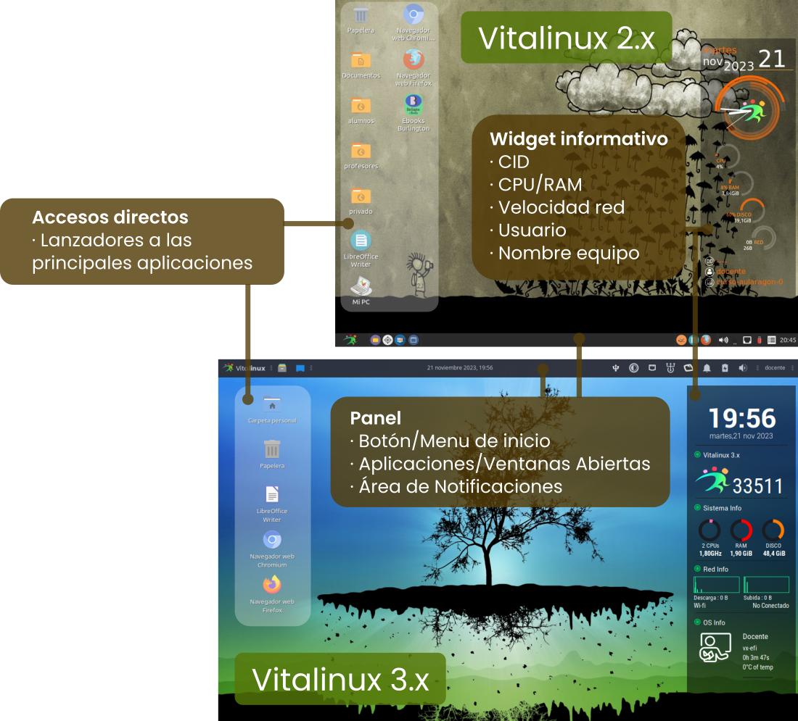
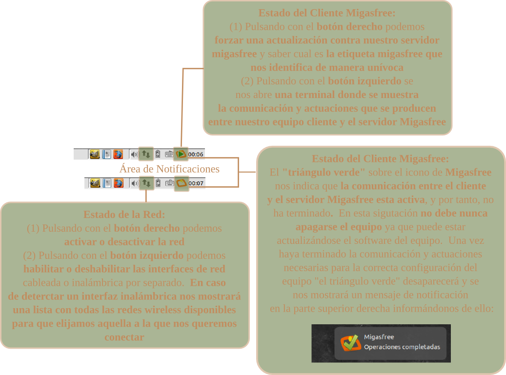

# Preferencias y Apariencia del Escritorio

## Partes del Escritorio Vitalinux {#PartesdelEscritorioVitalinux}

El **Entorno de Escritorio** de <tt>Vitalinux</tt> es lo que se observa en la pantalla o monitor de nuestro equipo al iniciar una sesión gráfica en el sistema, y se caracteriza por permanecer siempre de fondo.  Como podrá apreciarse una vez iniciado <tt>Vitalinux</tt>, este **Entorno de Escritorio** no difiere en gran medida de los Escritorios clásicos de Windows a los que todos estamos acostumbramos a trabajar.


Actualmente, el programa de software libre de la DGA da soporte a dos versiones de <b>Vitalinux</b>, la <b>2</b> basada en Ubuntu 18.04 LTS con <i>soporte oficial entre 2018-2023</b>, y la <b>3</b> basada en Ubuntu 22.04 LTS con <i>soporte oficial entre 2022-2027</b>. Aunque aparentemente en su manejo puedan resultar versiones parecidas, por debajo usan software diferente y se gestionan y administran de forma no igual. De cara a poder personalizar su entorno de Escritorio (<i>siguiente apartado</i>) es importante saber con que versión trabajamos.  La forma visual de conocer la versión de nuestro Vitalinux es observar el Widget informativo de su Escritorio, ya que como puede apreciarse en la imagen anterior no son iguales.


En concreto, dentro del **Escritorio** pueden diferenciarse las siguientes partes importantes:

*  **Wallpaper** o imagen de fondo de Escritorio
*  **Accesos Directos** de Escritorio o también llamados **lanzadores de aplicaciones**
* **Panel Inferior/Superior** compuesto por:
    * **Menú de Inicio**: Clásico menú de Inicio desplegable desde el cual podremos acceder a prácticamente todos los lanzadores de aplicaciones existentes en el sistema Vitalinux.  Estos lanzadores de aplicaciones, como podrá apreciarse, están clasificados y organizados en submenús, entre los cuales destacan: **Educación** (*lanzadores de aplicaciones Educativas*), **Oficina** (*lanzadores de aplicaciones Ofimáticas*), **Internet** (*lanzadores de aplicaciones relacionadas con Internet*) o **Vitalinux** (*lanzadores a aplicaciones creadas por el equipo de desarrollo de Vitalinux*).
    * **Lanzadores de Aplicaciones** más habituales.  Encontraremos lanzadores para poder abrir el **explorador de archivos del sistema**, un buscador de archivos, el editor de imágenes Gimp, la editor Ofimático Libreoffice Writer o el navegador Web Firefox.
    * **Área de notificación de aplicaciones abiertas**.  Por cada aplicación que tengamos abierta, aparecerá acceso a ella (*mediante ALT + TABULADOR podemos navegar entre las aplicaciones abiertas, al igual que en Windows).*
    * **Área de notificaciones del Sistema**. En la parte derecha del panel inferior encontraremos un área desde la cual podremos comprobar el volumen del audio, la distribución del teclado, la carga de la batería (*en el caso de que sea un equipo portátil*), ... y el más importante, el estado de la comunicación con **Migasfree** (*una especie de rectángulo naranja con unas manchas amarillas, las cuales representan unas **migas***).

