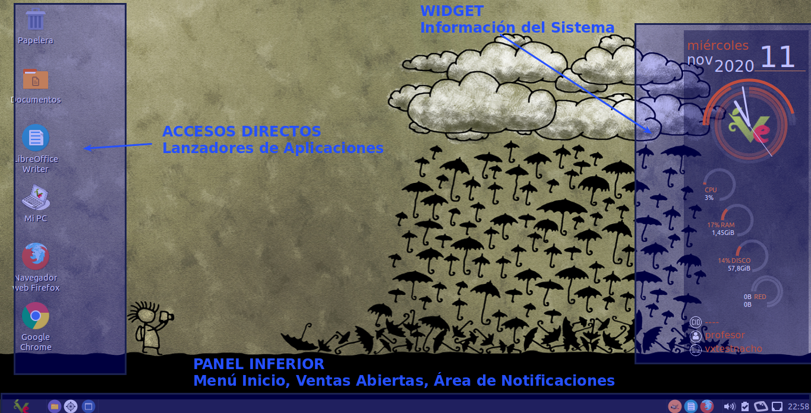
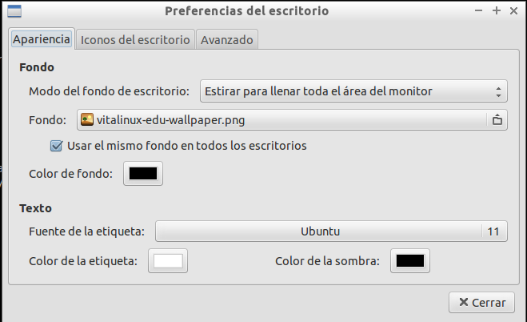
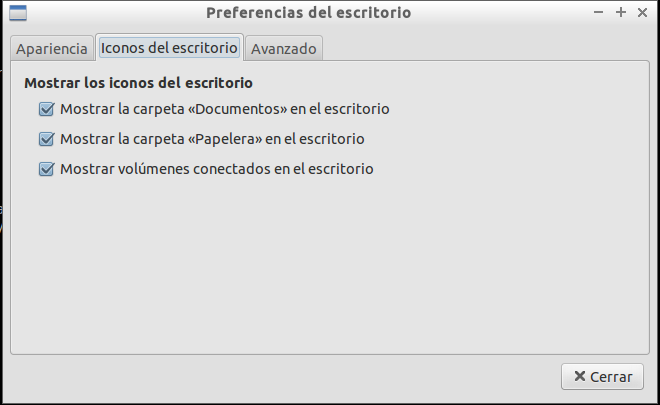
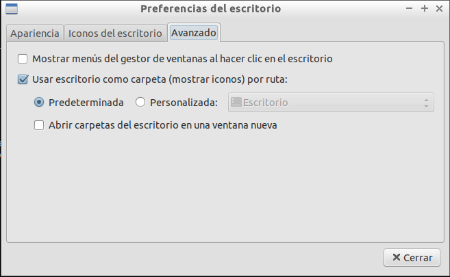

# Preferencias y Apariencia del Escritorio

## Contenido

- [1 Partes del Escritorio Vitalinux](#PartesdelEscritorioVitalinux)
- [2 Personalización del Escritorio Vitalinux](#PersonalizacionEscritorioVitalinux)
- [3 Personalización del Panel Inferior](#PersonalizarPanelInferior)
- [4 Apariencia de Vitalinux](#PersonalizarApariencia)

## Partes del Escritorio Vitalinux {#PartesdelEscritorioVitalinux}

El **Entorno de Escritorio** de <tt>Vitalinux</tt> es lo que se observa en la pantalla o monitor de nuestro equipo al iniciar una sesión gráfica en el sistema, y se caracteriza por permanecer siempre de fondo.  Como podrá apreciarse una vez iniciado <tt>Vitalinux</tt>, este **Entorno de Escritorio** no difiere en gran medida de los Escritorios clásicos de Windows a los que todos estamos acostumbramos a trabajar.

En concreto, dentro del **Escritorio** pueden diferenciarse las siguientes partes importantes:

*  **Wallpaper** o imagen de fondo de Escritorio
*  **Accesos Directos** de Escritorio o también llamados **lanzadores de aplicaciones**
* **Panel Inferior** compuesto por:
    * **Menú de Inicio**: Clásico menú de Inicio desplegable desde el cual podremos acceder a prácticamente todos los lanzadores de aplicaciones existentes en el sistema Vitalinux.  Estos lanzadores de aplicaciones, como podrá apreciarse, están clasificados y organizados en submenús, entre los cuales destacan: **Educación** (*lanzadores de aplicaciones Educativas*), **Oficina** (*lanzadores de aplicaciones Ofimáticas*), **Internet** (*lanzadores de aplicaciones relacionadas con Internet*) o **Vitalinux** (*lanzadores a aplicaciones creadas por el equipo de desarrollo de Vitalinux*).
    * **Lanzadores de Aplicaciones** más habituales.  Encontraremos lanzadores para poder abrir el **explorador de archivos del sistema**, un buscador de archivos, el editor de imágenes Gimp, la editor Ofimático Libreoffice Writer o el navegador Web Firefox.
    * **Área de notificación de aplicaciones abiertas**.  Por cada aplicación que tengamos abierta, aparecerá acceso a ella (*mediante ALT + TABULADOR podemos navegar entre las aplicaciones abiertas, al igual que en Windows).*
    * **Área de notificaciones del Sistema**. En la parte derecha del panel inferior encontraremos un área desde la cual podremos comprobar el volumen del audio, la distribución del teclado, la carga de la batería (*en el caso de que sea un equipo portátil*), ... y el más importante, el estado de la comunicación con **Migasfree** (*una especie de rectángulo naranja con unas manchas amarillas, las cuales representan unas **migas***).

## Personalización del Escritorio Vitalinux {#PersonalizacionEscritorioVitalinux}

Para poder personalizar el aspecto de nuestro Escritorio necesitamos editar las **Preferencias del Escritorio**: para ello pulsa **CONTROL+ESPACIO**, escribe ***preferencias del escritorio*** y confirma pulsando a la tecla **Intro**.  Podrás comprobar que desde la ventana que se te habrá abierto, en función de la pestaña que selecciones, tendrás la posibilidad de personalizar la imagen de fondo de Escritorio, el tipo y tamaño de la letra, los iconos de acceso a recursos (*papelera, carpeta Documentos, unidades de CD/DVD o USB que se conecten, etc.*), o el comportamiento del Escritorio.

## Personalización del Panel Inferior del Escritorio {#PersonalizarPanelInferior}

Otra opción de personalización del **Entorno de Escritorio** de <tt>Vitalinux</tt> es editar el **panel inferior**, o añadir uno nuevo para nuevas notificaciones.  Para editar el panel inferior será necesario pinchar con el botón derecho del ratón sobre el panel inferior (*sobre el área gris del panel*) y elegir _**Configuración del panel**_.  En el caso de que queramos añadir un panel nuevo seleccionaremos _**Crear un panel nuevo**_.  Entre las diferentes opciones de configuración del panel que encontrarás, destacaríamos la posibilidad de elegir <b>la posición del panel</b>, <b>su tamaño</b>, <b>su apariencia</b>, etc.


Personalización del Panel Inferior de Vitalinux



Opciones de Personalización del Panel Inferior de Vitalinux


## Personalización de la Apariencia y Comportamiento de las Ventanas {#PersonalizarApariencia}

Otro aspecto que nos puede interesar a la hora de personalizar nuestro Entorno en <tt>Vitalinux</tt> es la <b>Apariencia y Comportamiento de las Ventanas</b>.  En concreto, podemos personalizar el <b>tema de la apariencia</b> de las ventanas, sus <b>bordes</b>, el <b>puntero del ratón</b>, o el <b>tema de iconos</b>. Para configurar todo lo anterior deberemos teclear <b>CONTROL+ESPACIO</b> y escribir <b>personalizar apariencia</b>.


Personalización de la Apariencia del Entorno de Ventanas

