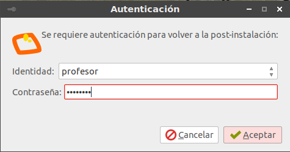
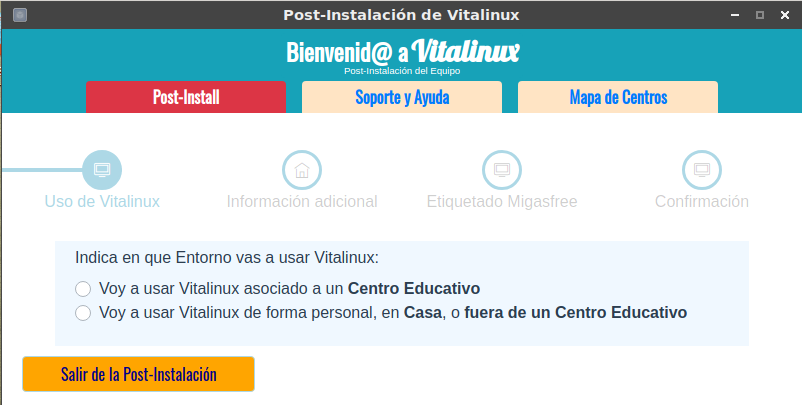

# Primer Contacto con Vitalinux


Las tareas que vamos a realizar a partir de ahora requieren de un <tt>Vitalinux</tt> instalado, ya sea en un equipo físico o de manera virtual (<i>tarea realizada previamente</i>).
 
En el caso de que hayas optado por usar un equipo que ya tiene instalado <tt>Vitalinux</tt>, será necesario volver a la <b>Post-Instalación</b> para poder conocer el asistente de configuración que aparece la primera vez que se inicia <tt>Vitalinux</tt> tras ser instalado. 
Para volver a la post-instalación <i>teclea CONTROL+ESPACIO y escribe <b>volver a la  post-instalación</b></i>, siendo necesario después reiniciar el equipo (<i>teclea CONTROL+ESPACIO y escribe <b>reiniciar equipo</b></i>).

 

<i>Img:</i> <tt>Se requieren usuario y contraseña de un usuario administrador para volver a la post-instalación</tt>

 

Podrás comprobar que para <b>volver a la post-instalación</b> será necesario introducir las credenciales (<i>usuario y contraseña</i>) de una usuario administrador con permisos/privilegios suficientes para ello.  En caso de que no hayan sido modificadas las passwords por defecto y sus privilegios, estos son los siguientes <b>usuarios/passwords</b> que hay por defecto en Vitalinux:

<ul>
<li><b>dga</b>: cuenta de usuario administrador.  Su contraseña por defecto es <b>careidga</b>.
</li>
<li><b>profesor/docente</b>: cuenta de usuario administrador.  Su contraseña por defecto es <b>careidga</b>.
</li>
<li><b>alumno/estudiante</b>: cuenta de usuario limitada.  Su contraseña por defecto es <b>alumno/estudiante</b>.
</li>
</ul>
 <b>¡Adelante! ¡Muchos Ánimos!</b>


Tras el primer arranque de <tt>Vitalinux</tt>, resultado de una nueva instalación o de una vuelta a la <b>Post-Instalación</b>, nos aparecerán las ventanas correspondientes a un **asistente de Post-Instalación** a las cuales deberemos contestar adecuadamente para una correcta configuración de <tt>Vitalinux</tt>.  Aclarar que algunas de estas cuestiones dependerán del lugar donde se le vaya a dar uso a Vitalinux: **Centro Educativo** o **casa**, siendo todas ellas configurables igualmente a posteriori como podremos observar en los dos siguientes apartados

<!--  -->

Además de la información que encontrarás en los subapartados siguientes de:
- [Post-Instalación en un Centro Educativo](Parte_3-Entorno_de_Escritorio/Parte_3-Asistente_post_instalacion_centro_educativo.md)
- [Post-Instalación en Entorno Casa](Parte_3-Entorno_de_Escritorio/Parte_3-Asistente_post_instalacion_entorno_casa.md)

...puedes encontrar información de todo éste proceso en la **Píldora formativa de Post-Instalación de Vitalinux**:

https://youtu.be/b7NRlR9JaXM
