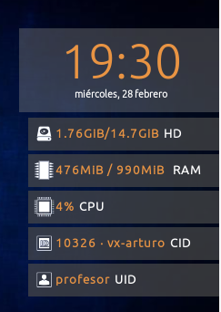

# Widgets del Escritorio


Un <b>Widget Conky</b> es un complemento de Escritorio que nos permite monitorizar e informar al usuario a través de un vistazo de diferentes aspectos de nuestro sistema operativo. <tt>Vitalinux</tt>, por defecto, dispone de uno <b>Widget Conky</b> en la parte derecha/central del Escritorio que informa al usuario de:
<ul>
<li>La <b>fecha y hora</b></li>
<li>La <b>cantidad de espacio libre en el disco duro en relación a su tamaño total</b></li>
<li>La <b>cantidad de memoria RAM ocupada en relación a la total</b></li>
<li>El <b>porcentaje de uso de la potencia de la CPU</b> del equipo</li>
<li>El <b>nombre del equipo</b> e <b>Identificador de Computador</b> (<i>El CID permite identificar al equipo de manera unívoca en relación al resto, pudiendo de esta forma actuar sobre él de manera remota y desatendida</i>)</li>
<li>El nombre del <b>usuario</b> que ha iniciado sesión gráfica en el sistema</li>



