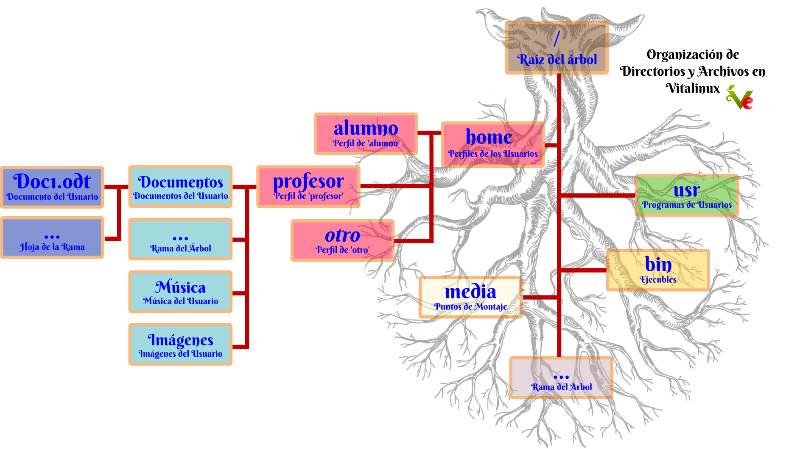

# ¿Cómo se Organizan los Directorios y Archivos?

## Contenido

- [1 Formas de Acceder a las Unidades de Almacenamiento](#FormasdeAccederalasUnidadesdeAlmacenamiento)
- [2 Sintaxis de las Rutas de Archivos](#SintaxisdelasRutasdeArchivos)
- [3 Organización básica del Sistema de Archivos de Vitalinux](#OrganizacionClasicaSistemadeArchivosdeVitalinux)

## Formas de Acceder a las Unidades de Almacenamiento {#FormasdeAccederalasUnidadesdeAlmacenamiento}

Una de las cuestiones más importantes que hay que tener en cuenta a la hora de familiarizarse con un nuevo sistema operativo es comprender **la forma que tiene de organizar sus directorios/carpetas y ficheros/archivos**.  Esta es una cuestión clave ya que cada sistema operativo se caracteriza por plantear una organización diferente, creyendo lógicamente, que esa es la forma más intuitiva y comprensible para que el usuario pueda interactuar con el sistema y así poder hacer uso de las aplicaciones que éste tenga instaladas y de la información que tenga almacena.
El ejemplo más conocido es **Microsoft Windows**, el cual se caracteriza por hacer uso de letras **C:\\, D:\\, E:\\, ...** para identificar a cada una de las unidades de almacenamiento accesibles por el sistema:

-  **C:\\** - Es la letra que normalmente Windows usa para que el usuario sepa en que partición del disco duro se ha instalado el sistema operativo de Microsoft.  De esta forma cuando el usuario quiere acceder a los directorios y archivos del sistema operativo o de las aplicaciones accederá a dicha unidad. Además si no se ha hecho nada más (seguir leyendo), desde aquí se accederá a sus datos de usuario (en Usuarios -> nombre_usuario para Windows 10.)
-  **D:\\** - En el caso de haber creado una partición en el disco diferenciada a la anterior para guardar los datos de los usuarios que hacen uso de Windows, ésta es la letra que es usada para apuntar a dicha partición.  En el caso de no haber creado dicha partición Windows usa esta letra para para apuntar a la **unidad de almacenamiento externo de CD/DVD**.
-  **E:\\** - Dependiendo de todo lo anterior, y de la cantidad de unidades lectoras de CD/DVD que se tengan en el equipo, esta letra puede corresponderse con la segunda lectora de CD/DVD del equipo, con un dispositivo de almacenamiento externo de tipo USB que se haya conectado, etc.
-  **F:\\, G:\\ ...** - Dependiendo de todo lo anterior, de como se haya particionado el disco, de la cantidad de unidades de almacenamiento externas ... estas letras pueden ser usadas por Microsoft Windows para apuntar/acceder a otras particiones del disco, otros dispositivos de almacenamiento externo de tipo USB que se hayan conectado, unidades de almacenamiento en red que se hayan configurado, etc.

Desde un punto de vista informático, haciendo un poco de abstracción, cada una de las letras anteriores hace referencia a una organización en forma de **árbol invertido de archivos y directorios**, donde **la raíz del árbol sería la letra asignada a la unidad de almacenamiento**, cada uno de **los directorios y subdirectorios que hubiera se corresponderían con las diferentes ramas de ese árbol**, y cada uno de **los archivos que hubiera dentro de cada uno de esos directorios serían las hojas de cada una de esas ramas**.

Por todo lo anterior, se dice que en Windows existen tantos árboles de directorios y archivos como unidades de almacenaminento (letras) haya.  Linux difiere drásticamente en este sentido y **hace uso de un único árbol invertido de directorios y archivos** de donde van colgando nuevas ramas y hojas a medida que el sistema de archivos crece: **porque se crean nuevos directorios y archivos**, **porque se ha conectado un nuevo dispositivo de almacenamiento externo de tipo USB**, **porque se ha configurado una unidad de almacenamiento en red**, etc.


Organización den forma de Árbol invertido de Windows


Por tanto, la clave para comprender y entender como Vitalinux organiza los directorios y archivos es reconocer donde esta la raíz del árbol y como se distribuyen sus ramas.


A diferencia de Windows, las distribuciones de GNU/Linux, y entre ellas <tt>Vitalinux</tt>, no hace uso de letras para apuntar/referenciar/acceder a las unidades de almacenamiento del equipo (*discos duros, unidades de almacenamiento USB, unidades de almacenamiento CD/DVD, unidades de almacenamiento en red, etc.*).
  

<i>Img:</i> <tt>Vitalinux organiza los directorios y archivos en una estructura de un único árbol invertido</tt>

 
<b>Linux/Vitalinux</b> hace uso de <b>un único árbol invertido de directorios y archivos</b> cuya raíz es <b>/</b> y de la cual cuelgan el resto de directorios del sistema operativo.  Por esta razón, al haber tan sólo un árbol de directorios, Vitalinux no necesita diferenciar entre varios árboles como ocurre en Windows, y por tanto no requiere del uso de letras identificativas (C:\\, D:\\, etc.).

Otra diferencia importante entre <b>Windows</b> y <b>Linux</b> es que para hacer referencia a uno de los archivos u hojas de las hojas del árbol de directorios del sistema operativo, partiendo de la ráiz, Windows hace uso de la <b>barra invertida</b> <b>\</b> (<i>ALTGR + tecla de superíndices</i>) para ir separando cada una de las ramas del árbol, mientras que <b>Linux</b> hace uso de la <b>barra normal /</b> (<i>MAYUSCULAS + 7</i>).

A modo de ejemplo, mientra la ruta de un archivo en Windows podría tener el siguiente aspecto <b>C:\Users\profesor\Mis Imágenes\imagen1.png</b>, en Linux sería <b>/home/profesor/Imágenes/imagen1.png</b>.


Además de lo anterior, cada sistema operativo se caracteriza por organizar los programas y datos de los usuarios de una forma particular.  Es decir, al igual que cada uno de nosotros organizaría de forma diferente en una estantería que tuviéramos un conjunto de libros de diferentes temáticas que nos diese, cada sistema operativo **organiza sus libros** (*archivos*) como él cree que estarían mejor organizados.  Por ejemplo, Windows se caracteriza por separar en dos directorios dentro de la unidad **C:\\** lo que son programas de usuario y los datos o perfiles de los usuarios, pero otros sistemas operativos consideran que esa no es una buena estrategia de organización y que sería necesario crear más directorios para su mejor organización.  A continuación se detallará someramente como se organiza todo lo anterior en Linux.

## Sintaxis de las Rutas de Archivos {#SintaxisdelasRutasdeArchivos}

Todo directorio y archivo en Vitalinux tiene una ruta identificativa.  Esta pueda consultarse a medida que navegamos por el sistema de archivos de Vitalinux mediante su **Explorador de Archivos**.  Tal como se muestra en la siguiente figura, si abrimos el **Explorador de Archivos** (*Tecla Windows + E*) podremos observar en la barra de direcciones la **ruta absoluta** de donde nos encontramos dentro del **árbol de directorios y archivos de Vitalinux**.


El Explorador de Archivos nos indica en todo momento donde nos encontramos dentro del árbol de directorios y archivos


La **ruta absoluta** de un directorio o archivo se caracteriza por comenzar por **la ráiz /** siguiéndole a continuación cada una de las ramas o directorios separados por la **barra normal /**.  Por ejemplo, asumiendo que colgando de la raíz **/** hay directorio que se llama **home**, y que dentro de este hay un subdirectorio que se llama **profesor**, y que a su vez tiene dentro un subdirectorio llamado **Documentos**, el cual contiene un archivo llamado **doc1.odt**, su ruta absoluta sería: **/home/profesor/Documentos/doc1.odt**.

## Organización básica del Sistema de Archivos de Vitalinux {#OrganizacionClasicaSistemadeArchivosdeVitalinux}

A continuación se va a explicar someramente algunos de los directorios que cuelgan de la raíz del sistema de archivos de Vitalinux (*no se describirán todos ya que un usuario no administrador no tiene porque saberlo más en detalle*):

| Directorio | Función |
| :---: | :--- |
| **/home** | Directorio por defecto donde se almacenan los perfiles de los usuarios. Cuando se crea un nuevo usuario en el sistema se le asigna un directorio HOME, **/home/&lt;nombre-usuario&gt;**, sobre el cual tiene todos los permisos de lectura y escritura.  Se denomina **perfil de usuario** a todo el conjunto de carpetas y ficheros que pertenecen a un usuario.  En concreto, de cada directorio asociado a un usuario (*por ejemplo, **/home/profesor***) contendrá un conjunto de subdirectorios pensados para que cada usuario organice sus datos: **Escritorio, Documentos, Imágenes, Música, Vídeos, etc.** |
| **/media** | Directorio que contiene los directorios o puntos de montaje de los dispositivos de almacenamiento externos que se conectan al sistema |
| **/bin /sbin /usr/bin /usr/sbin** | Directorios que contienen los ejecutables del sistema |


Directorios más importantes de un Sistema Operativo Linux


