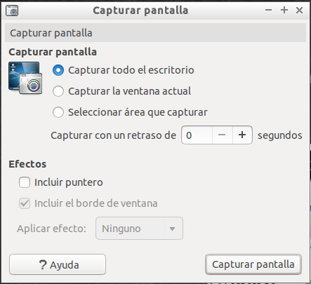
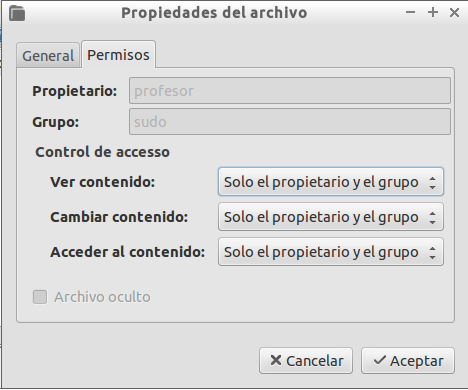

{% notificacion_task title='Organización de Directorios y Archivos, y permisos sobre estos',
numexer='4.1',
req='Es necesario haber leído todo lo referente a Organización del Sistema de Archivos en Vitalinux, propietarios y permisos',
formatoentrega='En un documento ofimático escribe y pega las fotos o capturas de pantalla necesarias para justificar todo lo que se te pide a continuación. Si es posible expórtalo a <b>formato PDF</b> para garantizar su portabilidad, y adjúntalo como respuesta a la tarea solicitada. Por tanto, envía al tutor un único archivo <b>.pdf</b> que se nombrará siguiendo las siguientes pautas: <b>apellido1_apellido2_nombre_TareaX.pdf</b>.
 
Asegúrate que el nombre no contenga la letra ñ, tildes ni caracteres especiales extraños. Así por ejemplo la alumna <b>Begoña Sánchez Mañas</b>, debería nombrar esta tarea como: <b>sanchez_manas_begona_Tarea4.2.pdf</b>' %}

Con la finalidad de familiarizarnos con la <b>Organización del Sistema de Archivos en Vitalinux</b>, los <b>propietarios y permisos</b>, a continuación se propone lo siguiente:
  
<ol>
<li>
Comenzaremos aprendiendo a hacer capturas de pantalla y acceder al directorio donde se almacenan escribiendo la ruta <b>a mano</b> (<i>así nos familiarizaremos con su sintaxis</i>).  Para ello:
</li>
<ol type="A">
<li>
Supondremos que queremos hacer una captura de pantalla de una aplicación con la que estemos trabajando.  A modo de ejemplo, abre el navegador Web <b>firefox</b> (<i><b>CONTROL+ESPACIO</b> y escribe <b>firefox</b></i>), y lanza a continuación la herramenta existente por defecto para hacer capturas de pantalla en <tt>Vitalinux</tt> (<i><b>CONTROL+ESPACIO</b> y escribes <b>Capturar pantalla</b></i>). 
</li>

 

<i>Img:</i> <tt>Personalización de la captura de pantalla</tt>

 

<li>
A continuación elige la opción de <b>Seleccionar área que capturar</b> y captura un trozo de la ventana del navegador y guárdala con el nombre <b>captura-curso.png</b>.  Por defecto, las capturas, sino se indica lo contrario, se almacenarán en el subdirectorio <b>Imágenes</b> que todo usuario tiene dentro de su perfil (<i>p.e. /home/aularagon/Imágenes</i>).  Para acceder a la foto abre el explorador de archivos, <b>Tecla Windows + E</b>, y escribe <b>a mano</b> la ruta siguiente: <b>~/Imágenes</b> (<i>el símbolo <b>~</b> podrás escribirlo tecleando <b>ALTGR + Ñ</b></i>).
 
<b>¡¡Compruébalo!!</b> Advertirás que el símbolo <b>~</b> hace referencia al directorio <b>HOME</b> o de <b>perfil del usuario</b>.  Prueba a abrir la captura de imagen que allí encontrarás pinchando sobre ella. Advierte también que Linux/Vitalinux es sensible a las mayúsculas y minúsculas, además de los posibles acentos que haya (<i>no es lo mismo <b>Imágenes</b> que <b>imágenes</b> o <b>Imagenes</b></i>).

</li>
</ol>
 
<li>
Con la finalidad de <b>comprender el uso de permisos</b> en <tt>Vitalinux</tt> realiza las siguientes acciones:
<ol type="A">

<li>Haciendo uso de la herramienta de gestión de usuarios que viste en la tarea anterior (<i><b>CONTROL + ESPACIO</b> y escribes <b>Usuarios y Grupos</b></i>), crea dos nuevas cuestas de usuario: 1) <b>profesor1</b> y 2) <b>profesor2</b> con contraseña para ambos <b>Passw0rd</b> (<i>la <b>o</b> es un cero</i>)</li>
<li><b>Cierra sesión</b> (<i>CONTROL + ESPACIO y escribe <b>Cerrar Sesión</b></i>) e inicia sesión como usuario <b>profesor1</b> (<i>password <b>Passw0rd</b></i>).</li>
<li>Abre el explorador de archivos (<i>Tecla Windows + E</i>) y crea dos directorios en <b>/tmp/</b> llamados <b>carpeta1</b> y <b>carpeta2</b>.  A su vez, dentro de cada uno de esos directorios crea un archivo llamado <b>misdatos.txt</b>. Los vamos a crear en el directorio /tmp/ ya que en los directorios personales de los usuarios, solo puede entrar cada usuario</li>
<li>Pincha con el botón derecho del ratón sobre la <b>carpeta2</b> y en <b>Propiedades/permisos</b> restringe los permisos para que solamente haya acceso a el propietario y grupo de propietarios.</li>

 

<i>Img:</i> <tt>Desde Propiedades/permisos podemos gestionar los permisos sobre archivos y directorios</tt>

 

<li>Por último, cierra la sesión del usuario <b>profesor1</b> e inicia sesión como <b>profesor2</b> (<i>password <b>Passw0rd</b></i>). NO REINICIES, pues perderías lo que has creado en el directorio /tmp/.  Abre como <b>profesor2</b> el explorador de archivos, navega hasta <b>/tmp/</b> y comprueba que <b>sí</b> puedes ver el contenido de la <b>carpeta1</b> pero no modificarlo, pero en el caso de la <b>carpeta2</b> ni siquiera se puede acceder.</li>
</ol>

</ol>

