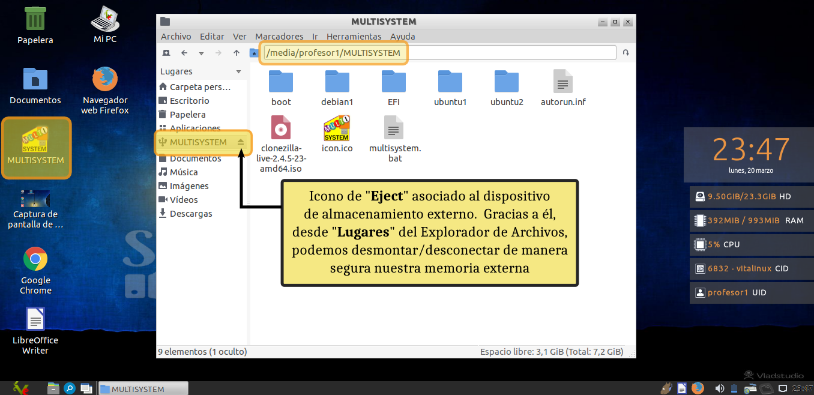

{% notificacion_task title='Características del Explorador de Archivos PCManFM y Gestión de Unidades de Almacenamiento Externas USB',
numexer='4.2',
req='Es necesario haber leído todo lo referente a el Explorador de Archivos de Vitalinux y la gestión de los Dispositivos de Almacenamiento',
formatoentrega='En un documento ofimático escribe y pega las fotos o capturas de pantalla necesarias para justificar todo lo que se te pide a continuación. Si es posible expórtalo a <b>formato PDF</b> para garantizar su portabilidad, y adjúntalo como respuesta a la tarea solicitada. Por tanto, envía al tutor un único archivo <b>.pdf</b> que se nombrará siguiendo las siguientes pautas: <b>apellido1_apellido2_nombre_TareaX.pdf</b>.
 
Asegúrate que el nombre no contenga la letra ñ, tildes ni caracteres especiales extraños. Así por ejemplo la alumna <b>Begoña Sánchez Mañas</b>, debería nombrar esta tarea como: <b>sanchez_manas_begona_Tarea4.2.pdf</b>' %}

Con la finalidad de familiarizarnos con las características y funcionalidades del <b>Explorador de Archivos</b> de <tt>Vitalinux</tt> <b>pcmanfm</b>, y la <b>gestión de unidades de almacenamiento externas</b> (<i>p.e. memoria USB</i>) a continuación se proponen los siguientes casos prácticos:

<ol>
<li>Lanza el <b>explorador de archivos</b> de Vitalinux <b>pcmanfm</b> haciendo uso del lanzador de aplicaciones <b>synapse</b>: <b>CONTROL + ESPACIO</b> y escribe <b>pcmanfm</b>, después pulsa la tecla <b>Intro</b> para confirmar</li>
<li>Lanza el <b>explorador de archivos</b> de Vitalinux <b>pcmanfm</b> haciendo uso del atajo de teclado <b>Tecla de Windows + E</b></li>
<li>Comprueba a través del <b>Widget</b> del Escritorio el incremento de consumo de los recursos del sistema: cantidad de memoria <b>RAM</b> y porcentaje de <b>CPU</b>.  Advierte que se trata de un explorador muy ligero</li>
<li>Escribe en la barra de direcciones del <b>Explorador de Archivos pcmanfm</b> la siguiente ruta absoluta: <b>/usr/share/vitalinux/iconos</b>.  Podrás comprobar que es un directorio que contiene un montón de imágenes PNG que se usan en las aplicaciones que se crean en <b>Vitalinux</b>.  Comprueba como cambia el modo de vista de <b>pcmanfm</b> al pulsar las combinaciones de teclado <b>"CONTROL + 1"</b>, <b>"CONTROL + 2"</b>, <b>"CONTROL + 3"</b> o <b>"CONTROL + 4"</b></li>
<li><b>pcmanfm</b> presenta la característica de <b>panel doble</b> (<i>pulsando <b>F3</b></i>)  con la finalidad de facilitar la copia y movimiento de archivos y directorios de una ubicación a otra. Para comprobar su funcionamiento copiaremos varias imágenes del directorio <b>Imágenes</b> a <b>Documentos</b>.  Para ello, haciendo uso de la aplicación de capturas de pantalla (*Tecla IMPRIMIR PANTALLA*) realiza varias capturas de pantalla dejándolas en la carpeta de destino por defecto <b>Imágenes</b> con el nombre que les quieras dar.  Después, abre en una pestaña del <b>Explorador de Archivos pcmanfm</b> el directorio <b>Imágenes</b> que contiene dichas capturas y pulsa <b>F3</b> para crear un panel doble.  Para terminar, en el panel de la derecha sitúate en el directorio <b>Documentos</b> y mueve las imágenes de un panel a otro</li>
<li>Crea un subdirectorio llamado <b>curso-aularagon</b> con algún archivo en su interior (<i>llámalos como quieras</i>), dentro del directorio <b>Documentos</b> ubicado en tu perfil de usuario (<i>estando dentro del directorio Documentos tan sólo tendrás que pinchar con el botón derecho del ratón y seleccionar la opción <b>crear</b></i>).  A continuación crea un marcador que apunte a dicho directorio llamado <b>Curso</b> (<i>CONTROL + D</i>). Comprueba que se ha creado el <b>marcador</b> en la parte inferior de la columna de la izquierda del <b>pcmanfm</b></li>
<li>De forma similar a lo anterior, crea otro subdirectorio llamado <b>musica-rock</b> con algún archivo en su interior (*llámalos como quieras</i>), dentro del directorio <b>Música</b> ubicado en tu perfil de usuario.  A continuación crea un marcador que apunte a dicho directorio llamado <b>Mi Rock</b> (<i>CONTROL + D</i>). Comprueba que se ha creado el <b>marcador</b> en la parte inferior de la columna de la izquierda del <b>pcmanfm</b></li>
<li>Abre tres nuevas pestañas en el explorador de archivos pulsando la combinación <b>CONTROL + T</b>, y abre en cada una de esas tres pestañas lo siguiente: el marcador <b>Curso</b>, el directorio <b>Imágenes</b> de tu perfil de usuario y el directorio <b>/usr/share/vitalinux/iconos</b>.  A continuación selecciona todos los iconos que hay en <b>/usr/share/vitalinux/iconos</b> mediante la combinación de teclas <b>CONTROL+A</b>, cópialos mediante la combinación <b>CONTROL+C</b> y pégalos en <b>Imágenes</b> mediante la combinación <b>CONTROL+V</b></li>
<li>Manteniendo abiertas las pestañas anteriores, selecciona todas las imágenes que acabas de copiar en el directorio <b>Imágenes</b>, <b>CONTROL+A</b> y arrástralas hasta la pestaña asociada al marcador <b>Curso</b>.  Comprueba que esto mueve los archivos de un directorio a otro.   Por último, comprueba que si intentas crear un directorio llamado <b>nuevo</b> dentro de </b>/usr/share/vitalinux</b> no podrás por no tener permisos/privilegios suficientes para ello.  En cambio, si te sitúas en <b>/usr/share</b>, pinchas con el botón derecho del ratón sobre el subdirectorio <b>vitalinux</b> y seleccionas la <b>Acción</b> <b>Abrir como Root</b> podrás comprobar que se te abrirá una nueva ventana sobre la cual ya tendrás permisos suficientes para crear el directorio <b>nuevo</b>. </i>¡¡Compruébalo!!!
</li>
<li>
Pincha una memoria USB y comprueba que se crean el <b>acceso directo en el Escritorio</b> y el <b>marcador en el Explorador de Archivos pcmanfm</b>
</li>
 

<i>Img:</i> <tt>Desmontaje de la memoria externa USB</tt>

 
<li>
Abre la unidad de almacenamiento y guarda alguna captura de pantalla
</li>
<li>
Abre una nueva pestaña en el <b>pcmanfm</b> (CONTROL + T) y escribe </b>a mano</b> en la barra de direcciones del <i>Explorador de Archivos PCmanFM</i> </b>/media</b>.  Comprueba que dentro de </b>/media</b> existe un subdirectorio con el mismo nombre que el usuario que ha iniciado sesión (<i>el usuario con el que se ha iniciado sesión aparece en el <b>Widget</b> del Escritorio</i>).  Por ejemplo, si el usuario que ha iniciado sesión es <b>profesor1</b>, aparecerá un directorio llamado </b>/media/profesor1</b>, y que a su vez dentro de ese directorio existe otro con el nombre de la etiqueta de la memoria USB (<i>p.e. si la memoria se llama <b>MULTISYSTEM</b>: </b>/media/profesor1/MULTISYSTEM</b></i>)
</li>
<li>
Desmonta de manera segura la unidad de almacenamiento.  Recuerda que para ello dispones de dos posibles opciones desde el explorador de archivos:
</li>
<ul>
<li>
Pulsar sobre el Icono de "<b>Eject</b>" asociado al dispositivo de almacenamiento externo que se muestra en "<b>Lugares</b>" del Explorador de Archivos de Vitalinux
</li>
<li>
Pinchar con el botón derecho del ratón sobre el acceso directo anterior elegir la opción "<b>Expulsar medio extraíbe</b>". ¿Qué significa la opción Desmontar? Recuerda que lo vimos antes en Dispositivos de almacenamiento: Desmontar permite no dejar accesible el pen desde el equipo, pero lo podríamos reconectar volviendo a clickar sobre el icono. Si expulsamos y queremos tener accesible el pen más tarde, deberemos sacarlo físicamente y volver a insertarlo.
</li>
</ul>

 

<i>Img:</i> <tt>Quitar USB de forma segura</tt>

 

<li>
Busca una memoria USB que puedas formatear (OJO: se borrará todo su contenido) y formatea la memoria USB con <b>sistema de archivos NTFS</b> (<i>sistema de archivos de Microsoft Windows</i>) y ponle de nombre <b>MIPEN</b>.
</li>
<li>
Comprueba al montar de nuevo la memoria USB que ésta se muestra con el nombre que has indicado (<i>p.e. en el Escritorio o explorando en /media</i>)
</li>

</ol>




En el caso de que estés trabajando con <tt>Vitalinux</tt> sobre una máquina virtual de VirtualBox y tengas problemas para transferirle a la máquina virtual el Pendrive/Memoria USB que has pinchado al equipo físico, te sugerimos que veas la primera parte del siguiente videotutorial: ¿Cómo <b>transferir a la máquina virtual un pendrive o memoria USB</b> conectada a la máquina física?


https://youtu.be/oj92vB5mFAs

