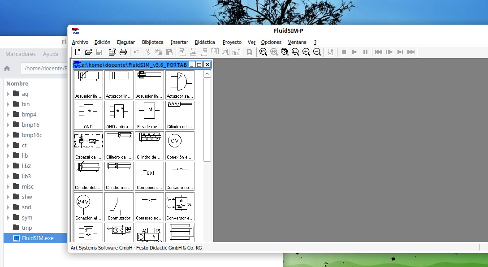

# Aplicaciones Windows sobre Vitalinux


Linux posibilita la instalación de software de Windows mediante el programa <b>Wine</b> o <b>WineHQ</b>.  De esta forma, el usuario que no encuentre un software alternativo en Linux al que solía usar en Windows podrá instalarlo.


## Ejecución de Aplicaciones Windows sobre Linux/Vitalinux {#EjecucionAppWindowsVitalinux}

Con la finalidad de suavizar al usuario final el paso de **Microsoft Windows** a **Linux**, además de crear **Interfaces de Usuario** y **Entornos de Escritorio** muy similares a los que existen en Windows, también se ha desarrollado un sofware libre llamado **WinE** que permite la instalación y ejecución de programas creados para Windows en Linux/Vitalinux.

A modo de ejemplo, mediante **WinE** podríamos instalar en Linux/Vitalinux las siguientes aplicaciones:

-  **Microsoft Office**.  Podría instalarse el paquete ofimático **Microsoft Office** en Vitalinux a través de Wine, pero no hay que olvidar que este software es privativo, y que por tanto requiere de una licencia en vigor.  En caso contrario estaríamos infringiendo la ley (*es ilegal instalar software privativo de manera pirata sin la licencia correspondiente*), podría tener consecuencias legales y es algo inpropio en un **Centro Educativo**.  A priori, este software no se preinstala en Vitalinux a través de Wine al carecerse de licencias en vigor y sobre todo por que existe un software equivalente: **LibreOffice**
-  **PhotoShop**.  Podría comentarse lo mismo que en el caso anterior.  A priori, este software no se preinstala en Vitalinux a través de Wine al carecerse de licencias en vigor, y por que existe un software equivalente: **Gimp**
-  **Aplicaciones específicas**. Aplicaciones muy concretas que solo se encuentran para sistemas MS Windows. Algunas de ellas, de Tecnología, podrían ser Fluidsim o Crocodile Clips.  

Para saber más sobre Wine se recomienda dirigirse a los siguientes enlaces:

-  [Sitio Oficial de Wine](http://www.winehq.org)
-  [Wiki en Español de Wine](https://es.wikipedia.org/wiki/Wine)

Podemos obtener mas información sobre la instalación de aplicaciones windows en vitalinux en la **píldora formativa de Gestión de Software**
https://youtu.be/W0hI9uRcCo8?t=629
