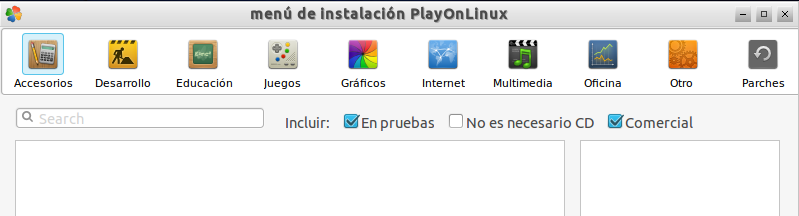

{% notificacion_task title='Gestión de Software en Vitalinux',
numexer='5.1',
req='Es necesario haber leído todo lo referente a gestión del software en Vitalinux mediante <a href="./Parte_5-Gestor_de_software_synaptic.html">Synaptic</a>, <a href="./Parte_5-Aplicaciones_windows_sobre_vitalinux.html">Wine y PlayOnLinux</a>',
formatoentrega='En un documento ofimático escribe y pega las fotos o capturas de pantalla necesarias para justificar todo lo que se te pide a continuación. Si es posible expórtalo a <b>formato PDF</b> para garantizar su portabilidad, y adjúntalo como respuesta a la tarea solicitada. Por tanto, envía al tutor un único archivo <b>.pdf</b> que se nombrará siguiendo las siguientes pautas: <b>apellido1_apellido2_nombre_TareaX.pdf</b>.
 
Asegúrate que el nombre no contenga la letra ñ, tildes ni caracteres especiales extraños. Así por ejemplo la alumna <b>Begoña Sánchez Mañas</b>, debería nombrar esta tarea como: <b>sanchez_manas_begona_Tarea5.1.pdf</b>' %}

En la presente tarea repasaremos como <b>instalar y desinstalar aplicaciones</b> nativas de Linux y Windows (si fuera necesario...pero hay que considerar alternativas libres siempre!) mediante <b>Synaptic</b> y/o <b>Wine</b>.  Para ello seguiremos los siguientes pasos:
  
<ol>

<li>
<b>Synaptic</b> es una fabulosa aplicación que permite gestionar el software (<i>instalar y desinstalar aplicaciones</i>). Recuerda que para poder instalar software, como éste se descarga de los repositorios oficiales, es necesario tener conexión a Internet.  A modo de ejemplo, en la presente tarea se propone instalar una de las mejores aplicaciones que existen para la reproducción de música, <b>Amarok</b> (<i>si lo presiferes puedes probar a instalar en lugar de Amarok el editor de audio <b>audacity</b>, la pizarra virtual <b>openboard/open-sankore</b>, o el programa de maquetación <b>scribus</b></i>).  Para ello:
</li>

<ul>
<li>
Asegurate de que tu equipo Vitalinux ha terminado la comunicación con Migasfree (<i>tiene que desaparecer el <b>triángulo verde</b> que aparece tras iniciar sesión en Vitalinux sobre el símbolo de <b>Migasfree</b> que encontrarás en la parte derecha de la barra/panel inferior del Entorno de Escritorio de Vitalinux</i>)
</li>
<li>
Accede a <b>Synaptic</b> (<i><b>CONTROL+ESPACIO</b> y tecleas <b>synaptic</b></i>)
</li>
<li>
Pulsa sobre el botón <b>"Recargar"</b> de <b>Synaptic</b> para actualizar el software disponible en los repositorios u origenes de software configurados en Vitalinux
</li>
<li>
Busca <b>amarok</b> a través de <b>Synaptic</b>
</li>
<li>
Una vez localizado pincha con el botón derecho del ratón sobre él y selecciona la opción <b>instalar</b>
</li>
<li>
Por último pincha sobre el botón <b>Aplicar</b> para que se apliquen los <b>cambios solicitados a Synaptic</b>, y cierralo.
</li>
<li>
Para terminar, abre <b>Amarok</b> (<i><b>CONTROL+ESPACIO</b> y tecleas <b>amarok</b></i>) y prueba a reproducir algún disco de música MP3 que tengas.  ¿Qué te parece este software libre?  Si te familiarizas un poco con <b>Amarok</b> podrás comprobar que es uno de los mejores reproductores de música que existen.
</li>
<li>
Con el fin de repasar el <i><b>Cómo desinstalar aplicaciones</b></i>, vuelve a abrir <b>synaptic</b> y desinstala la aplicación anterior <b>amarok</b>.  Para ello buscala mediante su buscador, pincha con el botón derecho sobre ella y elige la opción de <b>desintalar</b>.  Al igual que al instalar, será necesario darle al botón <b>Aplicar</b> para que surta efecto la desintalación.
</li>
<li>
Como en ocasiones <i>más vale un buen videotutorial que mil palabras</i> a continuación se sugiere ver el siguiente vídeo relacionado con este asunto (<i>es una parte del videotutorial completo: <a href="https://www.youtube.com/watch?v=8tBh8yz1FHY%7C">Gestión del Software en Vitalinux</a><i>):
 

<iframe width="560" height="315" src="https://www.youtube.com/embed/1nni5ikg11Q" frameborder="0" allow="autoplay; encrypted-media" allowfullscreen></iframe>

</li>
</ul>
  
<li>
Tal como se ha explicado en la parte teórica <b>WinE</b> surge con la finalidad de suavizar al usuario final el paso de <b>Microsoft Windows</b> a <b>Linux</b> permitiéndonos la instalación y ejecución de programas creados para Windows en Linux/Vitalinux. De esta forma, en caso de no encontrar ninguna alternativa en software libre a las aplicaciones privativas que usamos en Windows (<i>siempre es aconsejable buscar software alternativo de código libre/abierto</i>), gracias a Wine, vamos poder instalar y trabajar con nuestra aplicación Windows. A modo de ejemplo, como tarea se propone instalar un programa de Windows en Vitalinux:
</li>
<ol type="A">
<li>
Localiza algún instalador de alguna aplicación Windows (*.exe) con la que estés muy familiarizado, de la que no encuentras una alternativa libre en Vitalinux, y que por tanto, que te gustaría contar con ella en Vitalinux. En caso de no disponer de ninguna te proponemos a modo de ejemplo <a href="http://migasfree.educa.aragon.es/cosas-centros/windows-software/sebran/sebran.exe">Sebran</a> (<i>12 juegos infantiles para la iniciación a lectoescritura y matemáticas</i>), <a href="http://migasfree.educa.aragon.es/cosas-centros/windows-software/tinycad/TinyCAD_3.00.02.exe">TinyCAD</a> (<i>diagramas de circuitos electrónicos</i>), <a href="http://migasfree.educa.aragon.es/cosas-centros/windows-software/CROCCLIP/CROCCLIP.EXE">crocodile</a> (<i>simulación circuitos electrónicos</i>), <a href="http://migasfree.educa.aragon.es/cosas-centros/windows-software/relatran/setup.exe">relatran</a> (<i>simulador de mecanismos</i>) o <a href="http://migasfree.educa.aragon.es/cosas-centros/windows-software/convertall/convertall-0.8.0-install-user.exe">convertall</a> (<i>conversor entre magnitudes físicas</i>).
</li>
<li>
Pincha con el botón derecho del ratón sobre el archivo instalador anterior e indica que quieres abrirlo con <b>WinE</b> (<i>Cargador de programas de Windows</i>) o lo puedes lanzar también con doble-click. Comprobarás que a continuación se configurará Wine (acepta si te pide instalar complementos o librerías adicionales) y comenzará su instalación al estilo Windows (<i>siguiente, siguiente, siguiente, ...</i>). Es decir, instala la aplicación como si estuvieras en Windows.
</li>
<li>
Abre la aplicación como cualquier otra. Por ejemplo, <b>CONTROL+ESPACIO</b> y teclear el nombre de la aplicación (<i>sebran, crocodile, tinyCAD, etc.</i>). Es posibles que los iconos no se hayan actualizado o no aparezcan en el momento y necesite reiniciarse el equipo o reinciar la sesión gráfica. Comprueba el correcto funcionamiento de la aplicación Windows sobre Vitalinux.
</li>
<li>
Como cualquier otra aplicación de Vitalinux, para cerrarla puedes teclear: <b>ALT+F4</b>
</li>
<li>
Abre el <b>Explorador de Archivos</b> (Tecla Windows+E), y asegurandote que estás en el <b>HOME</b> del usuario (<i>p.e. /home/dga, /home/profesor, /home/aularagon, etc.</i>) y pulsa la combinación <b>CONTROL+H</b>. Podrás comprobar que de repente aparecerán varios <b>directorios y archivos ocultos</b> (<i>en Linux todo archivo o directorio cuyo nombre empieza por punto, ".", es un elemento oculto que sólo se mostrará si se pulsa la combinación de teclas <b>CONTROL+H</b>. Volviendoa a pulsar <b>CONTROL+H</b> se volverán a ocultar</i>)

  

<i>Img:</i> <tt>Toda la configuración y programas instalados sobre WinE se localizan en un directorio oculto dentro del HOME del usuario llamado .WinE</tt>

 
</li>
<li>
Entre los <b>directorios ocultos</b> verás uno que se llama </b>.wine</b>. En este directorio se encuentra toda la configuración y recreación de un sistema Windows y todos sus programas instalados a través de wine. Entra en él y comprueba que aparece la estructura de un disco "<b>C:/</b>" al estilo Windows. Si se eliminara este directorio oculto </b>.wine</b>, estaríamos eliminando todo el sistema de archivos Windows recreado en Linux como las aplicaciones Windows instaladas.
</li>
<li>
Comprueba que puedes desinstalar la aplicación usando el propio desinstalador de la aplicación. Para ello, teclea "<b>CONTROL+ESPACIO</b>" y escribiendo "<b>Desinstalar Sebran</b>" (si habéis instalado Sebran) y nos aparecerá una ventana o interfaz que nos permitirá desinstalar el software instalado.
</li>
<li>
Como en ocasiones <i>más vale un buen videotutorial que mil palabras</i> a continuación se sugiere ver el siguiente vídeo relacionado con este asunto:

 

<iframe width='560' height='315' src='https://www.youtube.com/embed/_e9FvVcEXIk' frameborder='0' allow='autoplay; encrypted-media' allowfullscreen></iframe>

</li>
</ol>
</ol>

  
Llegado este punto habrás advertido que <b>WinE</b> nos permite la instalación de aplicaciones Windows en Linux, pero presenta algunos inconvenientes entre los cuales cabría destacar los siguientes:
<li>
A priori, <b>Wine no nos garantiza un 100% de probabilidad de que una aplicación Windows se instale de manera exitosa sobre Linux</b>. En ocasiones la aplicación Windows que queremos instalar depende de algún parche de Windows (<i>Service Pack</i>) o librería que no esta disponible en nuestro Wine provocando una instalación fallida.
</li>
<li>
<b>Determinadas aplicaciones Windows requieren una determinada versión de Wine (<i>1.6, 1.7, 2...</i>) para funcionar</b>. Esto es un gran problema, ya que a priori sólo podemos tener instalada una única versión de Wine.
</li>
<li>
Al igual que en Windows, y a diferencia de Linux, para instalar una aplicación sobre Wine previamente tenemos que buscarla por Internet, fiarnos de ella, y descargarla. En ocasiones, el software de Windows que nos descargamos esta <b>infectado</b> o realiza acciones que desconocemos poniendo en <b>jaque</b> a nuestro sistema.
</li>
<!-- 
<li>
Con la finalidad de evitar lo anterior surge en Linux el software <b>PlayOnLinux</b>. Éste se caracteriza por:
</li>
<ul>
<li>
<b>Dispone de un repositorio público de aplicaciones Windows ya testeadas y comprobadas</b>, al estilo Linux. De esta forma, tan sólo tenemos que elegir que programa deseamos instalar y <b>PlayOnLinux</b> hará el resto:
</li>

<ol type="1">
<li>
<b>PlayOnLinux se conectará con sus repositorios de Internet para buscar el software deseado</b>. Gracias a esto no tendremos que ir por Internet perdiendo el tiempo buscando software en Sitios Webs como Softtonic o equivalentes.
</li>
<li>
<b>Descargará de forma desatendida la última versión de ese software que haya sido testeado y comprobado</b>. Gracias a ello no tendremos que desconfiar en lo que nos estamos instalando, además de asegurarnos de que ese software va a funcionar correctamente en Linux sobre <b>PlayOnLinux</b>.
</li>
</ol>

<li>
En caso de que el software que deseamos instalar no este disponible en los <b>repositorios de PlayOnLinux</b> tendremos la opción de instalarlo igualmente al estilo Wine, pero con la ventaja de que <b>podemos instalar y configurar la versión de Wine que nos interese</b>, además de poder instalar de forma muy sencilla los parches y librerías de Windows que puedan ser requeridos.
</li>
</ul>
<li>
Para comprobar su funcionamiento se propone llevar a cabo la siguiente tarea (<i>si te surgen dudas observa el siguiente Videotutorial donde se muestra las acciones a realizar</i>):
</li>
<ol type="1">
<li>
Haciendo uso de <b>Synaptic</b> instala <b>PlayOnLinux</b> en tu <tt>Vitalinux</tt> (<i>CONTROL + ESPACIO y escribes Synaptic</i>)
</li>
<li>
Una vez instalado, abre la aplicación: <b>CONTROL+ESPACIO</b> y escribes <b>PlayOnLinux</b>.
</li>
<li>
Selecciona la opción de Instalar un programa en <b>PlayOnLinux</b>.
</li>

 

<i>Img:</i> <tt>Aspecto de PlayOnLinux</tt>

 

<li>
Una vez en la ventana referente al <b>Menú de Instalación de PlayOnLinux</b>, navega entre las diferentes categorías de aplicaciones que te proporciona <b>PlayOnLinux</b>: Accesorios, Educación, Juegos, Desarrollo, etc. Si encuentras alguna aplicación que te interese, selecciónala e instálala. En caso de que no reconozcas ninguna de ellas, te proponemos buscar en instalar un software de Windows educativo que se usa en los centros: <b>Graph</b> (<i>o elige cualquier otra que desees</i>)
</li>

 

<i>Img:</i> <tt>PlayOnLinux dispone de múltiples programas Windows para seleccionar e instalar</tt>

 

<li>
Como en ocasiones <b>más vale un buen videotutorial que mil palabras</b> a continuación se sugiere ver el <a href="https://youtu.be/wULZ-xa3Om0">siguiente vídeo relacionado con este asunto</a>:

 

<iframe width='560' height='315' src='https://www.youtube.com/embed/wULZ-xa3Om0' frameborder='0' allow='autoplay; encrypted-media' allowfullscreen></iframe>

</li>

</ol> -->
</ol>

