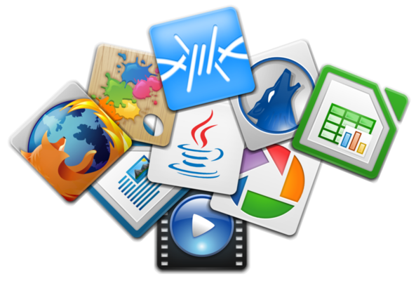

# Introducción a las Aplicaciones Libres

Dentro del ecosistema del Software en general, nos encontramos con la parte más visible del mismo: las aplicaciones. Las aplicaciones son los programas informáticos con los que interactuamos con el ordenador (o dispositivo) y son, al fin y al cabo, la esencia del uso o necesidad de las nuevas tecnologías.

Nos van a facilitar la realización de tareas complejas. A diferencia del sistema operativo, cuyo objetivo es gobernar el hardware y poner orden en la ejecución de los diferentes programas, las aplicaciones realizan funciones específicas. Gracias a ellas podemos disponer de un centro ofimático, visualizar y editar imágenes, navegar por internet, hacer cálculos matemáticos complejos (o simples).... Existen aplicaciones sencillas o auténticas herramientas/suites complejas realizadas con miles o millones de líneas de código.

Las aplicaciones no dejan de ser un **programa escrito en un lenguaje de programación** que realiza unas funcionalidades deseadas. Podremos disponer de Aplicaciones Libres o Aplicaciones No Libres, Comerciales o No comerciales, de código abierto pero no libres (con una licencia restrictiva por ejemplo), gratuitas o de pago...Compiladas (o disponibles) para ciertos sistemas operativos (por ejemlo solo para MacOs) o incluso para algunas arquitecturas concretas (*64 bits*)

En nuestro caso nos interesa centrarnos y profundizar en las aplicaciones libres. Las **razones** para ello, tal como hemos hablado al principio, son aplastantes en contraposición a las aplicaciones comerciales o privativas sobre todo en el ámbito de la educación:

* El código es **auditable**, garantía de que el código hace lo que tiene que hacer y no realiza acciones en segundo plano.
   Podemos modificar el código. Al tener disponible el código y poder modificarlo, podemos cambiar algo que no nos guste, personalizarlo e incluso involucrar a los alumnos en dicho proceso
* Podemos distribuir el software de forma **ética** entre nuestros alumnos. El alumno puede disponer de dicho software en casa sin necesidad de "piratear" o realizar alguna inversión.
* Como norma general, el software libre está **disponible** para todas las plataformas. Por tanto, no dependemos de usar un sistema operativo concreto para poder hacer uso del mismo. Qué ocurre si el alumno tiene en casa un Linux y en el centro un Windows? O al revés? O usa MacOs?
* La excusa de que es el software que se usa **en la empresa** solo puede llegar a ser justificable en etapas de Formación Profesional (e incluso en éste caso podría llega a ser discutible). El objetivo es que el alumno adquiera competencias tecnológicas, y las aplicaciones libres permiten dicha adquisición sin problemas
* *"Las aplicaciones propietarias funcionan mejor que las libres..."*. Es completamente discutible e incluso falso en muchas ocasiones. Tendemos a confundir desconocer una apliación con que **funcione** mal. Hay ejemplos de aplicaciones libres muy consolidadas y con un funcionamiento ejemplar.
   Libreoffice, Gimp o Firefox son suites y aplicaciones libres
   Incluso [la nave (Ingenuity) que llevó al Robot (Perseverance) a Marte](https://www.genbeta.com/linux/2021-ano-linux-marte-gracias-a-ser-sistema-operativo-helicoptero-que-acompana-al-rover-perseverance), estaba basado en Software Libre Open Source, y el código [se puede consultar y rehutilizar](https://github.com/nasa/fprime)

Terminamos este apartado con una lectura necesaria sobre [porqué una institución educativa debería usar y enseñar software libre](https://www.gnu.org/education/edu-why.html "GNU Page") por el proyecto GNU:

1. Permite **compartir** conocimiento y herramientas
2. **Responsabilidad Social** ante el posible dominio de un desarrollador o multinacionales
3. **Independencia** del producto
4. **Aprendizaje** de la propia herramienta, la ética y la práctica profesional
5. **Ahorro de costes** que puede redundar en otras áreas con necesidad
6. **Calidad**

Veamos pues qué aplicaciones y cómo tenerlas disponibles en nuestro Sistema Operativo **Vitalinux**.
