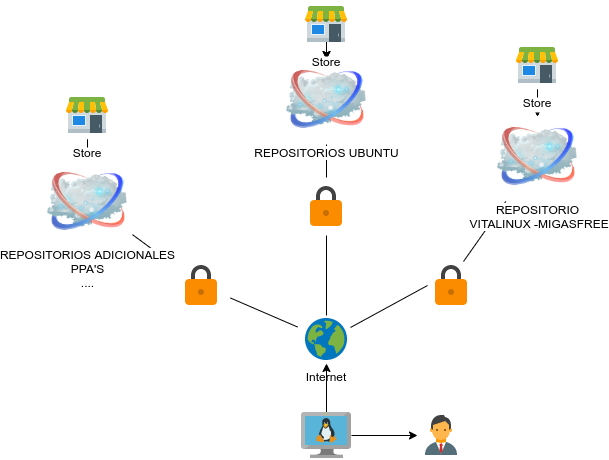
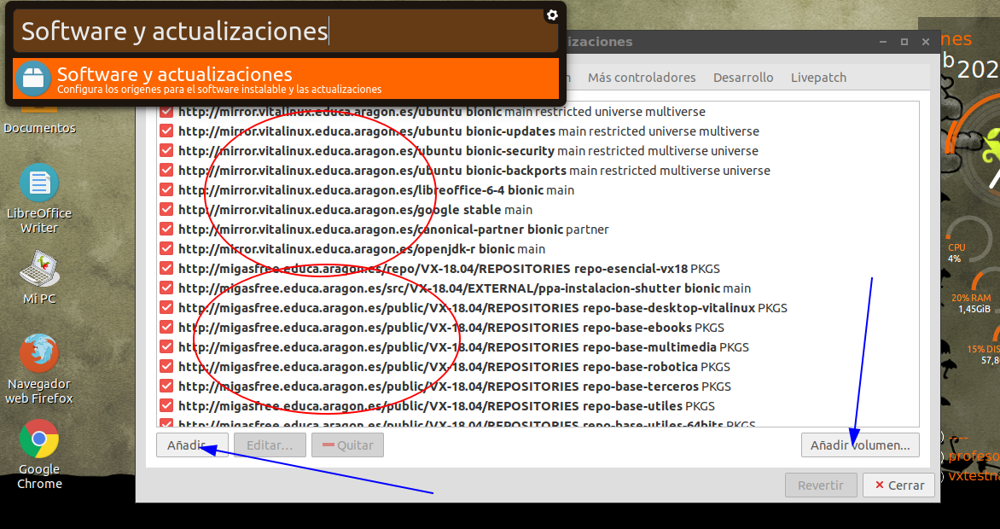

# Orígenes del Software

Una de las claves para el uso de las aplicaciones libres es la **distribución**. Recordar que una de las libertades del software libre es que puedes redistribuir copias para ayudar a otros o incluso puedes distribuir copias modificadas. Es decir que podemos coger cualquier programa hecho bajo la licencia de software libre, y además de ser libres para poderlo modificar y mejorar, podemos posteriormente entregarlo a quien queramos y de la forma que queramos.

## Repositorios

Ahora bien...cómo lo distribuimos de forma sencilla? Existen múltiples canales y gracias a esta libertad de distribución es posible aglutinar todo el software libre en determinadas ubicaciones de Internet y distribuirlo a quien lo desee de una manera centralizada. Estas ubicaciones se denominan en el mundo linux como **Repositorios**.



Un Repositorio es una especie de almacen/tienda, donde puedes consultar las aplicaciones disponibles solicitar su descarga e instalación. Para hacernos una idea del concepto, android (que también es un Linux) tiene preconfigurados unos repositorios de Google de tal forma que cuando nosotros buscamos e instalamos una nueva aplicación a través de su "Play Store", lo estamos haciendo entre el software recolectado por dichos repositorios. En el mundo Linux además contamos con las siguientes ventajas:

1. Existen **dependencias** entre aplicaciones. Muchas veces, una aplicación necesita de una o varias aplicaciones adicionales para funcionar (por ejemplo librerías). Gracias a éste mecanismo, cuando solicitemos instalar una aplicación se buscarán e instalarán las aplicaciones necesarias. Ésto aporta la ventaja, de que si una misma librería va a ser usada por varias aplicaciones...¿para que "engordar" cada aplicación con la misma librería? Simplemente se marca la dependencia, y si no la tiene (de alguna necesidad previa, la descargará e instalará por nosotros
2. **Actualización**. Los repositorios mantendrán actualizadas las aplicaciones. Es decir, si se encuentra un error o una mejora y se debe actualizar la aplicación, se actualizará en dicho repositorio, y nuestro sistema actualizará dicha aplicación porque la encontrará en una versión superior a la que tiene instalada.
3. **Seguridad**. Los repositorios vienen con un sistema de autenticación basado en firmas, de forma que establecemos una comunicación segura y los paquetes vienen firmados. Es decir, si confiamos en dicho repositorio, se nos proporcionarán las claves para verificar que estamos instalando el software de dicho repositorio, y no de otro.

## Repositorios preconfigurados

Por defecto, en Vitalinux están configurados los siguentes repositorios

* Repositorios oficiales* de **ubuntu**. Gran parte del software instalado proviene de la distribución de ubuntu base que lleva Vitalinux
  * Vitalinux 1.x basado en [Ubuntu Trusty](https://releases.ubuntu.com/14.04/)
  * Vitalinux 2.x basado en [Ubuntu Bionic](https://releases.ubuntu.com/18.04/)
  * Vitalinux 3.x basado en [Ubuntu Jammy](https://releases.ubuntu.com/22.04/)
* Respositorios de **Libreoffice**, para mantener una versión de la suite ofimática más actualizada que la que viene por defecto en Ubuntu. Así, contamos con las siguientes versiones:
  * Vitalinux 1.x con Libreoffice 6.1
  * Vitalinux 2.x con Libreoffice 7.4
  * Vitalinux 3.x con Libreoffice en la última versión (7.6)
* Repositorios de **aplicaciones comunes**, que no vienen de forma oficial en Ubuntu: Openshot, Freecad...
* Repositorio **propio de migasfree**. En éste tenemos disponibles muchas **aplicaciones propias del proyecto** para personalizar la distribución, así como **aplicaiones de terceros** que dejamos disponibles de forma actualizada para no tener que añadir repositorios de forma manual. Por ejemplo: obs-studio, scratch, geogebra... y muchas más que veremos en capitulos posteiores.

\* *- Los repositorios de Ubuntu están ("congelados") en un servidor del proyecto, para controlar así las actualizaciones periódicas y asegurar éste proceso de forma controlada, limitándolo a unos periodos concretos de actualización*

Podemos ver la lista de los repositorios configurados en un vitalinux si ejectuamos **Software y actualizaciones**.

Podemos observar los repositorios comentados. 
*NO es recomendable eliminar dichos repositorios para preservar la integridad del sistema. De hecho en Vitalinux se recrean en cada actualización por seguridad*.
También podemos añadir un volumen (repositorio local en base a un CD, en lugar de la nube) o un repositorio (Añadir...), pero recomendamos lo siguiente.

## Como añadir nuevos respositorios

> Nota: Éste apartado es algo mas complejo y lo mostramos a modo informativo...no es necesario para el uso de Vitalinux. Si quieres añadir un repositorio, consulta con el soporte de Vitalinux.

Muchas veces nos puede interesar añadir otras fuentes de software ya que en las que tenemos no está el software requerido o está en una versión que no es la que necesitamos.
Es muy importante tener en cuenta que:

1. Se deben usar siempre un **repositorio de confianza**, para lo cual haremos referencia al propio desarrollador del software. El uqe el software sea libre, garantiza no tener que andar buscando software pirata que puede contener código malicioso
2. Recuerda que podrías solicitar información al grupo de soporte del programa vitalnux (***soportevitalinux@educa.aragon.es***) y ellos te añadirán el repositorio en tus equipos de forma automática, sin necesidad de hacerlo a mano (¡y en todos los equipos!). Para eso contamos con **migasfree**. Y si además es interesante para todos, se pondrá a disposición de toda la comunidad educativa.

Para añadirlo podrías usar el botón de añadir que viste en la imagen anterior. Se te pedirá la url donde se encuentra y listo

Pero lo menjor es usar el comando **apt-add-repository** que nos va a permitir añadir repositorios, y si el mismo viene con una firma, se añadirá iguamente. Éstas instrucciones te las indicarán en la web del repositorio a añadir, pero veamos un ejemplo. Queremos instalar obs-studio que no está en los repositorios (mentira, si que está, y no tendrías que hacer nada, pero es una prueba para verlo). Nos iríamos a la página de [OBS oficial](https://obsproject.com/), y en su apartado de downloads para Linux, nos encontramos con unas instrucciones a ejecutar en una terminal (puedes abrir una en cualquier linux con la combinación CTRL+ALT+t)

```bash
sudo add-apt-repository ppa:obsproject/obs-studio
sudo apt update
sudo apt install obs-studio
```

Nos interesan las dos primeras instrucciones:
  
1. Con la primera estamos indicando al sistema que **añada un nuevo repositorio**, correspondiente a obs-studio en ppa. [PPA](https://help.launchpad.net/Packaging/PPA) es un almacen que nos permite distribuir software personal de una forma sencilla. Admite integración contínua (cuando se libera nuevo código se generan nuevas versiones de los paquetes de software) y está muy extendido su uso en la comunidad de Ubuntu y Debian
2. Con la segunda le estamos diciendo al sistema que **actualice el listado de software disponible**...es decir, que vaya a todos los respositorios/almacenes y pregunte qué paquetes (software) hay disponbible, para luego poder instalarlos. Si el sistema no tiene un índice de paquetes disponibles, cuando vayamos a instalar un paquete no sabrá si existe ni donde está

La última linea procederá a realizar la instalación del software (y todos los paquetes/librerias que necesite). Pero eso lo veremos en breve.