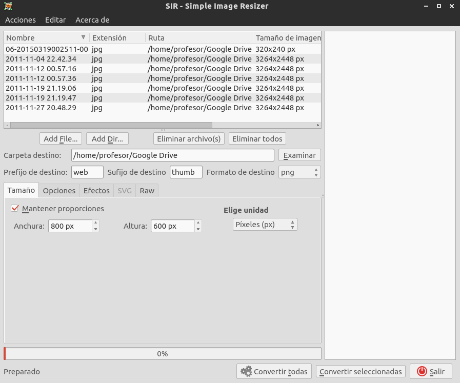

# Acciones del Explorador de Archivos {#Acciones_del_Explorador_de_Archivos}

Una de las característica más importantes que suele tener la mayor parte de los **Exploradores de Archivos** en Linux es la posibilidad de poder configurar y personalizar **acciones** (*Custom Actions*), aumentando de esta forma sus posibilidades y potencia.  **Vitalinux**, al basarse en la versión ligera de Ubuntu, **Lubuntu**, hace uso del **Explorador de Archivos *pcmanfm***, posiblemente, el explorador más ligero que existe.  No obstante, aún siendo ligero, **pcmanfm** ofrece la posibilidad de configurar mediante el uso de pequeños programas, funcionalidades añadidas para poder interactuar con los directorios y archivos por los que navega.  

En concreto, se han desarrollado para **Vitalinux EDU DGA** diversas funcionalidades **para manipular archivos PDFs**, **archivos MP3**, **imágenes**, ... tal como se puede apreciar al pinchar con el botón derecho del ratón sobre cualquiera de archivos o directorios.  De entre todos los que se han desarrollado podrían destacarse las siguientes **acciones del Explorador de Archivos**:

-  Acceder al panel para Quitar un USB (<i>se puede lanzar en cualquier momento, no es necesario estar sobre el dispositivo</i>)
-  Abrir un directorio como <b>Root/Administrador</b>, de forma que podemos "trabajar" con él con los <b>máximos privilegios</b> (<i>creación, borrado, permisos...</i>) <b>¡¡PRECAUCIÓN!!</b>
- Trabajar con PDF's:
    - Unir PDFs
    - Dividir PDFs (*extraer páginas de un PDF*)
    - Comprimir PDFs
- Trabajar con Imágenes:
    - Comprimir imágenes en formato JPG o PNG
    - Generar imágenes en miniatura
    - Convertir entre formatos de imágenes
    - ...
- Comprimir archivos MP3
- Enviar archivos usando una cuenta de <b>Gmail</b>
- Utilidades generales de un archivo: Editar como texto, Copiar, hacer un backup en el propio directorio...
- ...se van añadiendo más...


En el caso de que quieras manipular un conjunto de imágenes de manera simultánea, puedes hacer uso de las <b>acciones programadas</b> en el <b>Explorador de Archivos</b> seleccionando varias simultáneamente (<i>debes maneter la tecla CONTROL pulsada mientras pinchas las diversas imágenes</i>), o en el caso de que estés en <b>Vitalinux 2</b>, también puedes usar una herramienta pensada expresamente para ello como es <b>Simple Image Resizer</b> (<i>SIR</i>).  Esta última nos va a permitir de manera masiva:

<ul>
<li>Cambiar de formato (<i>p.e. pasar JPG/JPEG a PNG</i>)</li>
<li>Cambiar de dimensiones (<i>reducir o aumentar su tamaño</i>)</li>
<li>Rotar, pasar a blanco y negro, etc.</li>
</ul>

Para usar <b>Simple Image Resizer</b> tan sólo debes teclear <b>CONTROL+ESPACIO</b> y escribir <b>SIR</b>.

  

<i>Img:</i> <tt>SIR nos permite manipular imágenes de forma masiva</tt>

 



Como en ocasiones ***más vale un buen videotutorial que mil palabras*** a continuación se sugiere ver el siguiente vídeo relacionado con este asunto:

https://youtu.be/Yf-idxDBD7w