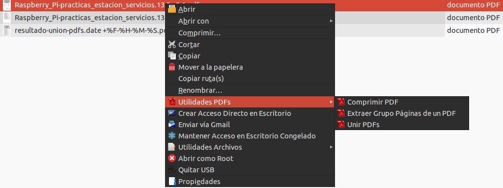
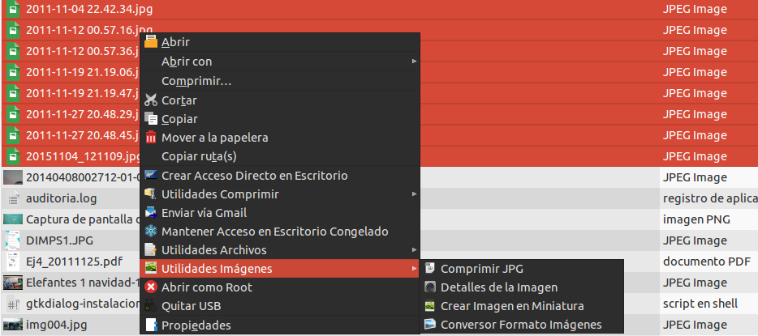

{% notificacion_task title='Acciones del Explorador de Archivos',
numexer='6.1',
req='Es necesario haber leído todo lo referente a <a href="./Parte_6-Acciones_del_explorador_de_archivos.md">las Acciones del Explorador de Archivos de Vitalinux</a>',
formatoentrega='En un documento ofimático escribe y pega las fotos o capturas de pantalla necesarias para justificar todo lo que se te pide a continuación. Si es posible expórtalo a <b>formato PDF</b> para garantizar su portabilidad, y adjúntalo como respuesta a la tarea solicitada. Por tanto, envía al tutor un único archivo <b>.pdf</b> que se nombrará siguiendo las siguientes pautas: <b>apellido1_apellido2_nombre_TareaX.pdf</b>.
 
Asegúrate que el nombre no contenga la letra ñ, tildes ni caracteres especiales extraños. Así por ejemplo la alumna <b>Begoña Sánchez Mañas</b>, debería nombrar esta tarea como: <b>sanchez_manas_begona_Tarea6.1.pdf</b>' %}

Mediante la siguiente tarea nos familiarizaremos con una de las características de los <b>Exploradores de Archivos</b> en Linux: el uso de <b>acciones</b> programadas.  <b><tt>Vitalinux</tt></b> hace uso del Explorador de Archivos <b>pcmanfm</b> el cual se caracteriza por ser muy ligero, pero al mismo tiempo, muy potente.  Con la finalidad de apreciar la gran versatilidad y funcionalidad del explorador de archivos a continuación se propone comprobar las siguientes <b>acciones</b> (<i>en el vídeo que se adjunta, se explican y completan cada una de ellas en el mismo orden que se solicitan</i>):

<ol>
<li>Abre el <b>Explorador de Archivos <i>pcmanfm</i></b> (<i>Tecla Windows + E</i>)</li>
<li><b>Reproducir Vídeo en Miniatura</b>.  Almacena un <b>archivo de vídeo</b> en algún directorio de tú perfil en <tt>Vitalinux</tt>, y desde el <b>Explorador de Archivos pcmanfm</b> pincha con el botón derecho del ratón sobre él, y selecciona dentro de <b>"Utilidades Vídeos"</b> la opción <b>"Reproducir Vídeo en Miniatura"</b>.  Comprueba que el vídeo se reproduce en una de las esquinas de tu Entorno de Escritorio pudiendo trabajar simultáneamente con el equipo con otras aplicaciones.  Por ejemplo, abre <b>Libreoffice Writer</b> y redacta algo mientras se visualiza el vídeo en miniatura.  Para cerrar el vídeo debes pinchar sobre él con el ratón y pulsar la tecla <b>q</b> (<i>quit</i>).

  

<i>Img:</i> <tt>Reproducir Vídeo en miniatura</tt>

 
</li>

<li><b>Comprimir MP3</b>.  Almacena <b>archivos MP3</b> en algún directorio de tú perfil en <tt>Vitalinux</tt>, y desde el <b>Explorador de Archivos pcmanfm</b> selecciona varios de ellos (<i>pincha con el botón izquierdo del ratón sobre ellos manteniendo la tecla CONTROL pulsada</i>), y estando seleccionados, pincha con el botón derecho del ratón sobre ellos y selecciona dentro de <b>"Utilidades Música"</b> la opción <b>"Comprimir MP3"</b>.  Comprueba que se crea una subcarpeta con los archivos comprimidos (<i>p.e. 64Kbps</i>), y advierte que se ha reducido su tamaño, pero que al mismo tiempo se escuchan bien.
 </li>

<li><b>Utilidades PDFs</b>: Desde el explorador de archivos podrás realizar de una manera muy eficiente la compresión de archivos PDF, la unión de varios de ellos o la extracción de un conjunto de páginas.  Prueba alguna de ellas.
</li>

 

<i>Img:</i> <tt>Acciones del Explorador de Archivos sobre documentos PDF</tt>

 

<ul>

<li><b>Comprimir PDFs</b>.  Almacena <b>archivos PDFs</b> en algún directorio de tú perfil en <tt>Vitalinux</tt>,  y desde el <b>Explorador de Archivos pcmanfm</b> selecciona uno o varios de ellos (<i>pinchando con el botón izquierdo del ratón y manteniendo la tecla CONTROL pulsada</i>), después pincha con el botón derecho del ratón sobre los documentos seleccionados, y selecciona dentro de <b>"Utilidades PDFs"</b> la opción <b>"Comprimir PDF"</b>.  Comprueba que se crean archivos resultantes junto a los seleccionados con el mismo nombre pero un sufijo <b>-comp</b> (<i>comprimido</i>).  Advierte si el tamaño se ha reducido considerablemente, conservando al mismo tiempo que sean legibles (<i>si no dispones de un PDF de gran tamaño para comprobar la compresión, puedes <a href="https://www.dropbox.com/s/ll2h99xneo6oqkf/libro_seguridad_informatica.v14.5.pdf?dl=0">descargarte este</a></i>).</li>

<li><b>Unir PDFs</b>.  Almacena <b>archivos PDFs</b> en algún directorio de tú perfil en <tt>Vitalinux</tt>, y desde el <b>Explorador de Archivos pcmanfm</b> selecciona simultáneamente varios de ellos pinchando con el botón izquierdo del ratón y manteniendo la tecla CONTROL pulsada, pincha con el botón derecho del ratón sobre los documentos seleccionados, y selecciona dentro de <b>"Utilidades PDFs"</b> la opción <b>"Unir PDFs"</b>.  Comprueba que se crea un archivo resultante junto a los seleccionados con el nombre de <b>resultado-union-pdfs.pdf</b> (<i>puedes renombrar el archivo seleccionando el archivo y pulsando la tecla <b>F2</b></i>)</li>

<li><b>Extraer Grupo de Páginas de un PDF</b>.  Desde el <b>Explorador de Archivos pcmanfm</b> pincha con el botón derecho del ratón sobre algún <b>documento PDF</b>, y selecciona dentro de <b>"Utilidades PDFs"</b> la opción <b>"Extraer Grupo Páginas ..."</b>.  Comprueba que se crea un archivo resultante junto al documento original seleccionado con el mismo nombre pero con un sufijo que indica las páginas extraídas.</li>

</ul>

<li><b>Utilidades de Imágenes</b>: Desde el Explorador de Archivos podrás llevar a cabo ciertas acciones sobre tus imágenes, tales como generar una imagen en miniatura, comprimir la imagen (<i>*.jpg/*.png</i>), cambiar el formato de la imagen (<i>jpg->png, jpg->bmp, png->pdf...</i>), etc. Prueba alguna de ellas:

 

<i>Img:</i> <tt>Acciones del Explorador de Archivos sobre imágenes</tt>

 

</li>

<ul>

<li><b>Comprimir JPG/PNG</b>.  Almacena <b>Imágenes JPG o PNG</b> en algún directorio de tú perfil en <tt>Vitalinux</tt>, y desde el <b>Explorador de Archivos pcmanfm</b> pincha con el botón derecho del ratón sobre varios de ellos simultáneamente, y selecciona dentro de <b>"Utilidades Imágenes"</b> la opción <b>"Comprimir ..."</b>.  Comprueba que se crean archivos resultantes con la extensión del nombre "-comp".  Advierte si el tamaño se ha reducido considerablemente, conservando al mismo tiempo su resolución</li>

<li><b>Información Detallada de Imágenes</b>.  Almacena <b>Imágenes</b> en algún directorio de tú perfil en <tt>Vitalinux</tt>, y desde el <b>Explorador de Archivos pcmanfm</b> pincha con el botón derecho del ratón sobre varios de ellos simultáneamente, y selecciona dentro de <b>"Utilidades Imágenes"</b> la opción <b>"Detalles de la Imagen"</b>.  Advierte la información detallada de salida</li>

<li><b>Cambiar formato de Imágenes</b>.  Almacena <b>Imágenes</b> en algún directorio de tú perfil en <tt>Vitalinux</tt>, y desde el <b>Explorador de Archivos pcmanfm</b> pincha con el botón derecho del ratón sobre varios de ellos simultáneamente, y selecciona dentro de <b>"Utilidades Imágenes"</b> la opción <b>"Conversor Formato Imágenes"</b> (<i>por ejemplo, cambia varias imágenes a formato BMP o PDF</i>).  Comprueba que se crean archivos resultantes junto a los seleccionados pero con el formato y extensión especificados</li>

</ul>

<li>Aunque no es una <b>acción programada del Explorador de Archivos</b>, pero relacionado con lo anterior, lanza la aplicación <b>SIR</b> (<i>Simple Image Resizer</i>), tecleando <b>CONTROL+ESPACIO</b> y escribiendo <b>SIR</b>, y prueba a realizar alguna operación masiva sobre imágenes: generar imagenes miniatura, cambiar formato, cambiar tamaño, etc.
</li>

<li>Por último, indica alguna funcionalidad que te gustaría que estuviera incluida dentro del Explorador de Archivos, y que actualmente no esta implementada.  <b>¡¡Esto nos puede servir a los que desarrollamos <tt>Vitalinux</tt> para mejorarlo!!</b>
</li>

</ol>

 

<iframe width='560' height='315' src='https://www.youtube.com/embed/Yf-idxDBD7w' frameborder='0' allow='autoplay; encrypted-media' allowfullscreen></iframe>



