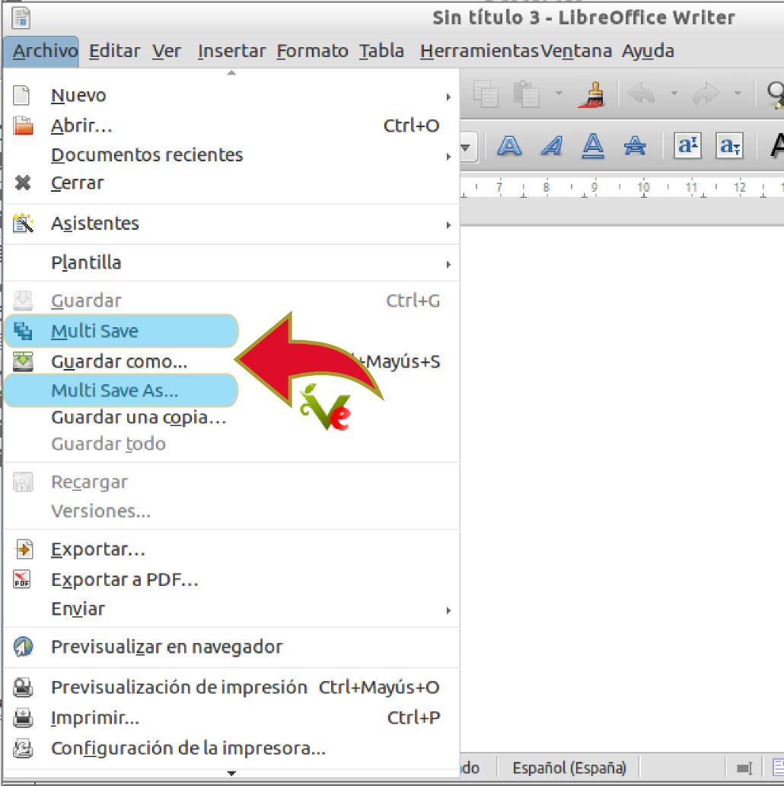

{% notificacion_task title='Aplicaciones Ofimáticas en Vitalinux',
numexer='6.2',
req='Es necesario haber leído todo lo referente a <a href="../Parte_6-Aplicaciones_utiles_y_alternativas/Parte_6-Aplicaciones_ofimaticas.md">Aplicaciones Ofimáticas en Vitalinux</a>',
formatoentrega='En un documento ofimático escribe y pega las fotos o capturas de pantalla necesarias para justificar todo lo que se te pide a lo largo de la tarea. Si es posible expórtalo a <b>formato PDF</b> para garantizar su portabilidad, y adjúntalo como respuesta a la tarea solicitada. Por tanto, envía al tutor un único archivo <b>.pdf</b> que se nombrará siguiendo las siguientes pautas: <b>apellido1_apellido2_nombre_TareaX.pdf</b>.
 
Asegúrate que el nombre no contenga la letra ñ, tildes ni caracteres especiales extraños. Así por ejemplo la alumna <b>Begoña Sánchez Mañas</b>, debería nombrar esta tarea como: <b>sanchez_manas_begona_Tarea6.2.pdf</b>' %}

Mediante la presente tarea se pretende:

<ol type="I">
<li>
Dar a conocer a <b>LibreOffice</b> como una alternativa de software libre al paquete ofimático de Microsoft (<i>Microsoft Office</i>), tratando de apreciar sus similitudes y compatibilidades, con la finalidad de que el usuario final comprenda que sería una buena opción prescindir del uso de un software privativo que habitualmente se encuentra de manera ilegal en los centros educativos, lo cual es totalmente incomprensible habiendo una alternativa libre.
 
En concreto, mediante la realización de la tarea comprobaremos la compatibilidad que existe entre ambos paquetes ofimáticos, <b>LibreOffice</b> y <b>Microsoft Office</b>, mediante la apertura y tratamiento de archivos con <b>LibreOffice</b> que han sido creados previamente a través de <b>Microsoft Office</b>.
</li>
<li>
Aprender cómo aumentar la potencia de nuestro paquete ofimático mediante el uso de <b>Extensiones</b>.
</li>
<li>
Saber cómo <b>editar archivos PDFs</b>.
</li>
</ol>

Comenzaremos comprobando la compatibilidad <b>en el caso de que dispongas y hagas uso de Microsoft Office</b> (¡¡<i>No hace falta que hagas todas las comprobaciones de compatibilidad propuestas, con que hagas una de las tres es suficiente</i>!!):

<ul>
<li>
Compatibilidad en <b>LibreOffice Writer</b> con documentos que han sido previamente creados con <b>Microsoft Word</b>:
</li>
    <ol>
    <li>
    Localiza algún documento <b>"*.doc"</b> o <b>"*.docx"</b> que haya sido creado con <b>Microsoft Word</b> y guárdalo en el directorio <b>Documentos</b> de tu perfil de Vitalinux
    </li>
    <li>
    Abre <b>LibreOffice Writer</b> (<i><b>CONTROL + ESPACIO</b> y teclea <b>Writer</b></i>), y desde allí abre el documento anterior
    </li>
    <li>
    Comenta tu impresión respecto a la compatibilidad detectada, y en caso de detectar alguna incompatibilidad, por favor indícala
    </li>
    <li>
    Realiza alguna modificación en el documento y guarda el documento con formato/extensión <b>"*.doc"<b>/</b>"*.docx"</b>.  Después ábrelo con <b>Microsoft Word</b> y comprueba la compatibilidad a la inversa
    </li>
    </ol>

<li>
Compatibilidad en <b>LibreOffice Calc</b> con documentos que han sido previamente creados con <b>Microsoft Excel</b>:
</li>
    <ol>
    <li>
    Localiza algún documento <b>"*.xls"</b> o <b>"*.xlsx"</b> que haya sido creado con <b>Microsoft Excel</b> y guárdalo en el directorio <b>Documentos</b> de tu perfil de Vitalinux (*en caso de que no dispongas de ningún documento puedes descargarte el siguiente: [Ejemplo de Hoja de Cálculo creada con Microsoft Excel](http://www.ejemplode.com/uploads/12098166700-hojacalculo.xls)*)
    </li>
    <li>
    Abre <b>LibreOffice Calc</b> (<i><b>CONTROL + ESPACIO</b> y teclea <b>Calc</b></i>), y desde allí abre el documento anterior
    </li>
    <li>
    Comenta tu impresión respecto a la compatibilidad detectada, y en caso de detectar alguna incompatibilidad, por favor indícala
    </li>
    <li>
    Realiza alguna modificación en el documento y guarda el documento con formato/extensión <b>"*.xls"**/**"*.xlsx"</b>.  Después ábrelo con <b>Microsoft Excel</b> y comprueba la compatibilidad a la inversa
    </li>
    </ol>

<li>
Compatibilidad en <b>LibreOffice Impress</b> con documentos que han sido previamente creados con <b>Microsoft Power Point</b>:
</li>
    <ol>
    <li>
    Localiza algún documento <b>"*.ppt"</b> o <b>"*.pptx"</b> que haya sido creado con <b>Microsoft Point</b> y guárdalo en el directorio <b>Documentos</b> de tu perfil de Vitalinux (<i>en caso de que no dispongas de ningún documento puedes descargarte el siguiente: <a href="http://www.ejemplode.com/uploads/120811710123-ejemplopresentacionpowerpoint.zip">Ejemplo de presentación PPT creada con Microsoft Power Point</a></i>)
    </li>
    <li>
    Abre <b>LibreOffice Impress</b> (<i><b>CONTROL + ESPACIO</b> y teclea <b>Impress</b></i>), y desde allí abre el documento anterior
    </li>
    <li>
    Comenta tu impresión respecto a la compatibilidad detectada, y en caso de detectar alguna incompatibilidad, por favor indícala
    </li>
    <li>
    Realiza alguna modificación en el documento y guarda el documento con formato/extensión <b>"*.ppt"<b>/</b>"*.pptx"</b>.  Después ábrelo con <b>Microsoft Power Point</b> y comprueba la compatibilidad a la inversa
    </li>
    </ol>

</ul>

<pre style="border: 1; border-color: brown; background-color: orange; text-align: center;white-space: pre-wrap; color: white; font-weight: bold; font-size: 110%;">¡¡¡Recuerda que "LibreOffice" es "Software Libre"  disponible tanto para Linux como para Windows!!!¡¡¡Anímate a instalar y usar "LibreOffice" si quieres evitar el uso de software ilegal/pirata tanto en tu casa como en tu centro educativo!!!</pre>

La característica más importante de <b>LibreOffice</b> es que es <b>Software Libre</b>.  Ésto permite su instalación, uso y distribución de manera libre y colaborativa. A consecuencia de todo ello surgen otras características interesantes como la posibilidad de instalar <a href="http://extensions.libreoffice.org/extension-center">Extensiones creadas por la comunidad de usuarios</a>. A modo de ejemplo, como tarea se propone instalar al menos una <b>Extensión de LibreOffice</b>:

<ol>
<li>
Abre un navegador Web y accede a la Web de <b>Extensiones Oficiales de LibreOffice</b>: <a rel="nofollow" class="external text" href="http://extensions.libreoffice.org/extension-center"><b>Centro de descargas de Extensiones de LibreOffice</b></a>
</li>
<li>
Busca la extensión llamada <b>"MultiFormatSave"</b>, descárgala (<i>extensión \*.oxt</i>) e instálala (<i>pincha con el botón derecho del ratón sobre el archivo *.oxt descargado e indica que quieres abrirlo con <b>LibreOffice</b></i>).  Esta extensión permitirá a la hora de guardar un documento ofimático, guardarlo simultáneamente en los formatos de <b>LibreOffice</b> (<i>p.e. *.odt</i>), de Microsoft Office (<i>p.e. "*.doc"/"*.docx"</i>) y PDF (<i>*.pdf</i>)
</li>
<li>
A continuación abre por ejemplo <b>LibreOffice Writer</b>, escribe algo y comprueba que en el menú <b>"Archivo"</b> aparece una nueva opción llamada <b>"Multi Save"/"Multi Save As"</b>
</li>
<li>
Selecciona la opción <b>"Multi Save"</b> e indica que quieres guardar el resultado en un subdirectorio que crearás dentro de <b>Documentos</b> llamado <b>misDocs</b>, eligiendo como nombre para el archivo tu nombre y apellidos (*p.e. Arturo_Martin_Romero*).  <b>¡¡¡Guárdalo en todos los formatos disponibles!!!</b>
</li>

 

<i>Img:</i> <tt>Tras instalar la <b>Extensión MultiFormatSave</b> aparecerá una nueva opción en el menú <b>Archivo</b> permitiéndonos guardar un archivo en varios formatos simultáneamente</tt>

 

<li>
Por último, echa un vistazo a la lista de <b>Extensiones</b> disponibles para LibreOffice y comprueba si hay alguna que te puede resultar interesante.  En caso afirmativo instálala y comprueba su cometido.  Por ejemplo, si haces uso de ecuaciones matemáticas en tus clases la extensión de Libreoffice <b>"TexMaths"</b> es bestial, ya que te permite generar ecuaciones en formato Latex insuperables (<i>¡¡Ojo!! para usar TexMaths necesitarás instalar el programa texlive-latex-base, p.e. a través de synaptic</i>)
</li>
</ol>

Por último, se pretende mostrar una herramienta ofimática que puede resultar de utilidad: <b>"un Editor PDF"</b>.  Para ello sigue los siguientes pasos:

<ol>
<li>
Con la finalidad de usar un documento de partida común para todos, descarga el siguiente archivo PDF de ejmplo: <a href="http://migasfree.educa.aragon.es/cosas-centros/Vitalinux-tea4cups.pdf">Documento PDF</a>
</li>
<li>
Lanza el editor PDF que viene incorporado en Vitalinux: <b>CONTROL+ESPACIO</b> y escribes <b>Master PDF Editor</b> (<i>en caso de no tenerlo instalado deberás lanzar <b>synaptic</b> e instalar el paquete <b>master-pdf-editor3</b></i>) 
</li>
<li>
En el caso de que los menús del <b>Master PDF Editor</b> no aparezcan en <b>Español</b> deberás ir al menú de la aplicación <b>"Tools"-"Settings"</b> y buscar la opción que permite configurar el <b>Language</b> del programa
</li>
<li>
Accede al menú <b>"Herramientas/Tools"</b> y selecciona la opción de <b>"Editar Texto"</b>. A continuación cambia al menos uno de los títulos principales del documento.
</li>
</ol>


