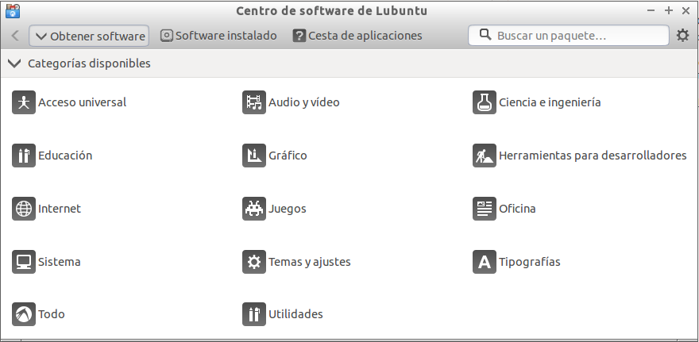
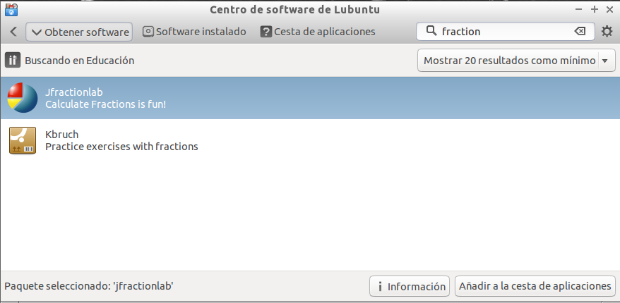
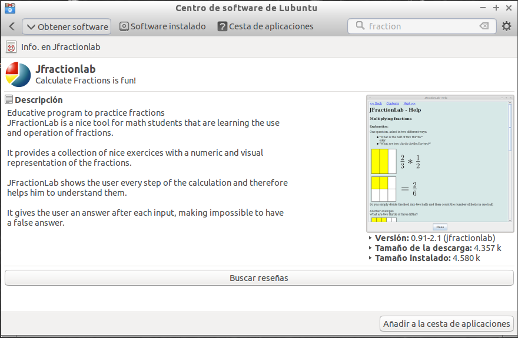

# Centro de Software de Lubuntu

## Centro de Software de Lubuntu

**Vitalinux** es una distribución basada en la versión ligera de Ubuntu llamada **Lubuntu**, la cual dispone de un **Centro de Software** específico que permite al usuario instalar y desinstalar aplicaciones, al igual que ya hace **Synaptic**, pudiendo filtrar la búsqueda de una manera categorizada: **Educación, Ofimática, Internet**, etc.

Para interactuar con **El Centro de Software de Lubuntu** simplemente debemos lanzarlo pulsando la combinación **"CONTROL + ESPACIO"'** y tecleando **"Centro de Software ..."'**:

Como en ocasiones ***más vale un buen videotutorial que mil palabras*** a continuación se sugiere hacer una Tarea al respecto y visualizar un vídeo relacionado con este asunto (*es una parte del videotutorial completo: [Gestión del Software en Vitalinux](https://www.youtube.com/watch?v=8tBh8yz1FHY)*).

##  Tarea 4.3: Gestión del Software mediante el Centro de Software de Lubuntu

**Requisitos**: Es necesario haber leído todo lo referente a el **Centro de Software de Lubuntu** y disponer de un equipo con Vitalinux, físico o virtual, para realizar la Tarea.

**Vitalinux** es una distribución basada en la versión ligera de Ubuntu llamada **Lubuntu**, la cual dispone de un **Centro de Software** específico que permite al usuario instalar y desinstalar aplicaciones, pudiendo filtrar la búsqueda de una manera categorizada: **Educación, Ofimática, Internet**, etc.  A modo de ejemplo, en esta tarea se propone instalar la aplicación **jFractionLab** a través de este **Centro de Software**.  Para ello:
1.  Asegurate de que tu equipo Vitalinux ha terminado la comunicación con Migasfree (*tiene que desaparecer el **triángulo verde** que aparece tras iniciar sesión sobre el símbolo de **Migasfree** que encontrarás en la parte derecha de la barra/panel inferior del Entorno de Escritorio de Vitalinux*)
1.  Accede a el **Centro de Software de Lubuntu** (***CONTROL + ESPACIO** y tecleas **centro de software ...***)
1.  Accede a la categoría de software asociada a **Educación** y busca la aplicación **JFractionLab**
1.  Una vez localizada dicha aplicación pincha sobre el botón que te permite obtener más información sobre ella
1.  Después añade la aplicación a la **Cesta** e instálala 
1.  Como no, por último, lanza la aplicación **JFractionLab** (***CONTROL + ESPACIO** y tecleas **fraction ...***)

Como en ocasiones ***más vale un buen videotutorial que mil palabras*** a continuación se sugiere ver el siguiente vídeo relacionado con este asunto (*es una parte del videotutorial completo: [[Gestión del Software en Vitalinux](https://www.youtube.com/watch?v=8tBh8yz1FHY%7C)]*):

https://youtu.be/iQNvU481ciY
