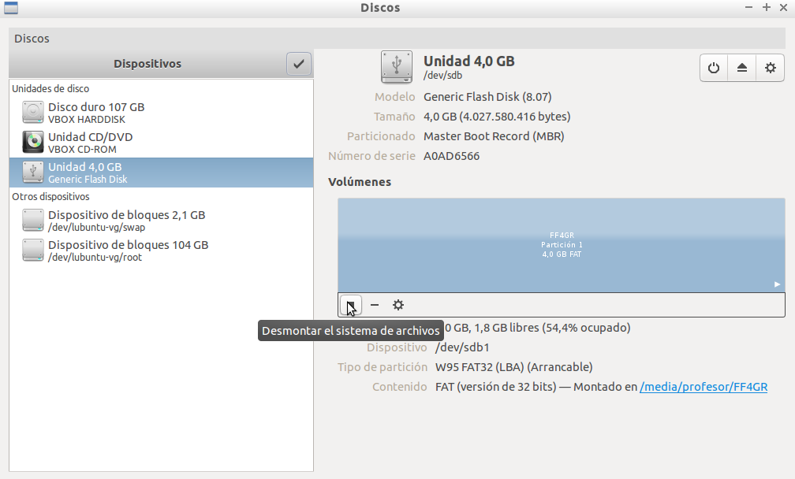
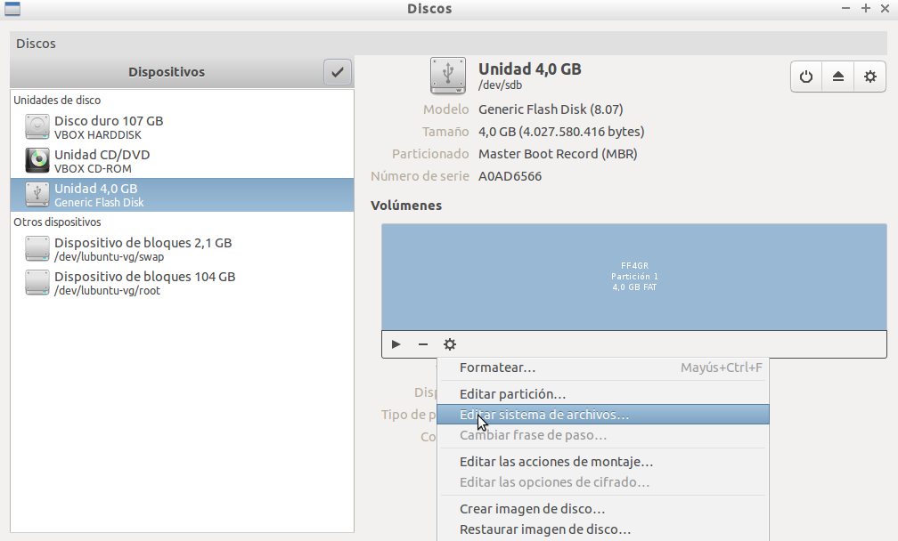
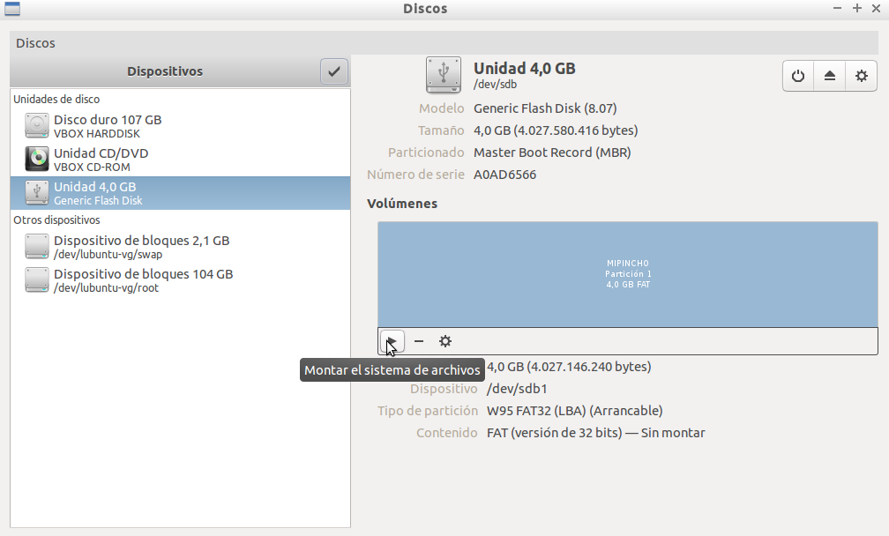
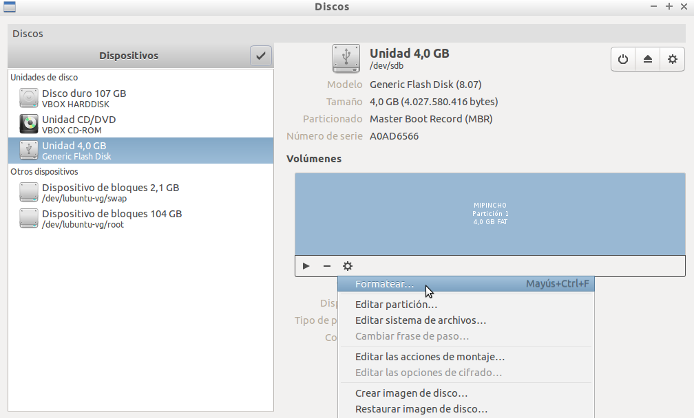
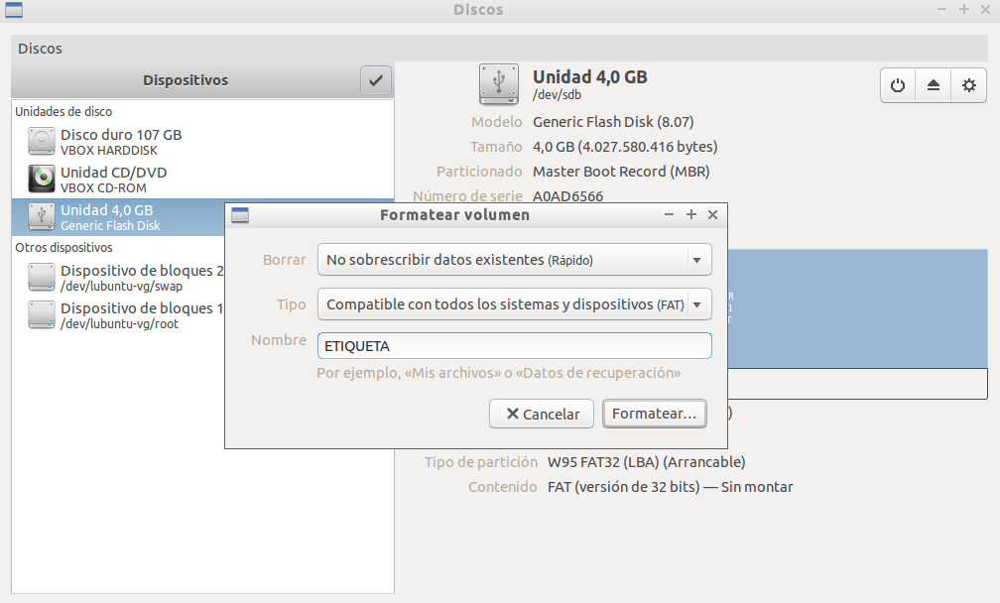

# Dispositivos de Almacenamiento

## Contenido

- [1 Gestión de Unidades de Almacenamiento Externas](#GestionUnidadesAlmacenamientoExternas)
- [2 Administración Básica de los Dispositivos de Almacenamiento](#AdministracinBasicaDispositivosAlmacenamiento)
    - [2.1 Montar y Quitar](#MontarQuitar)
    - [2.2 Cambiar nombre del Dispositivo](#CambiarnombreDispositivo)
    - [2.3 Formatear un dispositivo](#Formatearundispositivo)
- [3. Tarea 3.5: Gestión de Unidades de Almacenamiento Externas USB](#Tarea3-5)

## Gestión de Unidades de Almacenamiento Externas {#GestionUnidadesAlmacenamientoExternas}

Vitalinux, como cualquier otro sistema operativo, permite trabajar con unidades de almacenamiento externas tales como **CDs/DVDs** o **memorias USB**.  Una vez insertado un CD/DVD o memoria USB, Vitalinux lo detectará y nos invitará a abrir dicho dispositivo de almacenamiento.  Al mismo tiempo se crearán un **acceso directo en el Escritorio** y un nuevo **marcador en el pcmanfm** para poder acceder rápidamente a él.

Como ya ha explicado anteriormente, a diferencia de Windows, Vitalinux no asigna una letra (D:\, E:\, etc.) a estas unidades de almacenamiento para identificarlas y acceder a su contenido, sino que crea nuevas ramas dentro del **árbol del sistema de archivos de Vitalinux**.  Concretamente, Vitalinux creará un directorio con el nombre del usuario dentro de **/media** (*p.e. si el usuario es **profesor**, se creará el directorio **/media/profesor***), y a su vez dentro de él se creará un subdirectorio por cada unidad de almacenamiento externa cuyo nombre coincidirá con la etiqueta que tenga asignada el dispositivo de almacenamiento.  Por ejemplo, si el usuario **profesor** pincha una memoria USB identificada con la etiqueta **misdatos**, en Vitalinux se creará el directorio **/media/profesor/misdatos** que contendrá todo el contenido del USB.

En el caso de que queramos desconectar de manera segura la unidad de almacenamiento externa USB podrá hacerse pinchando con el botón derecho del ratón sobre el acceso directo a dicha memoria que se creo en el Escritorio y seleccionando la **Acción** llamada **Desmontar USB**.  También es posible el desmontaje en modo seguro pinchando sobre el ***iconito *** de **eject** que aparece junto al **marcador del pcmanfm** referente a dicha memoria.

## Administración Básica de los Dispositivos de Almacenamiento {#AdministracinBasicaDispositivosAlmacenamiento}

Hay dos tareas básicas cuando trabajamos con dispositivos de almacenamiento externo tipo "pincho"

1.  **Cambiar el nombre** del dispositivo. Ésta operación nos va a permitir tener el dispositivo perfectamente identificado (sobre todo ahora que contamos con varios de ellos) de forma que vamos a poder reconocerlo fácilmente cuando insertamos varios
1.  **Formatear** el dispositivo. Operación recomendable para borrar toda la información disponible y poder empezar a usarlo "limpio"...entre otras.
Para ejecutar éstas y otras acciones disponemos de varias herramientas o trucos, pero nos vamos a centrar en una herramienta muy sencilla disponible en Vitalinux llamada **Discos**. Para arrancar la aplicación, simplemente clickamos *CTRL-ESPACIO + teclear Discos* y lo podremos lanzar. Resaltar en éste punto lo fácil e intuitivo que podemos encontrar todo con Synapse

### Montar y Quitar {#MontarQuitar}

La acción de cambiar el nombre, igual que pasará con Formatear y otras, requiere que el dispositivo esté **desmontado**. ¿Qué significa ésto?

> Cuando insertamos un dispositivo (por ejemplo un pincho) el sistema lo ve físicamente, pero además de verlo físicamente lo monta en el sistema de archivos. Ésta acción lo único que hace es incorporar un acceso a los datos del dispositivos en una ruta/dirección/lugar de nuestro Sistema de Archivos (recordar el apartado de Sistema\_de\_Archivos-Estructura). Así, podemos acceder a nuestros datos si no vamos al directorio /media/nombre\_usuario/nombre\_dispositivo. Si queréis probarlo, insertar un pincho y abrir el gestor de archivos. En la barra de arriba os aparecerá la dirección de la carpeta principal del pincho.

Sin embargo, para acciones como cambiar el nombre o formatearlo, necesito "desmontarlo", es decir, que el pincho esté físcamente insertado y reconocido pero que nadie pueda acceder (copiar, leer, crear directorios ni nada), ya que se podría armar una buena. Por tanto tengo que desmontarlo

> Nota: Aqui se diferencia entre desmontar un dispositivo de forma segura o Quitar un dispositivo de forma segura. Éste último realiza las dos acciones: desmontar y quitarlo físicamente para el ordenador. En el caso de un DVD el Sistema hasta abre y expulsa de verdad el DVD, pero en el caso de un pincho de momento los ordenadores no pueden escupirlos...

### Cambiar nombre del Dispositivo {#CambiarnombreDispositivo}

Vamos pues a cambiar el nombre. Abrimos la herramienta de discos (con nuestro pincho insertado por ejemplo, aunque lo podemos insertar una vez abierto el programa)
Veremos una interfaz como la que se adjunta en la captura. Aquí es importante reconocer los elementos

1.  En ésta zona podremos seleccionar el Disco con el que queremos trabajar. En éste caso tenemos el Disco Duro normal de la instalación, un lector de DVD y lo que es un pincho de 4GB.
1.  Según el disco que tengamos seleccionado, en la zona 2 nos aparecerá un detalle del mismo: Modelo, Tamaño, Tipo de Particionado, Número de Serie del Disco, Particiones realizadas en el disco y su tipo....
1.  En la zona 3 tendremos (al igual que con la ruleta de arriba) una serie de acciones a realizar.
Nos centramos en éste punto, ya que aquí es donde podremos desmontar el disco para cambiar el nombre. Para ello

Nos centramos en éste punto, ya que aquí es donde podremos desmontar el disco para cambiar el nombre. Para ello:

*  Seleccionamos el pincho y lo desmontamos. Fijaros que en la zona 2 puedo ver que mi pincho se llama FF4GR.

*  Al desmontar habrá desaparecido el acceso desde el escritorio a nuestro dispositivo. Pero podemos Editar sistema de archivos 

1.  Una vez que cambie el nombre, veremos que en la zona 2 ya aparece nuestro nuevo nombre: MIPINCHO, y puedo montarlo si quiero para tener acceso a él. Si lo hago me aparecerá un acceso al pincho en el escitorio y en el navegador de archivos con el nuevo nombre

### Formatear un dispositivo {#Formatearundispositivo}

A veces un pincho empieza a dar problemas, va algo lento, no funciona muy bien o simplemente tiene muchas cosas o no sabemos que hay y queremos darle una buena limpia. Para ello lo mejor: **formatear**.

Ésta acción eliminará todo archivo que hubiera. Además vamos a poder elegir un **tipo de formato**, importante si queremos que nuestro pincho se accesible desde otros dispositivos. Los formatos disponible son:

-  FAT. Es el formato más compatible. Se puede leer en todos los Sistemas Operativos (windows, Linux, Mac..) y en todos los dispositivos: reproductores, televisiones y demás. La desventaja que tiene es que es algo antiguo, no es muy eficiente y no se lleva bien con tamaños grandes de pinchos y archivos...pero será nuestra mejor elección si queremos máxima compatibilidad. Sin embargo, si podemos nos iremos a...
-  NTFS. Es la evolución que sacó Microsoft. Es mucho mejor sistema que FAT, mas seguro y soluciona los problemas del anterior. Sin embargo podemos tener problemas con versiones muy antiguas de windows o dispositivos que no acepten éste formato. 
-  Ext4. Si solo vamos a usar el pincho en sistemas Linux, a todas luces es la mejor opción, pero normalmente buscaremos ser lo más compatible y nos iremos a una de las dos opciones anteriores...

Para llevar a cabo el Formateo, iremos a la misma aplicación de Discos y

*  **Seleccionamos el pincho** y lo desmontaremos si estaba montado

*  Ahora seleccionaremos la opción de Formatear

* En las opciones, el sistema nos va a permitir
    1.  Hacer un borrado rápido o uno más lento y seguro que elimina todo a conciencia
    1.  El tipo de Sistema de Archivos
    1.  Podemos darle en éste momento un nombre, por si lo queremos renombrar (lo que hicimos en el punto anterior)

Luego solo quedará montarlo si queremos volver a usarlo

##  Tarea 3.5: Gestión de Unidades de Almacenamiento Externas USB {#Tarea3-5}

Requisitos: Es necesario haber leído todo lo referente a  **Unidades de Almacenamiento en Vitalinux**

Con la finalidad de practicar lo vista referente a unidades de almacenamiento externas haremos lo siguiente:
-  Inicia Vitalinux (*si estás trabajando en **modo Live** puedes **anular la Post-Instalación***)
-  Pincha una memoria USB y comprueba que se crean el **acceso directo en el Escritorio** y el **marcador en el Explorador de Archivos pcmanfm**

-  Abre la unidad de almacenamiento y guarda alguna captura de pantalla
-  Abre una nueva pestaña en el **pcmanfm** (CONTROL + T) y escribe **a mano** en la barra de direcciones del *Explorador de Archivos PCmanFM* **/media**.  Comprueba que dentro de **/media** existe un subdirectorio con el mismo nombre que el usuario que ha iniciado sesión (*el usuario con el que se ha iniciado sesión aparece en el **Widget** del Escritorio*).  Por ejemplo, si el usuario que ha iniciado sesión es **profesor1**, aparecerá un directorio llamado **/media/profesor1**, y que a su vez dentro de ese directorio existe otro con el nombre de la etiqueta de la memoria USB (*p.e. si la memoria se llama **MULTISYSTEM**: **/media/profesor1/MULTISYSTEM***)
-  Desmonta de manera segura la unidad de almacenamiento.  Recuerda que para ello dispones de dos posibles opciones: </ol>
    -  Pulsar sobre el Icono de "**Eject**" asociado al dispositivo de almacenamiento externo que se muestra en "**Lugares**" del Explorador de Archivos de Vitalinux 
    -  Pinchar con el botón derecho del ratón sobre el acceso directo a la memoria externa que aparece en el Escritorio y elegir la opción "**Quitar USB**"

-  Formatea la memoria USB (buscar una memoria USB que quieras/puedas formatear) con **sistema de archivos NTFS** (*sistema de archivos de Microsoft Windows*) y ponle de nombre **MIPEN**.
-  Comprueba al montar de nuevo la memoria USB que ésta se muestra con el nombre que has indicado (*p.e. en el Escritorio o explorando en /media*)

¡¡Importante!!  En el caso de que estés trabajando con Vitalinux sobre una máquina virtual de VirtualBox y tengas problemas para transferirle a la máquina virtual el Pendrive/Memoria USB que has pinchado al equipo físico, te sugerimos que veas la primera parte del siguiente videotutorial: ¿Cómo **transferir a la máquina virtual un pendrive o memoria USB** conectada a la máquina física?

https://youtu.be/oj92vB5mFAs

> Formato de Entrega: Si no encuentras muchos problemas para ello, haz capturas de pantalla de todo lo que vayas haciendo (tecla IMPRIMIR PANTALLA, o CONTROL + ESPACIO y escribes Capturar pantalla). En caso de encontrar problemas para ello puedes hacer fotos directamente desde el móvil.

> Elabora un documento ofimático (o usa cualquier otro formato que te resulte más comodo) donde puedas incluir las capturas solicitadas y expórtalo como pdf para adjuntarlo como respuesta a la tarea solicitada. El nombre del fichero deberá seguir la pauta: apellido1_apellido2_nombre_TareaX.pdf. Si lo consideras necesario puedes indicar cualquier comentario a las capturas de pantalla.

> >Importante entregar al tutor el documento con las imágenes en formato pdf para que no haya problemas de lectura y calificar la tarea

> Asegúrate que el nombre no contenga la letra ñ, tildes ni caracteres especiales extraños. Así por ejemplo la alumna Begoña Sánchez Mañas, debería nombrar esta tarea como: sanchez_manas_begona_Tarea3.5

