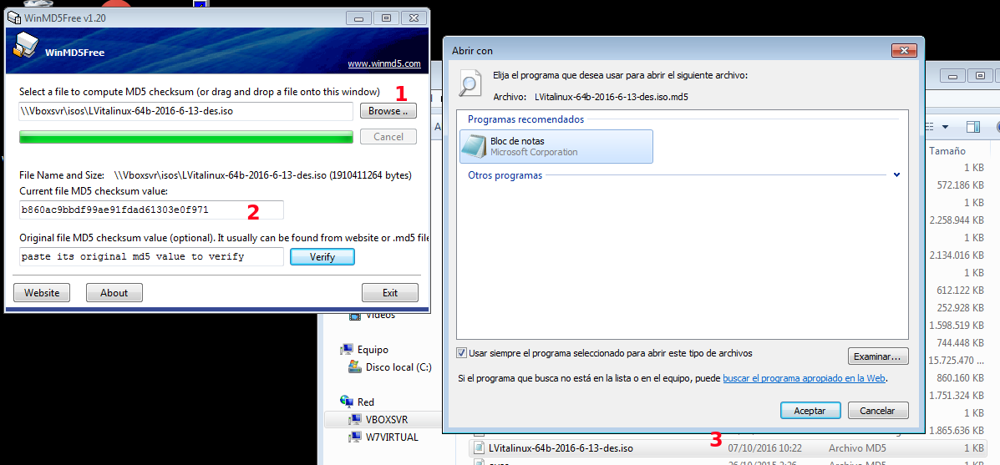

# ¿Donde Descargar Vitalinux?

##  ¿¿Sabías ...?? ¿Qué es una Imagen ISO? 

La extensión **.iso** en un archivo nos permite adivinar que se trata de un archivo resultante de comprimir y empaquetar a otro conjunto de archivos mayor. A modo de ejemplo existen muchos programas que nos permiten crear un archivo o imagen ISO a partir de un CD de música o DVD de vídeo, obteniendo como resultado un único archivo resultante **.iso**, el cual contiene todos los archivos existentes en el CD o DVD, posibilitando posteriormente su copia o restauración.

En lo que a este curso respecta, en el ámbito de los sistemas operativos, una imagen ISO de un sistema operativo (*p.e. Vitalinux*) hace referencia a un único archivo que aglutina en su interior a todos los archivos necesarios, que volcados sobre un disco duro, o pendrive, o DVD, permiten a un equipo informático arrancar bajo ese sistema, interactuar y trabajar con él.

##   ¡¡Importante!! Área de Descargas de Vitalinux EDU DGA 

A continuación podrás descargar el sistema Vitalinux EDU DGA en sus diferentes modalidades.  Estas son:

1. **Imágenes ISO de Vitalinux**.  Tras descargar estas imágenes ISOS podrás crear un **DVD o USB arrancable** que te permitirá probar Vitalinux en modo Live o directamente instalar el sistema en un equipo informático.
2. **Imágenes DRBL/Clonezilla en formato ZIP**.  Tras descargar y descomprimir el archivo ZIP correspondiente obtendrás una imagen Clonezilla que podrás utilizar para **restaurar el sistema Vitalinux EDU DGA en un equipo o en varios** mediante el uso de la herramienta de clonación en Red **DRBL Live** (*Clonezilla Server*)
3. **Imágenes ISO de Clonezilla Live**.  Tras su descarga podrás crear un **DVD o USB arrancable** que te permitirá **restaurar la imagen de Clonezilla de Vitalinux** en un equipo informático.

### Área de DESCARGA de ISOS e Imágenes {#areaDescargas}

#### ISOS de 32b y 64b de Vitalinux EDU DGA basado en LUbuntu
-  [Vitalinux 64bits Legacy/UEFI 2017-12-15](http://wiki.vitalinux.educa.aragon.es/isos/Vitalinux-64b-2017-12-15.des.iso) - [MD5SUM V64](http://wiki.vitalinux.educa.aragon.es/isos/Vitalinux-64b-2017-12-15.des.iso.md5)-  [Vitalinux 32bits Legacy/UEFI 2017-12-15](http://wiki.vitalinux.educa.aragon.es/isos/Vitalinux-32b-2017-12-15.des.iso) - [MD5SUM V32](http://wiki.vitalinux.educa.aragon.es/isos/Vitalinux-32b-2017-12-15.des.iso.md5)
Vitalinux 64bits para equipos nuevos (p.e. HP ProDesk):

-  [Vitalinux 64bits Legacy/UEFI 2017-12-15 (Equipos HP ProDesk)](http://wiki.vitalinux.educa.aragon.es/isos/Vitalinux-64b-2017-12-15-kernel-4.14.des.iso) - [MD5SUM V64 (HP ProDesk)](http://wiki.vitalinux.educa.aragon.es/isos/Vitalinux-64b-2017-12-15-kernel-4.14.des.iso.md5)
#### ZIP de Imágenes para DRBL/Clonezilla de 32 y 64 bits de Vitalinux EDU DGA
-  [Imagen DRBL/Clonezilla LVitalinux 32bits 2017-01-18](http://wiki.vitalinux.educa.aragon.es/isos/drbl-clonezilla-imagen-2017-01-18-LVitalinux-32b.zip) - [MD5SUM](http://wiki.vitalinux.educa.aragon.es/isos/drbl-clonezilla-imagen-2017-01-18-LVitalinux-32b.zip.md5)
-  [Imagen DRBL/Clonezilla LVitalinux 64bits 2017-06-14](http://wiki.vitalinux.educa.aragon.es/isos/drbl-clonezilla-imagen-2017-06-14-LVitalinux-64b.zip) - [MD5SUM](http://wiki.vitalinux.educa.aragon.es/isos/drbl-clonezilla-imagen-2017-06-14-LVitalinux-64b.zip.md5)
#### ISOS de Clonezilla Live de 32 y 64 bits de Vitalinux EDU DGA
-  [Clonezilla Live LVitalinux 32bits 2017-01-18](http://wiki.vitalinux.educa.aragon.es/isos/clonezilla-live-2017-01-18-LVitalinux-32b.iso) - [MD5SUM](http://wiki.vitalinux.educa.aragon.es/isos/clonezilla-live-2017-01-18-LVitalinux-32b.iso.md5)
-  [Clonezilla Live LVitalinux 64bits 2017-06-14](http://wiki.vitalinux.educa.aragon.es/isos/clonezilla-live-2017-06-14-LVitalinux-64b.iso) - [MD5SUM](http://wiki.vitalinux.educa.aragon.es/isos/clonezilla-live-2017-06-14-LVitalinux-64b.iso.md5)
#### ISOS de Clonezilla Live de 32 y 64 bits del Servidor Caché de la Intranet (Debian 8)
-  [Servidor Caché Debian8 32bits](http://wiki.vitalinux.educa.aragon.es/isos/clonezilla-live-2015-11-debian8mini32.iso) - [MD5SUM](http://wiki.vitalinux.educa.aragon.es/isos/clonezilla-live-2015-11-debian8mini32.iso.md5)
-  [Servidor Caché Debian8 64bits](http://wiki.vitalinux.educa.aragon.es/isos/clonezilla-live-2017-01-debian8cache64-160gb.iso) - [MD5SUM](http://wiki.vitalinux.educa.aragon.es/isos/cclonezilla-live-2017-01-debian8cache64-160gb.iso.md5)
#### Comprobar la correcta descarga de un fichero

Antes de hacer uso de los ficheros, es aconsejable [comprobar la integridad](#comprobarIntegrar) de los ficheros descargados.

##  ¡¡Importante!! Verificar los ficheros descargados 

Cuando nos descargamos un fichero de Internet, y en éste caso un fichero tan grande, es importante verificar que el fichero se ha descargado correctamente. Ocurre más a menudo de lo que nos gustaría, que la descarga no se realiza de forma correcta y luego perdemos mucho tiempo hasta que nos damos cuenta de que el error está en una descarga errónea o fallida.

## Comprobar la Integridad de un fichero descargado {#comprobarIntegrar}

Para verificar que la descarga de un fichero ha sido correcta existen las "*firmas*", "*resúmenes*" o "*ficheros hash*". Si observas, al lado del fichero a descargar tienes otra descarga disponible: **MD5SSUM**. Prueba a bajar uno y abrirlo con el bloc de notas o cualquier editor de texto plano.

Observarás que es un fichero de texto que contiene simplemente una línea con el **resumen** del fichero y el nombre del fichero. El resumen de un archivo es una cadena de texto de tamaño fijo (32 caracteres) resultante de aplicar un algoritmo al fichero original, de forma que si el archivo original cambiara en lo más mínimo, el resultado de aplicar de nuevo el resumen sería completamente distinto.

Así pues, si aplico el algoritmo (MD5 en éste caso) al fichero **\*.iso** que me he descargado y resulta la misma cadena que contiene en su adjunto ***.iso.md5**, puedo asegurar que la descarga se realizó con éxito.

¿Y cómo hago ésto? Dependerá del Sistema Operativo que uses para descargar y comprobar los ficheros de descargas:

-  Si usamos cualquier **distribución GNU/Linux**, contaremos con un ejecutable llamado **md5sum**. Para comprobar el fichero, navega hasta el directorio donde has descargado la ISO y el fichero md5 y ejecutas (*si se verifica el fichero saldrá un resultado de "**La suma coincide**"*):

```
md5sum -c fichero_md5_descargado.md5`
```

-  Si usamos **Windows**, podemos descargarnos el programa [winmd5free](http://wiki.vitalinux.educa.aragon.es/isos/WinMD5.exe). Lo ejecutamos y seguiremos unos sencillos pasos:
    1.  Ejecuta el programa y busca el archivo ISO (o el que corresponda) a comprobar 
    1.  El programa comprobará el fichero y generará un **resumen** o **hash** resultante 
    1.  Abrimos el fichero resultante con el **resumen MD5** para comprobar si coincide con el proporcionado por el suministrador de la descarga. Para ello, podemos hacer botón derecho sobre el fichero y abrir con Bloc de Notas:<br>
    
    1.  Si la firma coincide podemos concluir que está todo correcto. Para ello podemos hacer uso del campo correspondiente en el programa:
    
Comprueba el resúmen

##  Tarea 1.2: Descargar las ISOS de Vitalinux

<span style="color:red">Requisitos: Es necesario haberse leído el apartado relativo a **Descargar Vitalinux**.</span>

Con la finalidad de poder probar a posteriori el sistema operativo **Vitalinux** a continuación se propone descargar y comprobar los siguientes archivos que encontrarás en el [Área de Descargas](#areaDescargas):

* **ISOS de 32b y 64b de Vitalinux EDU DGA basado en LUbuntu**: **Imagen ISO de Vitalinux**, la cual nos servirá para probar **Vitalinux en modo Live** (<i>desde un DVD o pendrive sin necesidad de instalarlo en un equipo</i>) en primer lugar, y a posteriori, instalarla en un equipo.  Advertirás que hay **dos versiones, una de 32 bits y otra de 64bits** ... **¿Cuál me descargo?** A priori, si el equipo no es muy antiguo, y con la finalidad de aprovechar al máximo su potencia, se recomienda hacer uso de la versión de 64 bits.  Es decir, la versión de 32 bits garantiza compatibilidad total con cualquier equipo, nuevo o viejo, pero adolece de que si el equipo soporta 64 bits no estaremos siendo eficientes.  Ante la duda, podéis descargaros ambas versiones e intentar trabajar antes de nada con la de 64 bits, y en el caso de que el equipo no sea compatible, hacer uso de la versión de 32 bits.
* **ISOS de Clonezilla Live de 32 y 64 bits de Vitalinux EDU DGA**: **Imagen ISO de Clonezilla Live**, la cual nos permitirá **restaurar de una manera muy rápida la instalación de un sistema Vitalinux**, ya que es la imagen de  un sistema instalado.  Al igual que con la ISO de Vitalinux, existen dos versiones, una de 32 y otra de 64 bits. El uso de una u otra se podría argumentar con las mismas razones anteriores. 

> **Formato de Entrega.** Deberás realizar:
> 1.  Una captura de pantalla del directorio donde has descargado las imágenes ISO anteriores 
> 1.  Una captura de pantalla donde compruebas la integridad de uno de los archivos descargados

> Elabora un documento ofimático (o usa cualquier otro formato que te resulte más comodo) donde puedas incluir las capturas solicitadas y **expórtalo como pdf** para adjuntarlo como respuesta a la tarea solicitada. El nombre del fichero deberá seguir la pauta: **apellido1\_apellido2\_nombre\_TareaX.pdf**. Si lo consideras necesario puedes indicar cualquier comentario a las capturas de pantalla.

> *Importante entregar al tutor el documento con las imágenes en formato pdf para que no haya problemas de lectura y calificar la tarea*

> Asegúrate que el nombre no contenga la letra ñ, tildes ni caracteres especiales extraños. Así por ejemplo la alumna **Begoña Sánchez Mañas**, debería nombrar esta tarea como: **sanchez_manas_begona_Tarea1.2**