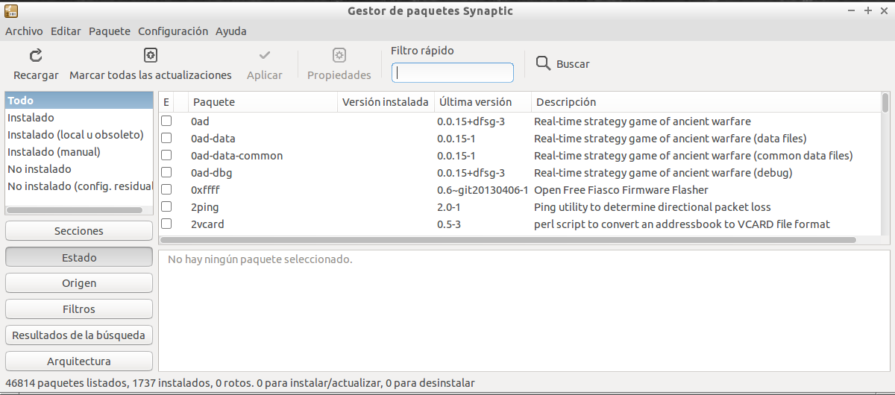
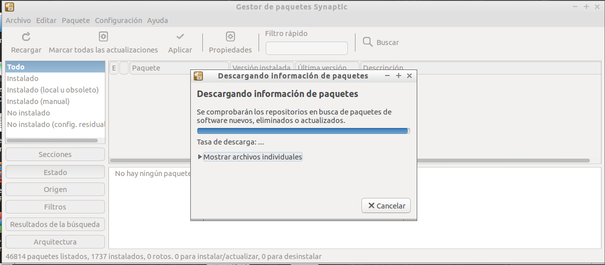
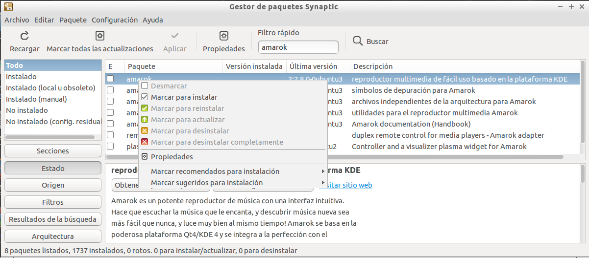
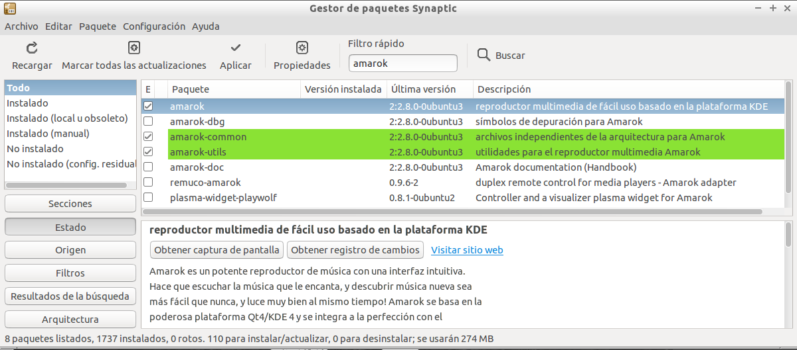

# El Gestor de Software Synaptic

## Gestión del Software en Vitalinux mediante Synaptic

Una de las aplicaciones más afamadas usada en el mundo Linux para la gestión del software es **Synaptic**.  Aunque su aspecto visual no es tan amigable como el de otras aplicaciones equivalentes que han ido surgiendo con los años, su eficiencia y robustez han hecho que sea una aplicación muy asentada y universalmente utilizada en muchas distribuciones Linux.

Entre sus características cabría destacar:

-  Permite **actualizar la lista de software disponible en los repositorios** configurados en la máquina 
-  Permite **buscar** rápidamente, **instalar y desinstalar** aplicaciones 
-  Permite solventar problemas con **paquetes rotos** (*paquetes que no se terminaron de instalar correctamente*)

Para interactuar con **Synaptic** simplemente debemos lanzarlo pulsando la combinación **"CONTROL + ESPACIO"'** y tecleando **"Synapse ..."'**:

Como en ocasiones ***más vale un buen videotutorial que mil palabras*** a continuación se sugiere hacer una Tarea al respecto y visualizar un vídeo relacionado con este asunto (es una parte del videotutorial completo: [Gestión del Software en Vitalinux](https://www.youtube.com/watch?v=8tBh8yz1FHY)).

##  Tarea 4.2: Instalación de Software mediante Synaptic

Requisitos: Es necesario haber leído todo lo referente a  **El Gestor de Software Synaptic** y disponer de un equipo con Vitalinux, físico o virtual, para realizar la Tarea

**Synaptic** es una fabulosa aplicación que permite gestionar el software a instalar y desinstalar en Vitalinux.  A modo de ejemplo, en la presente tarea se propone instalar una de las mejores aplicaciones que existen para la reproducción de música, **Amarok**.  Para ello:
-   Asegurate de que tu equipo Vitalinux ha terminado la comunicación con Migasfree (*tiene que desaparecer el **triángulo verde** que aparece tras iniciar sesión en Vitalinux sobre el símbolo de **Migasfree** que encontrarás en la parte derecha de la barra/panel inferior del Entorno de Escritorio de Vitalinux*)
-   Accede a **Synaptic** (***CONTROL + ESPACIO** y tecleas **synaptic***)
-   Pulsa sobre el botón **"Recargar"** de **Synaptic** para actualizar el software disponible en los repositorios u origenes de software configurados en Vitalinux
-   Busca **amarok** a través de **Synaptic**
-   Una vez localizado pincha con el botón derecho del ratón sobre él y selecciona la opción **instalar**
-   Por último pincha sobre el botón **Aplicar** para que se apliquen los **cambios solicitados a Synaptic** 
-   Para terminar, abre **Amarok** (***CONTROL + ESPACIO** y tecleas **amarok***) y prueba a reproducir algún disco de música MP3 que tengas.  ¿Qué te parece este software libre?

Como en ocasiones ***más vale un buen videotutorial que mil palabras*** a continuación se sugiere ver el siguiente vídeo relacionado con este asunto (*es una parte del videotutorial completo: [[Gestión del Software en Vitalinux](https://www.youtube.com/watch?v=8tBh8yz1FHY%7C)]*):

https://youtu.be/1nni5ikg11Q

> **Formato de Entrega**: Si no encuentras muchos problemas para ello, haz capturas de pantalla (tecla IMPRIMIR PANTALLA) de todo lo que vayas haciendo, y almacénalas en una memoria USB o donde creas conveniente. En caso de encontrar problemas para ello puedes hacer fotos directamente desde el móvil. Elabora un documento ofimático (o usa cualquier otro formato que te resulte más comodo) donde puedas incluir las capturas solicitadas y **expórtalo como pdf** para adjuntarlo como respuesta a la tarea solicitada. El nombre del fichero deberá seguir la pauta: **apellido1\_apellido2\_nombre\_TareaX.pdf**.

