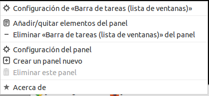
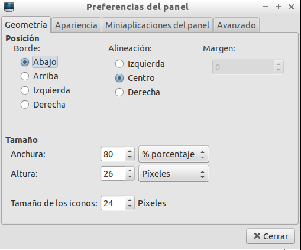

# ¿Preferencias del Escritorio

## Contenido

- [1 Partes del Escritorio Vitalinux](#PartesdelEscritorioVitalinux)
- [2 Personalización del Escritorio Vitalinux](#Personalizaci.C3.B3n_del_Escritorio_Vitalinux)
- [3 Tarea 2.1: ¿Cómo personalizo el Entorno de Escritorio de Vitalinux?](#Tarea_2.1:_.C2.BFC.C3.B3mo_personalizo_el_Entorno_de_Escritorio_de_Vitalinux.3F)

## Partes del Escritorio Vitalinux {#PartesdelEscritorioVitalinux}

El **Entorno de Escritorio** de Vitalinux es lo que se observa en la pantalla o monitor de nuestro equipo al iniciar sesión en el sistema, y se caracteriza por permanecer siempre de fondo.  Como podrá apreciarse una vez iniciado Vitalinux en **modo Live**, este **Entorno de Escritorio** no difiere en gran medida de los Escritorios clásicos de Windows a los que todos nos acostumbramos a trabajar.

En concreto, dentro del **Escritorio** pueden diferenciarse las siguientes partes importantes:

*  **Wallpaper** o imagen de fondo de Escritorio
*  **Accesos Directos** de Escritorio o también llamados **lanzadores de aplicaciones**
* **Panel Inferior** compuesto por:
    * **Menú de Inicio**: Clásico menú de Inicio desplegable desde el cual podremos acceder a prácticamente todos los lanzadores de aplicaciones existentes en el sistema Vitalinux.  Estos lanzadores de aplicaciones, como podrá apreciarse, están clasificados y organizados en submenús, entre los cuales destacan: **Educación** (*lanzadores de aplicaciones Educativas*), **Oficina** (*lanzadores de aplicaciones Ofimáticas*), **Internet** (*lanzadores de aplicaciones relacionadas con Internet*) o **Vitalinux** (*lanzadores a aplicaciones creadas por el equipo de desarrollo de Vitalinux*).
    * **Lanzadores de Aplicaciones** más habituales.  Encontraremos lanzadores para poder abrir el **explorador de archivos del sistema**, un buscador de archivos, el editor de imágenes Gimp, la editor Ofimático Libreoffice Writer o el navegador Web Firefox.
    * **Área de notificación de aplicaciones abiertas**.  Por cada aplicación que tengamos abierta, aparecerá acceso a ella (*mediante ALT + TABULADOR podemos navegar entre las aplicaciones abiertas, al igual que en Windows).*
    * **Área de notificaciones del Sistema**. En la parte derecha del panel inferior encontraremos un área desde la cual podremos comprobar el volumen del audio, la distribución del teclado, la carga de la batería (*en el caso de que sea un equipo portátil*), ... y el más importante, el estado de la comunicación con **Migasfree** (*una especie de rectángulo naranja con unas manchas amarillas, las cuales representan unas **migas***).

## Personalización del Escritorio Vitalinux

Para poder personalizar el aspecto de nuestro Escritorio tenemos dos alternativas:

1. Editar las **Preferencias del Escritorio**: para ello pulsa **CONTROL + ESPACIO**, escribe ***preferencias del escritorio*** y confirma pulsando a la tecla **Intro**.  Podrás comprobar que desde la ventana que se te habrá abierto, en función de la pestaña que selecciones, tendrás la posibilidad de personalizar la imagen de fondo de Escritorio, el tipo y tamaño de la letra, los iconos de acceso a recursos (*papelera, carpeta Documentos, unidades de CD/DVD o USB que se conecten, etc.*), o el comportamiento del Escritorio.

2. Otra opción de personalización del **Entorno de Escritorio** de Vitalinux es editar el **panel inferior**, o añadir uno nuevo para nuevas notificaciones.  Para editar el panel inferior será necesario pinchar con el botón derecho del ratón sobre el panel inferior (*sobre el área gris del panel*) y elegir ***Configuración del panel***.  En el caso de que queramos añadir un panel nuevo seleccionaremos ***Crear un panel nuevo***.

##  Tarea 2.1: ¿Cómo personalizo el Entorno de Escritorio de Vitalinux?

Requisitos: Haber leído todo lo referente a **Preferencias del Escritorio Vitalinux**

Con la finalidad de **jugar** un poco con el **Entorno de Escritorio de Vitalinux** en esta tarea a realizar se propone lo siguiente:

-  Desde las **Preferencias del Escritorio** modifica la imagen de fondo del Escritorio, el tamaño y fuente de la letra, y evita que aparezcan los iconos de la **Papelera** y del **directorio Documentos**.  Comprueba todas las modificaciones realizadas, además de advertir que al no **desmarcar** la casilla de **Iconos del Escritorio** referente a **Mostrar volúmenes conectados en el Escritorio**, al pinchar una memoria USB ésta si que aparece en el Escritorio una vez reconocida por el sistema.
-  **Configura el panel inferior** de tal forma que su anchura sea de tan sólo el 80% y que aparezca centrado.  En la pestaña de **Miniaplicaciones del panel** prueba a añadir un **Monitor de temperatura** situándolo al lado del **Control de Volumen**.
-  **Crea un nuevo panel** en la parte superior y personalizalo a tu gusto.

> **Formato de Entrega:** Si no encuentras muchos problemas para ello, haz capturas de pantalla (tecla **IMPRIMIR PANTALLA**, o en Vitalinux también es posible teclear **CONTROL + ESPACIO** y escribir capturar pantalla) que muestren las acciones solicitadas y el nuevo aspecto de tu Escritorio Vitalinux.  En el caso de que no sepas hacer capturas de pantalla puedes hacer fotos desde tu móvil.

> Elabora un documento ofimático (o usa cualquier otro formato que te resulte más comodo) donde puedas incluir las capturas solicitadas y **expórtalo como pdf** para adjuntarlo como respuesta a la tarea solicitada. El nombre del fichero deberá seguir la pauta: **apellido1_apellido2_nombre_TareaX.pdf**. Si lo consideras necesario puedes indicar cualquier comentario a las capturas de pantalla.

> *Importante entregar al tutor el documento con las imágenes en formato pdf para que no haya problemas de lectura y calificar la tarea*

> Asegúrate que el nombre no contenga la letra ñ, tildes ni caracteres especiales extraños. Así por ejemplo la alumna **Begoña Sánchez Mañas**, debería nombrar esta tarea como: **sanchez_manas_begona_Tarea2.1**

