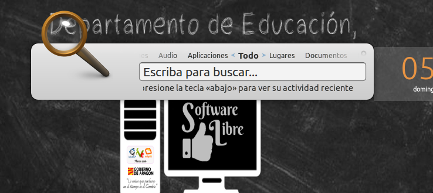

# Primeras Pruebas con Vitalinux

##  ¡¡Importante!! ¿Modo Live o Instalación?

Las tareas que vamos a realizar a partir de ahora las podemos hacer en modo Live hasta la [Parte 4](parte_4_gestion_del_software_en_vitalinux.md) donde se aconseja instalar el sistema. Recuera como has visto en el punto anterior que lo puedes hacer en un entorno Virtual (donde se instala directamente) o usar un entorno real (un equipo físico). En éste último caso se recomienda instalar también, pero se puede seguir funcionando en modo Live.  Algunos de vosotros siempre pide poder instalarlo ya, al contar con experiencia. ¡Adelante!

##  ¡¡Aviso!! ¿Qué hacer cuando arranca Vitalinux por primera vez?

Tras haber modificado el **Boot Order** y haber arrancado **Vitalinux en modo Live** nos aparecerá un **asistente de post-instalación** que nos invitará a terminar de configurar el sistema operativo Vitalinux.  En nuestro caso, al haber arrancado en **modo Live no persistente** (*no se guardan los cambios que hagamos en la sesión iniciada en modo Live*) **no completaremos el asistente** a menos que quisieramos actualizar Vitalinux para comprobar sus mejoras.  Por ello, para empezar a trabajar y probar Vitalinux pincharemos en la primera ventana del asistente de post-instalación sobre el botón **Salir de la Post-Instalación**.

## Contenido

- [1 Primer Arranque de Vitalinux](#PrimerArranquedeVitalinux)
- [2 Asistente de Post-Instalación en el caso de usar Vitalinux en un Centro Educativo](#AsistentedePost-InstalacionVitalinuxCentroEducativo)
- [3 Asistente de Post-Instalación en el caso de usar Vitalinux en casa](#AsistentePost-InstalacionVitalinuxCasa)
- [4 Tarea 1.4: ¿Qué hago tras el primer Arranque?](#Tarea_1.4)

## Primer Arranque de Vitalinux {#PrimerArranquedeVitalinux}

Tras el primer arranque de Vitalinux, resultado de una nueva instalación o de un uso en modo Live, nos aparecerán unas ventanas correspondientes a un **asistente de Post-Instalación** a las cuales deberemos contestar adecuadamente para una correcta configuración de Vitalinux.  Aclarar de algunas de estas cuestiones dependerán del lugar donde se le vaya a dar uso a Vitalinux: **Centro Educativo** o **casa**.

##  ¡¡Aviso!! ¿Asistente de Post-Instalación en modo Live?

El **asistente de Post-Instalación de Vitalinux** esta pensado para que únicamente aparezca una vez en caso de que se complete exitósamente.  En el caso de que estés haciendo uso de un arranque en **modo Live no persistente**, puedes completar el asistente con la finalidad de actualizar el software del equipo gracias al cliente migasfree, pero al no almacenarse los cambios, cada vez que arranquemos Vitalinux en modo Live deberemos volver a completarlo nuevamente, lo cual puede resultar algo tedioso.  Por ese motivo, a no ser que se considere necesario, en **modo Live no persistente** se aconseja pinchar sobre la primera ventana del asistente en **Salir de la Post-Instalación**

## Asistente de Post-Instalación en el caso de usar Vitalinux en un Centro Educativo {#AsistentedePost-InstalacionVitalinuxCentroEducativo}

Tal como se puede apreciar a través de las siguientes capturas de pantalla, en el caso de que el uso que se le vaya a dar al sistema Vitalinux sea dentro de un **Centro Educativo** deberemos informar a Vitalinux de lo siguiente:

* **¿Dirección IP del servidor Caché?** Los centros que hacen uso de Vitalinux tienen la opción de implementar un pequeño servidor dentro del centro con la finalidad de aumentar la eficacia del conjunto de equipos Vitalinux.  En concreto cabría destacar que este servidor ofrece los siguientes servicios:
    * Servicio de carpetas compartidas para alumnos y profesores. De esta forma todos los usuarios de Vitalinux pueden almacenar de manera centralizada sus documentos haciendo que sean accesibles desde cualquier equipo del centro.  Además esto facilita la entrega de documentos entre profesores y alumnos.
    * Servicio de entrega de software.  Este servicio es fundamental, ya que cuando se requiere instalar un programa en todos o parte de los equipos Vitalinux del centro, en lugar de descargarse de Internet múltiples veces el mismo software, este se descarga una única vez en el servidor y posteriormente este se encarga de entregárselo a todos aquellos que lo requieran.  De esta forma reducimos el consumo de ancho de banda del centro y aceleramos el proceso de instalación de software en los equipos Vitalinux.
* **¿Usuario que inicia sesión de manera automática en Vitalinux?** Con la finalidad de evitar que el usuario tenga que introducir un **login** y una **password** para poder iniciar sesión gráfica cada vez que arranca un equipo, a través del asistente podremos indicar quien es el usuario que mayormente va a usar el equipo. En caso de desearse puede indicarse que el equipo no inicie sesión de manera automática, y que sea necesario autenticarse cada vez que se inicia.
* **¿Qué etiquetas Migasfree queremos asignar al equipo?** La correcta asignación de **etiquetas Migasfree** al equipo es fundamental ya que en función de sus etiquetas Migasfree se decidirá que software tendrá ese equipo. Es decir, al menos todo equipo Vitalinux ubicado en un centro educativo debería tener una etiqueta Migasfree correspondiente al nombre de su centro, de tal forma que ese etiquetado le obligue al equipo a instalarse un determinado conjunto de aplicaciones que ha sido especificado por los responsables informáticos de ese centro. Veremos más en detalle la parte de Etiquetas y Cliente de Migasfree en la [Parte 4](parte_4_gestion_del_software_en_vitalinux.md).
* **¿Aceptas el uso de formatos restrictivos no libres necesarios en la reproducción de archivos MP3, DVDs, Windows Media, etc?** Por cuestiones de legalidad es necesario aceptar explícitamente el uso de estos formatos en el caso de querer trabajar con ellos.

## Asistente de Post-Instalación en el caso de usar Vitalinux en casa {#AsistentePost-InstalacionVitalinuxCasa}

En el caso de que Vitalinux vaya a ser usado de manera privada fuera de un centro educativo deberemos contestar al asistente de Post-Instalación en lo siguiente:

-  Vitalinux trae preconfiguradas varias cuentas de usuario con privilegios diferentes: **alumno, profesor y control**.  Por ello al indicar que vamos a  hacer un uso personal de Vitalinux fuera de un centro educativo, el asistente nos sugiere crear un nueva cuenta de administrador y modificar o eliminar las cuentas ya existentes.
-  **¿Usuario con el que queremos que se inicie sesión de manera automática en Vitalinux?** Con la finalidad de evitar que el usuario tenga que introducir un **login** y una **password** para poder iniciar sesión gráfica cada vez que arranca un equipo, a través del asistente podremos indicar quien es el usuario que mayormente va a usar el equipo.  En caso de desearse puede indicarse que el equipo no inicie sesión de manera automática, y que sea necesario autenticarse cada vez que se inicia.
-  **¿Aceptas el uso de formatos restrictivos no libres necesarios en la reproducción de archivos MP3, DVDs, Windows Media, etc?** Por cuestiones de legalidad es necesario aceptar explícitamente el uso de estos formatos en el caso de querer trabajar con ellos.
-  Y podría tener las **etiquetas** como en mi centro, de forma que tuviera la misma *personalización*? (por ejemplo, que un alumno pueda tener en el ordenador de casa el mismo software que en el cole). Pues si...pero la funcionalidad de las etiquetas la veremos algo mas adelante: [Parte 4](parte_4_gestion_del_software_en_vitalinux.md).

##  Tarea 1.4:  ¿Qué hago tras el primer Arranque?

Requisitos: Es necesario haber leído los puntos de la documentación relativos a [Probar Vitalinux](probar.md) y **Primeras Pruebas con Vitalinux**

Como habrás advertido a través de la tareas anteriores, tras instalar Vitalinux, en el primer arranque se mostrará un **asistente de Post-Instalación** de Vitalinux.  A continuación se propone la **tarea de Post-Instalación**, con la finalidad de conocer que es lo que se pretende con esta post-instalación de Vitalinux.  Para ello simplemente deberás seguir las preguntas del asistente vista ya en la documentación que ya habrás leído teniendo que indicar la información siguiente:

-  El uso que va a hacerse de Vitalinux es personal, privado, **fuera del entorno de un Centro Educativo**.
-  Vas a **crear una nueva cuenta de usuario** con los siguientes campos:
    -  Nombre: aularagon
    -  Password: 1
    -  Comentario: Usuario aulAragon
-  Indicarás que el usuario recién creado **aularagon** sea **administrador** del equipo.
-  El resto de cuentas de usuario que existen por defecto no las vas a tocar, ya que no hay necesidad para ello.
-  Indicarás que se inicie sesión de manera automática con el usuario **aularagon**.

No obstante, antes de nada, nos aseguraremos de que tenemos conexión con Internet probando a abrir un navegador Web.  Para ello pulsa la combinación **CONTROL+ESPACIO** y escribe **Firefox ...** o **Chrome ...**, de tal forma que si pulsas al **INTRO** debería iniciarse el navegador seleccionado pudiendo comprobar si ya navegas (también puedes lanzar el navegador usando el icono de firefox que hay en el escritorio).

Si no tienes conexión a red y el equipo se conecta por cable, revisa que estés correctamente conectado y que la red de tu casa tenga servidor DHCP (que será lo normal en un entorno doméstico).

En el caso de que la conexión sea inalámbrica deberás configurar previamente la red Wireless pinchando con el botón izquierdo del ratón sobre el icono de red que hay en la parte derecha de la barra inferior de notificaciones, permitiéndote elegir la red Wireless a la que te quieres conectar e introduciendo la contraseña de la red a la que te conectes. Si necesitas mas información o ayuda puedes ir a la [parte 4](parte_4_gestion_del_software_en_vitalinux.md) del curso donde se explica la [configuración de la red](http://wiki.vitalinux.educa.aragon.es/index.php/Vitalinux/Configurar_la_red).

Una vez terminado el proceso de post-instalación podremos trabajar con Vitalinux, aunque **en verdad, la Post-Intalación seguirá configurando el equipo en base a la información suministrada al asistente pero de una manera transparente para el usuario**. La Post-Instalación terminará en el momento en que finalice la comunicación con el servidor Migasfree que gestiona su software, y por tanto, en el momento en que el equipo este perfectamente actualizado.

> **Formato de Entrega:** Deberás realizar las fotos (*por ejemplo, desde tu móvil*) que acrediten que has realizado cada paso de los anterioreslo que se te pide.

> Elabora un documento ofimático (o usa cualquier otro formato que te resulte más comodo) donde puedas incluir las capturas solicitadas y **expórtalo como pdf** para adjuntarlo como respuesta a la tarea solicitada. El nombre del fichero deberá seguir la pauta: **apellido1_apellido2_nombre_TareaX.pdf**. Si lo consideras necesario puedes indicar cualquier comentario a las capturas de pantalla.

> *Importante entregar al tutor el documento con las imágenes en formato pdf para que no haya problemas de lectura y calificar la tarea*

> Asegúrate que el nombre no contenga la letra ñ, tildes ni caracteres especiales extraños. Así por ejemplo la alumna **Begoña Sánchez Mañas**, debería nombrar esta tarea como: **sanchez_manas_begona_Tarea1.4**