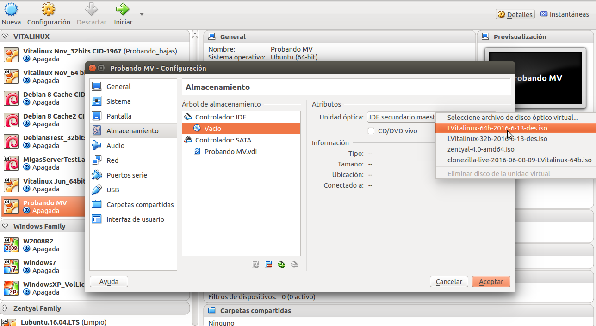
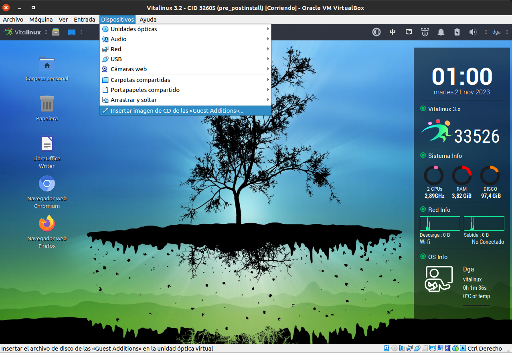
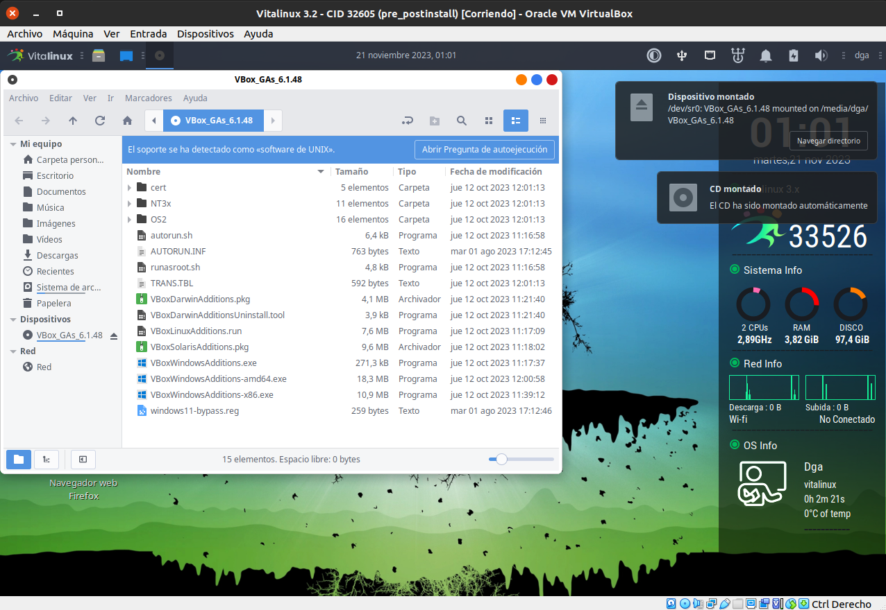
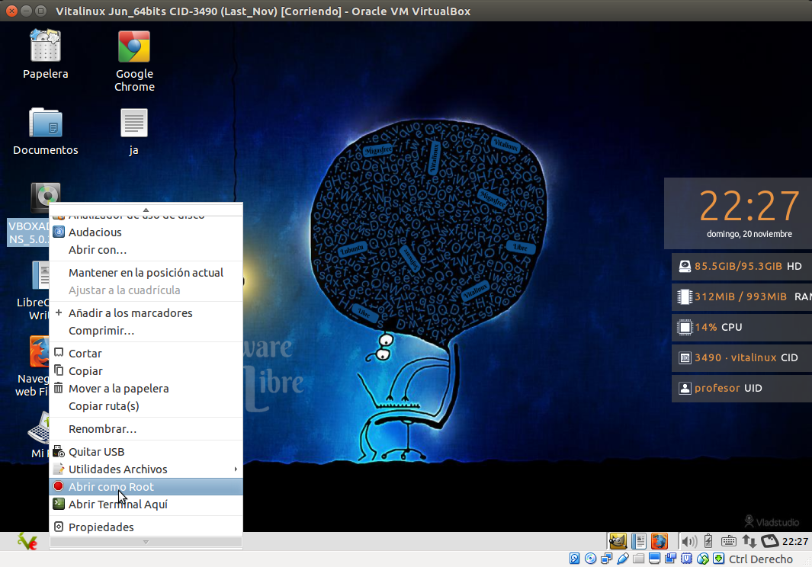
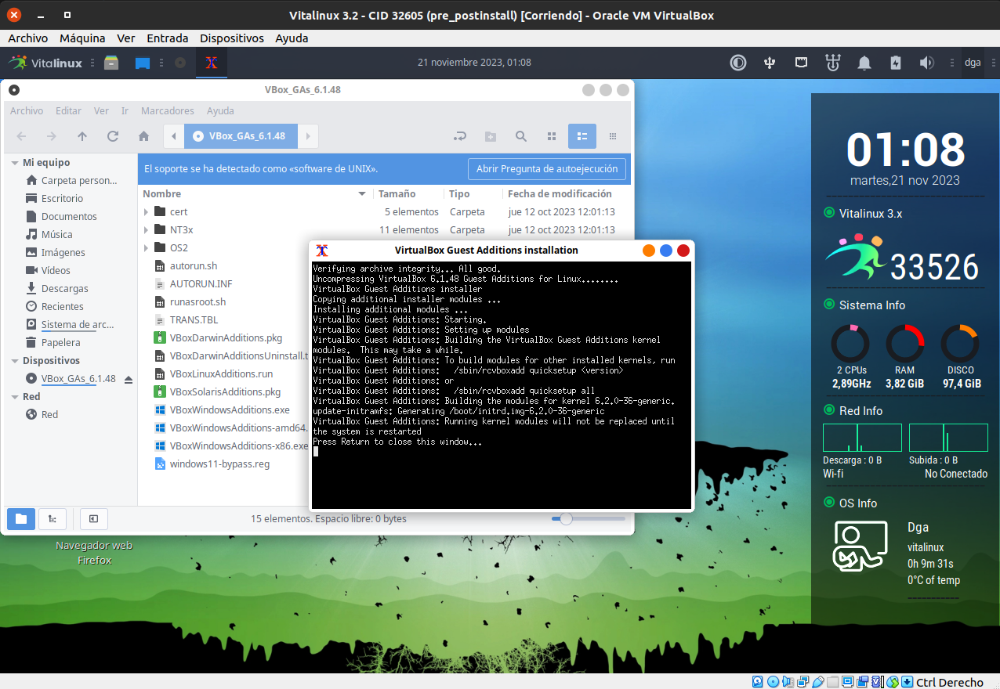
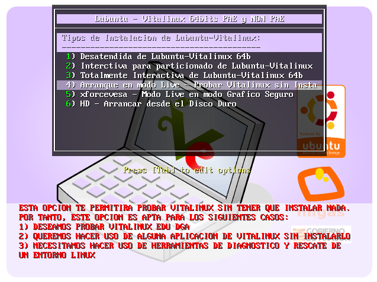
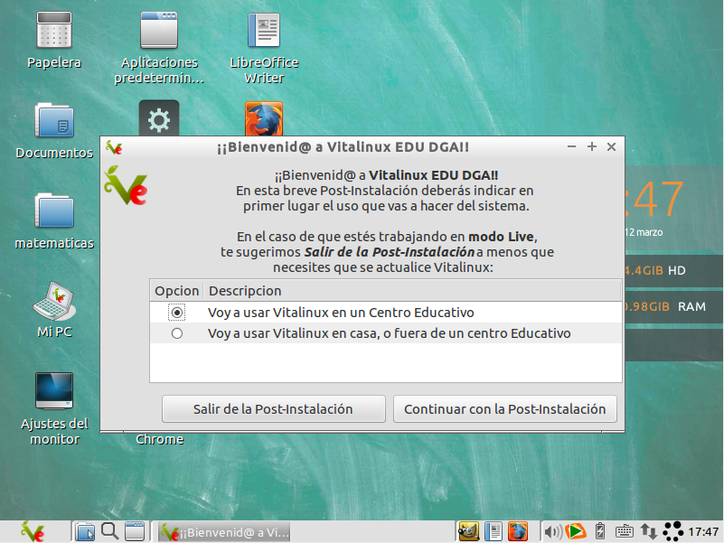
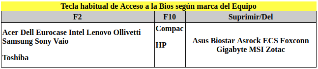
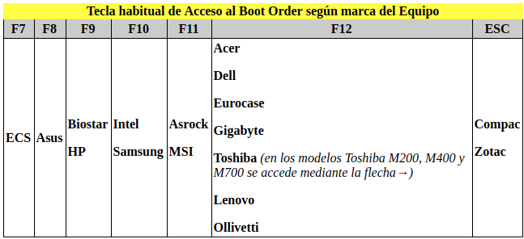

##   ¡¡Importante!! **¿Donde probar Vitalinux?**

Una vez hemos descargado la imagen ISO de Vitalinux EDU DGA ([Área de Descargas de Vitalinux](donde_descargar_vitalinux.md#areaDescargas)) tenemos diferentes posibilidades/opciones para poder **probar Vitalinux** y establecer un primer contacto con él.  Ésta decisión es importante, ya que Vitalinux no es una aplicación sin más que podamos instalar y desinstalar ... sino de un Sistema Operativo completo.  Entre todas las opciones destacaremos tres:

-  Puedes hacer las pruebas **en tu propio ordenador** iniciando Vitalinux en **modo Live**.  El **modo Live** es una posibilidad que nos ofrece Linux para probar sus sistema operativos **sin tener que instalarlos en el disco duro de nuestro equipo**. Para ello será necesario pasar el archivo ISO con la imagen de Vitalinux a un DVD o memoria USB, y posteriormente indicarle a nuestro equipo que arranque desde ese DVD o USB (*el DVD o USB hará las veces de disco duro de la máquina*).  Ésta opción es recomendada cuando quieres tener una primera experiencia de uso de un sistema operativo Linux, pero no para un uso habitual del sistema ya que normalmente son sesiones de uso no persistentes (*tras trabajar en modo Live, cuando se apaga el equipo se pierden todos los datos, todos los cambios realizados o personalizaciones realizadas*).
-  **Instalar Vitalinux en un equipo**.  Esta es la opción más recomendable cuando tenemos claro que Vitalinux va a ser nuestro sistema operativo de trabajo de ahora en adelante.  Al instalar Vitalinux en el disco duro de tu equipo tendrás la opción de eliminar todo lo que allí exista y hacer una instalación limpia, o hacer una **instalación dual** para tener la opción de poder seguir trabajando tanto con el sistema operativo que ya tengas instalado (p.e. Windows 7) y Vitalinux.  Si deseas hacer uso de esta opción y dudas si usar tu equipo personal, puedes usar **otro ordenador** diferente, puedes usar otro ordenador que tengas de pruebas, alguno del centro educativo en el que trabajas o un equipo antiguo que no sepas que uso darle.
-  Usar un [ **software de Virtualización**](http://wiki.vitalinux.educa.aragon.es/index.php/Vitalinux/Vitalinux_con_VirtualBox) como VirtualBox.  Ésta última opción es la más recomendable para tener un primer contacto con Vitalinux, poder probarlo en toda su plenitud e incluso seguir trabajando con él en un futuro.  Este tipo de software (*p.e. Virtualbox*), permite crear dentro de nuestro equipo **Máquinas Virtuales** que posteriormente podemos eliminar, al igual que eliminamos cualquier otro archivo de nuestro sistema, y sobre las cuales podemos instalar el sistema operativo que deseemos probar, en nuestro caso Vitalinux.   En concreto, haciendo uso de estas **máquinas virtuales** tendremos exactamente las mismas posibilidades que tendríamos con un equipo físico: probar Vitalinux en modo live o instalarlo en su disco duro Virtual, y todo ello **sin tener que temer que le ocurra nada a nuestro equipo**.

Para llevar a cabo el presente curso de introducción a Vitalinux se va a sugerir el hacer uso de Virtualbox.  Si quieres o deseas hacer uso de alguna otra opción tan sólo tendrás que sugerírsela al tutor. Una vez decidido ésto ... podemos continuar con el curso!!

## Contenido

- [1.1 ¿Qué es VirtualBox?](#C2BFQuC3A9esVirtualBox3F)
- [1.2 ¿De donde obtener VirtualBox?](#C2BFDedondeobtenerVirtualBox3F)
- [1.3 ¿Cómo crear una máquina Virtual e instalar Vitalinux?](#CrearMaquinaVirtual)
- [1.4 Instalar las Guest Additions](#InstalarGuestAdditions)
- [1.5 Utilidades de VirtualBox](#utilidadesVirtualBox)

- [4.1 ¿Cómo crear un USB Bootable o Arrancable?](#USBBootable)

## Instalación de Vitalinux usando VirtualBox

### ¿Qué es VirtualBox? {#C2BFQuC3A9esVirtualBox3F}

Tal cómo lo definen en su página oficial ***VirtualBox es un poderoso software de virtualización tanto para la empresa,  como para el uso doméstico. Además se caracteriza por ser la única solución profesional que está libremente disponible como software de código abierto bajo los términos de la Licencia Pública General de GNU (GPL v2)***.

En definitiva, **VirtualBox** es un software muy interesante que nos va a permitir crear una máquina virtual, para posteriormente sobre ésta instalar y probar un sistema operativo (*p.e. Vitalinux*) y todas sus aplicaciones obteniendo como resultado exactamente lo mismo que si lo hubiéramos hecho directamente sobre el equipo físicamente.

##   ¡¡Importante!! **¿Qué significa que la máquina es Virtual?**

Virtualbox nos va a permitir crear máquinas virtuales en un sentido metáforico, ya que cuando creamos una máquina en Virtualbox en realidad estamos cediendo parte de los recursos hardware de la máquina física a la máquina creada en Virtualbox.  Es decir, a modo de ejemplo, si disponemos de un equipo físico con 4GB de memoria RAM y creamos una máquina en Virtualbox con 1GB de memoria RAM, ese GigaByte es real (*no es virtual*) ya que se los esta *quitando* a la máquina física dejándola únicamente con 3GB.  Entendido lo que sucede con la memoria RAM de la máquina virtual, exáctamente igual podríamos decir de la CPU, la tarjeta de sonido, las tarjetas de red, etc ...  Por tanto, Virtualbox es un software que tiene la capacidad de hacernos creer que tenemos varias máquinas en una.

### ¿De donde obtener VirtualBox? {#C2BFDedondeobtenerVirtualBox3F}

Para poder descargar Virtualbox deberemos dirigirnos a su página Web, a su área de descargas:

-  [Área de Descargas de Virtualbox](https://www.virtualbox.org/wiki/Downloads)
Una vez allí deberemos descargar dos cosas:

1.  El programa de instalación de **Virtualbox** para el sistema operativo que tengas.  Por ejemplo, para el caso de que tengas Windows: [Instalador de Virtualbox para Windows](http://download.virtualbox.org/virtualbox/5.1.14/VirtualBox-5.1.14-112924-Win.exe)
1.  El [**Extension Pack**](http://download.virtualbox.org/virtualbox/5.1.14/Oracle_VM_VirtualBox_Extension_Pack-5.1.14-112924.vbox-extpack).  Este paquete **debe instalarse una vez se haya instalado el anterior**. No es más que un conjunto de drivers y funcionalidades añadidas para Virtualbox (*soporte para dispositivos USB, carpetas compartidas, etc.*)

### ¿Cómo crear una máquina Virtual e instalar Vitalinux? {#CrearMaquinaVirtual}

Crear una máquina virtual es tan facil como seleccionar la acción de Nueva Máquina Virtual, y seguir los pasos que se indican en el asistente. Si dejamos todo por defecto no tendremos problemas, pero por revisar:

-  **Nombre y Tipo de máquina**. Nombre deseado y tipo Linux (32 o 64, según deseemos)
-  Memoria **RAM** que le asignamos (1GB por ejemplo está bien)
-  Crear un **disco** Virtual (se recomienda cuando lo pida reservar el espacio dinámicamente para que solo ocupe en disco el espacio que gastemos). Tamaño el que queramos.

Una vez creada la máquina, tendremos que ir a configuración antes de poder arrancarla para "introducir" el DVD de Vitalinux.

En Configuración de la máquina vamos a la opción de Almacenamiento y seleccionamos la iso que queremos

También podriamos cambiar parámetros de Red y otros, pero de momento lo podemos dejar como está.

Con la finalidad de tratar que sea más comprensible el **proceso de creación de una máquina Virtual en Virtualbox** se ha creado el siguiente videotutorial (*advertir que este videotutorial se realizó con otra ordenación de contenidos del curso diferente al actual, por lo que hace las referencias a una supuesta parte 4 que había entonces habría que omitirlas):*

https://youtu.be/NsVrwUFeYrc

### Instalar las Guest Additions #InstalarGuestAdditions

Las Guest Additions son un conjunto de librerías y programas que podemos instalar en la máquina virtual (no en la real), para añadir funcionalidades extra, de forma que la experiencia en el manejo resulta mucho más enriquecida. De ésta forma podemos tener características como que la resolución de pantalla se ajusta al tamaño de ventana, mejor interacción entre la máquina virtual y la real...

> Nota: Se recomienda instalar antes **dkms**, que nos recompilará las librerías cuando se actualice el núcleo. No es necesario y de hecho lo podemos hacer después, pero si alguno quiere hacerlo puede ir a la Parte 5, sobre como instalar Software

Para ello debemos tener arrancada la máquina y clickar en la opción que hay en **VirtualBox de Dspositivos-&gt;Insertar Imágen de CD** de las Guest Additions. Éste menú puede cambiar si estamos trabjando en un sistema base de Microsoft.

La acción anterior lanzará un proceso en la máquina similar al de insertar un CD, donde tendremos el software a instalar.

Para instalarlo debemos **ejecutar el instalador con privelegios de administrador**. Podríamos hacerlo desde la consola, pero vamos a simplificarlo lanzando el proceso desde el navegador de archivos. Usando el botón derecho sobre el icono del CD de las GuestAdditions clickamos sobre la acción de Abrir como root. 

Ahora podemos ejecutar (con doble click) el archivo que pone **"VBolsLinuxAdditions.run"**. Éste proceso lanzará una terminal que ejecutará lo necesario

Solo nos queda **reiniciar**.

Con la finalidad de tratar que sea más comprensible el **proceso de instalación de las Guest Additions en la máquina Virtual Virtualbox** se ha creado el siguiente videotutorial (*advertir que este videotutorial se realizó con otra ordenación de contenidos del curso diferente al actual, por lo que hace las referencias a una supuesta parte 4 que había entonces habría que omitirlas):*

https://youtu.be/2QMHD891ksQ

### Utilidades de VirtualBox {#utilidadesVirtualBox}

Con la finalidad de sacarle el máximo partido a VirtualBox se sugiere que veáis el [siguiente videotutorial](https://youtu.be/oj92vB5mFAs%7C), el cual os mostrará los siguientes aspectos:

-  Cómo **transferir a la máquina virtual un pendrive o memoria USB** conectada a la máquina física
-  Cómo **compartir carpetas** entre las máquinas física y virtual
-  Cómo **crear puntos de restauración** el la máquina virtual con la finalidad de poder retornar a un estado previo
-  Cómo **compartir el portapapeles** entre las máquinas física y virtual
-  Cómo habilitar **la opción de *Arrastrar y Soltar* para copiar archivos** entre las máquinas física y virtual

https://youtu.be/oj92vB5mFAs

##  Tarea 1.3 Op1: ¿Cómo probar Vitalinux mediante Virtualbox?

Requisitos: Es necesario haber leído todo lo referente a  **¿Cómo probar Vitalinux?** y haber descargado los archivos solicitados (Images ISO de Vitalinux).

Esta tarea surge con la finalidad de poder instalar Vitalinux y poder trabajar con él a lo largo del curso.  Recuerda, que llevar a cabo la **Instalación de Vitalinux en una máquina virtual de Virtualbox** es la opción sugerida ya que:

-  **No es necesario crear ningún DVD o USB bootables** a partir de la imagen ISO
-  **No es necesario configurar la BIOS u opciones de arranque de la máquina** para que se inicie el proceso de instalación
-  **No es necesario dedicar un equipo equipo físico para estos menesteres**
-  **Nos va permitir trabajar con Vitalinux de forma idéntica a una instalación en equipo físico**

Para hacer uso de Virtualbox deberemos seguir los siguientes pasos:

1. Acceder mediante nuestro navegador preferido a el [Área de Descargas de Virtualbox](https://www.virtualbox.org/wiki/Downloads)
2. Descargar el programa de instalación de **Virtualbox** para el sistema operativo que tengas.  Por ejemplo, para el caso de que tengas Windows: [Instalador de Virtualbox para Windows](http://download.virtualbox.org/virtualbox/5.1.14/VirtualBox-5.1.14-112924-Win.exe)
3. **Instalar Virtualbox** en tu máquina a través del instalador que te acabas de descargar
4. Una vez que ya tenemos instalado Virtualbox en nuestra máquina deberemos **descargar e instalar** el [**Extension Pack**](http://download.virtualbox.org/virtualbox/5.1.14/Oracle_VM_VirtualBox_Extension_Pack-5.1.14-112924.vbox-extpack). Este paquete no es más que un conjunto de drivers y funcionalidades añadidas para Virtualbox (*soporte para dispositivos USB, carpetas compartidas, etc.*)
5. **Crear una nueva máquina Virtual en Virtualbox indicando cual es el sistema operativo que se va a instalar** en ella.  Indicar en este punto que Vitalinux esta basado en la versión ligera de Ubuntu, por lo que deberemos indicar que vamos a instalar un **Ubuntu**, de **32 o 64 bits** dependiendo de la versión de Vitalinux que te hayas descargado
6. **En la unidad de DVD de la máquina virtual cargar la imagen ISO de Vitalinux**.  De esta forma, lo primero que hará la maquina virtual al arrancar será comprobar que hay esa ISO y comenzará su instalación.
7. **Arrancar la máquina virtual** pulsando en el botón de encendido

Por último, independientemente de que la instalación se haga en un equipo físico o en una máquina virtual, **una vez se inicie el proceso de instalación aparecerá un menú de opciones de instalación** entre las cuales deberemos escoger la opción correspondiente a **una Instalación Desatendida**, la cual nos instalará Vitalinux sin ningún tipo de:

Seleccionaremos la **opción** correspondiente a una **Instalación Desatendida**

Con la finalidad de tratar que sea más comprensible el **proceso de creación de una máquina Virtual en Virtualbox** se ha creado el siguiente videotutorial (*advertir que este videotutorial se realizó con otra ordenación de contenidos del curso diferente al actual, por lo que hace las referencias a una supuesta parte 4 que había entonces habría que omitirlas):

https://youtu.be/NsVrwUFeYrc

¡¡Comprueba que el proceso de instalación es desantendido!!** Debes advertir que el proceso de instalación **no es interactivo**, sino **desantendido**.  Es decir, no solicita ningún tipo de información al usuario, haciendo que la instalación de Vitalinux sea muy trivial, posibilitando que durante el tiempo que se produce la instalación podamos invertirlo en otros menesteres.

Para terminar con la tarea, [**siguiendo los pasos que se describen anteriormente en la teoría**](#Instalar_las_Guest_Additions), instalaremos las **Guest Additions** en la máquina virtual donde acabamos de instalar Vitalinux.  Para ello, una vez terminada la instalación de **Vitalinux** en la **Máquina Virtual de Virtualbox**, la iniciaremos y **cancelaremos el proceso de Post-Instalación** (*lo trataremos en el siguiente punto*) para pasar con la instalación de estas **Guest Additions** (*en el caso de que se te solicite alguna clave o password de usuarios administradores: usuarios "profesor" y "dga" tienen la clave "careidga"*).  Con la finalidad de tratar que sea más comprensible el **proceso de instalación de las Guest Additions en la máquina Virtual Virtualbox** se ha creado el siguiente videotutorial (*advertir que este videotutorial se realizó con otra ordenación de contenidos del curso diferente al actual, por lo que hace las referencias a una supuesta parte 4 que había entonces habría que omitirlas):

https://youtu.be/2QMHD891ksQ

> **Formato de Entrega:** Si no encuentras muchos problemas para ello, haz capturas de pantalla del proceso de instalación de Vitalinux sobre Virtualbox (tecla IMPRIMIR PANTALLA). En caso de encontrar problemas para ello puedes hacer fotos directamente desde el móvil.</tt>Elabora un documento ofimático (o usa cualquier otro formato que te resulte más comodo) donde puedas incluir las capturas y **expórtalo como pdf** para adjuntarlo como respuesta a la tarea solicitada. El nombre del fichero deberá seguir la pauta: **apellido1_apellido2_nombre_TareaX.pdf**. Si lo consideras necesario puedes indicar cualquier comentario a las capturas de pantalla.<dl><dd> *Importante entregar al tutor el documento con las imágenes en formato pdf para que no haya problemas de lectura y calificar la tarea*</dd></dl>Asegúrate que el nombre no contenga la letra ñ, tildes ni caracteres especiales extraños. Así por ejemplo la alumna **Begoña Sánchez Mañas**, debería nombrar esta tarea como: **sanchez_manas_begona_Tarea1.3**

## Crear un Live DVD Bootable de Vitalinux

Un **Live DVD** nos va a permitir poder probar **Vitalinux** sin necesidad de instalarlo.  Para ello simplemente tendremos que abrir la aplicación que normalmente usemos para grabar CDs/DVDs y buscar una de las opciones que se encuentra disponible en todos los **quemadores de CDs/DVDs** referente a **grabar una imagen existente en un CD/DVD**, la cual nos solicitará la ubicación de la imagen **ISO de Vitalinux** que hayamos descargado previamente para pasarla posteriormente a un DVD Virgen que hayáis insertado en la unidad de CDs/DVDs.
Además, por lo general, si abrimos nuestro explorador de archivos y nos situamos en el directorio donde se encuentran las imágenes ISO, y pinchamos con el botón derecho del ratón sobre la imagen ISO nos debería aparecer una opción que explícitamente nos invite a grabar dicha ISO en un CD/DVD.

## Crear un Live USB Bootable de Vitalinux

De forma similar a un CD/DVD Arrancable, podemos grabar la imagen **ISO de Vitalinux** en una **memoria USB** con la finalidad de poder probar o instalar Vitalinux.  A diferencia de lo que nos ocurre con los CD/DVD, nuestro sistema operativo no siempre integra una aplicación que se encargue de grabar la ISO en una memoria USB, por lo que tendremos que instalar una aplicación expresamente para ello si no existe una alternativa.

### ¿Cómo crear un USB Bootable o Arrancable? {#USBBootable}

En el caso de querer quemar la imagen ISO en una memoria USB para crear un USB bootable de instalación de nuestro Linux preferido tenemos también varias opciones

1.  El sistema Operativo suele traer una aplicación para "quemar" USB. Por ejemplo en Ubuntu se llama **Creador de Discos de Arranque**
1.  Aplicaciones de terceros como unetbootin
Comentar que el software actualmente más afamado por su sencillez y por ser multiplataforma (*disponible tanto para Windows como para Linux*) para realizar dicha tarea es **UnetBootin** ([https://unetbootin.github.io/](https://unetbootin.github.io/)). Una vez instalado **UnetBootin** tan sólo es necesario ejecutarlo, elegir la imagen ISO que previamente hayamos descargado de Internet (p.e. [Área de Descargas]({#areaDescargas})) y seleccionar el dispositivo USB (*drive*) que queramos convertir en USB bootable de instalación (*el dispositivo USB debe estar previamente conectado al equipo antes de iniciar UnetBootin*).

***Importante: Se recomienda haber [formateado](/dispositivos_de_almacenamiento.md#Formatearundispositivo) el Pen previamente en FAT***. No es obligatorio que el pen esté formateado, pero a veces da problemas. Nos hemos encontrado incluso algún pen de tipo USB3.0 con problemas de reconocimiento en equipos antiguos

##  Tarea 1.3 Op2: ¿Cómo probar Vitalinux en modo Live?

**Requisitos: Es necesario haber leído el punto de la documentación**

En primer lugar, aclarar/recordar que esta tarea es **opcional**, o como alternativa a la propuesta como obligatoria: **Probar Vitalinux mediante Virtualbox**.  Asumiendo que has leído y realizado las tareas anteriores, y que por tanto, dispones de la imagen ISO de Vitalinux, a continuación pasaremos a crear un **Live DVD o USB** para posteriormente probar **Vitalinux en modo Live**.  Arrancar el sistema en **modo Live** nos va a permitir poder probar Vitalinux de igual forma a como si estuviera instalado en el equipo pero **sin alterar para nada el sistema operativo y los datos que haya en el disco duro del equipo**.  Aunque por sencillez se sugiere la creación de un Live DVD, se puede optar por la creación de un Live USB para la realización exitosa de esta tarea ya que en ocasiones es mas sencillo contar con un USB que con un DVD. **Solo es necesario realizar la tarea con una de las dos opciones propuestas**:

-  **Live DVD**: Quema la imagen **ISO de Vitalinux** que te hayas descargado en un **DVD**, y posteriormente, configura el **Boot Loader** de tu equipo para que en lugar de arrancar con el sistema que tienes instalado en el disco duro lo haga con el sistema disponible en el DVD.  Una vez que arranque el equipo desde el DVD deberás elegir la opción de **Arranque en modo Live** en el menú de arranque que aparecerá (*ver imagen adjunta*), provocando que el sistema operativo Vitalinux arranque sin necesidad de modificar ni instalar nada del disco duro del equipo.  Tras un periodo de espera deberías visualizar el **entorno de Escritorio de Vitalinux** con una ventana emergente de configuración que aparece en el primer arranque de Vitalinux (*al trabajar en modo Live, y no guardarse nada, no hay constancia de que el sistema Vitalinux se inició en algún momento, por lo que por muchas veces que repitamos el proceso siempre nos aparecerán estas ventanas emergentes de configuración*).

-  **Live USB**: Vuelca la imagen **ISO de Vitalinux** en una **memoria USB** mediante algún software que te permita este proceso, como por ejemplo **UnetBootin**, y posteriormente configura el **Boot Loader** de tu equipo para que en lugar de arrancar con el sistema que tienes instalado en el disco duro lo haga con el sistema disponible en el USB.  Después deberás seguir los mismos pasos que en el caso de haber creado un **Live DVD**. Con la finalidad de que el sistema se cargue y responda rápido se recomienda hacer uso de una memoria USB 3.0.

Una vez haya arrancado **Vitalinux en modo Live**, para empezar a probar Vitalinux deberemos **cerrar** el asistente de post-instalación pinchando en **Salir de la Post-Instalación** (*Esta post-instalación la veremos en detalle más adelante*)

> **Formato de Entrega:** Deberás realizar las fotos (*por ejemplo, desde tu móvil*) que acrediten que has realizado lo que se te pide.

> Elabora un documento ofimático (o usa cualquier otro formato que te resulte más comodo) donde puedas incluir las capturas solicitadas y **expórtalo como pdf** para adjuntarlo como respuesta a la tarea solicitada. El nombre del fichero deberá seguir la pauta: **apellido1_apellido2_nombre_TareaX.pdf**. Si lo consideras necesario puedes indicar cualquier comentario a las capturas de pantalla.<dl><dd> Importante entregar al tutor el documento con las imágenes en formato pdf para que no haya problemas de lectura y calificar la tarea*</dd></dl>Asegúrate que el nombre no contenga la letra ñ, tildes ni caracteres especiales extraños. Así por ejemplo la alumna **Begoña Sánchez Mañas**, debería nombrar esta tarea como: **sanchez_manas_begona_Tarea1.3**

##  ¡¡Aviso!! ¿Cómo modificar el Boot Order para que arranque el equipo desde DVD o USB?

Para poder probar o instalar un sistema operativo desde un Live DVD o USB es necesario indicar al **Boot Order del equipo** que en lugar de arrancar desde el disco duro del equipo debe hacerlo desde el dispositivo donde tenemos cargado el sistema Live (*unidad de DVD o memoria USB*). La forma de hacer esto **depende bastante del modelo y fabricante del equipo informático** con el que nos encontremos, aunque podemos generalizar que la modificación de este **Boot Order** siempre es posible desde la configuración de la **BIOS** del equipo, accesible tras encender el equipo pulsando sobre una tecla concreta que a su vez también depende del modelo y marca del equipo.

Una vez dentro de la **BIOS** habrá que buscar entre los menús que aparezcan la opción de modificación del **Boot Order** con la finalidad de elegir como primer dispositivo de arranque al medio donde hemos volcado la imagen ISO.

No obstante, a parte de todo lo anterior, cabría decir que en muchos de los equipos no es necesario acceder a la **BIOS** y modificar el **Boot Order** para poder arrancar desde el DVD o memoria USB, ya que disponen de una tecla de acceso directo a un menú de selección de dispositivo de arranque (*en la pantalla que aparece nada más arrancar el equipo se suele informar de esa tecla de acceso al **Boot Order**, en el caso de que exista esta posibilidad*).

A continuación se muestra una tabla donde poder consultar, sin un 100% de éxito ya que depende del modelo, la supuesta tecla de acceso a la **BIOS** y al **Boot Order** en función de la marca del equipo.

