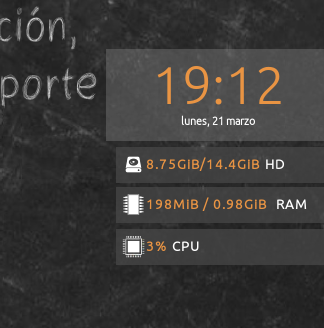

# Widgets del Escritorio

##  ¡¡Importante!! ¿Qué es un Widget Concky? 

Un **Widget Conky** es un complemento de Escritorio que nos permite monitorizar a través de un vistazo diferentes aspectos de nuestro sistema operativo.  Vitalinux, por defecto, dispone de unos Widgets Conky en la parte izquierda/central del Escritorio que informan al usuario de la **fecha y hora**, de la **cantidad de espacio libre en el disco duro en relación a su tamaño total**, de la **cantidad de memoria RAM ocupada en relación a la total**, y por último, del **porcentaje de uso de la potencia de la CPU** del equipo.

##  Tarea 2.2: Comprobación del consumo de Recursos del Sistema

Requisitos: Conocer que es un Widget Conky

Como podrás advertir a través del **Widget Conky del Escritorio de Vitalinux**, la cantidad de **memoria RAM** que consume el entorno de Escritorio de Vitalinux es muy pequeña al basarse en la versión ligera de Ubuntu, **Lubuntu**.  En concreto, puede advertirse que una vez cargado el sistema y estando operativo **tan sólo requiere de unos 200MB**, mientras que otros entornos de Escritorio, Windows y Linux, pueden requerir para empezar a funcionar en torno a 1GB de memoria RAM.

Mediante la realización de esta tarea se pretende advertir que para que un ordenador vaya rápido no sólo es necesario que el sistema operativo sea ligero (*Lubuntu*), sino también es necesario que lo sean las aplicaciones que se lanzan sobre él.  Como veremos a continuación, puede ocurrir que una aplicación (*p.e. Google Chrome*) consuma más recursos del sistema (*RAM y CPU*) que el propio sistema operativo.

Éste es un aspecto muy importante, ya que la cantidad de memoria RAM es un bien escaso en todo equipo informático, siendo su cantidad **determinante para garantizar que las aplicaciones que lancemos sean más o menos fluidas**.  En concreto, cada vez que abrimos cualquiera de las aplicaciones que tenemos instaladas en nuestro disco duro, ésta se carga en memoria RAM y es de hay de donde la CPU del ordenador trabaja con la aplicación.  Esto significa que a medida que vamos lanzando/abriendo aplicaciones, estas se van cargando en memoria RAM hasta que esta se llena.  En el momento en que se llena, al no caber todas, parte de ellas tienen que enviarse temporalmente al disco duro haciendo que las aplicaciones sean más lentas al tener que estar continuamente moviéndose desde el disco duro a la RAM, y viceversa.

De igual forma, el porcentaje de uso de la CPU es sumamente importante.  El uso de la CPU determina lo ocioso u ocupado que se encuentra nuestro ordenador.  Por tanto, cuando mayor es el porcentaje de uso de la CPU en un equipo, más estresado éste se encuentra y por tanto más complicado tiene el atendernos de una manera ágil, rápida y eficiente a nuestras demandas.

Como tarea vas a comprobar como varían la cantidad de memoria RAM ocupada y el porcentaje de uso de la CPU en función de las aplicaciones que se van lanzando.  Para ello, vamos a ir abriendo las aplicaciones que se indicarán a continuación, al mismo tiempo que minimizas las ventanas para ver la cantidad de memoria RAM ocupada y el uso de CPU en el **Widget Conky que hay en el Escritorio**:

1.  Antes de nada, apunta la **memoria RAM** y **porcentaje de uso de la CPU** consumidos por el sistema operativo Vitalinux **sin haber lanzado ninguna aplicación**.  Para ello arranca Vitalinux, inicia sesión y espera a que se estabilicen ambos parámetros (*deberemos esperar a que haya terminado la comunicación con Migasfree que se produce al inicio para saber exactamente lo que consume el sistema operativo sin nada más*).  Tras anotar esos valores, pasaremos a ver que sucede con esas cifras cuando se lanzan nuestras aplicaciones más comunes: **navegadores Web** y **herramientas ofimáticas**.
1.  Abre el **Navegador Web Firefox**: pulsa **CONTROL + ESPACIO** y escribe **firefox** (*pulsa al Intro para confirmar*).  Una vez abierto el navegador, abre tres pestañas (*pulsa **CONTROL + T***) y haz lo siguiente: (1) en la primera pestaña accede **www.educaragon.org**, en la segunda busca en Google la palabra clave **Vitalinux**, y en la tercera abre el **vídeo de youtube** referente a el [Videotutorial Cliente Migasfree](https://youtu.be/MiPYmOzlN4g). Apunta en cuanto aumenta la cantidad de memoria RAM y CPU del sistema Vitalinux, y después cierra la aplicación.
2.  Abre el **Navegador Web Google Chrome**: pulsa **CONTROL + ESPACIO** y escribe **chrome** (*pulsa al Intro para confirmar*).  Haz exactamente lo mismo que has hecho con **firefox** y anota en cuanto se incrementa la RAM y CPU. Después cierra la aplicación.
3.  Además de los dos archiconocidos navegadores Web **Firefox** y **Chrome** existen otros muchos que nos pueden ser útiles cuando nuestro equipo no es muy potente, y queremos que funcione aún así de una manera rápida.  A modo de ejemplo, para compararlo con los anteriores, aquí se propone usar **Midori**.  Para ello abre el **Navegador Web Midori**: pulsa **CONTROL + ESPACIO** y escribe **midori**.  A continuación haz lo mismo que has hecho con los navegadores anteriores y apunta los nuevos valores de incremento de CPU y RAM que supone hacer uso de esta aplicación. Después cierra la aplicación.
4.  Abre la herramienta **Ofimática LibreOffice Writer** (*equivalente a Microsoft Office Word*): pulsa **CONTROL + ESPACIO** y escribe **writer** (*pulsa al Intro para confirmar*).  Apunta en cuanto aumenta la cantidad de memoria RAM y CPU ocupada de tu sistema.
5.  Por último, **abre simultáneamente varias varias de las aplicaciones propuestas** y comprueba como va reduciéndose la RAM y CPU disponibles, advirtiendo que las aplicaciones a usar son las que acaban determinando la cantidad de memoria RAM y cantidad de potencia de CPU que necesito para mi equipo.

> **Formato de Entrega:** Indica las cifras de la cantidad de memoria RAM ocupada tras realizar cada una de las acciones anteriores, y haz una reflexión personal del comportamiento del sistema.  También puedes adjuntar, si no encuentras muchos problemas, capturas de pantalla (tecla **IMPRIMIR PANTALLA**).  Elabora un documento ofimático (o usa cualquier otro formato que te resulte más comodo) donde puedas incluir las capturas e información solicitada y **expórtalo como pdf** para adjuntarlo como respuesta a la tarea solicitada. El nombre del fichero deberá seguir la pauta: **apellido1_apellido2_nombre_TareaX.pdf**. Si lo consideras necesario puedes indicar cualquier comentario a las capturas de pantalla.

> *Importante entregar al tutor el documento con las imágenes en formato pdf para que no haya problemas de lectura y calificar la tarea*

> Asegúrate que el nombre no contenga la letra ñ, tildes ni caracteres especiales extraños. Así por ejemplo la alumna **Begoña Sánchez Mañas**, debería nombrar esta tarea como: **sanchez_manas_begona_Tarea2.2**